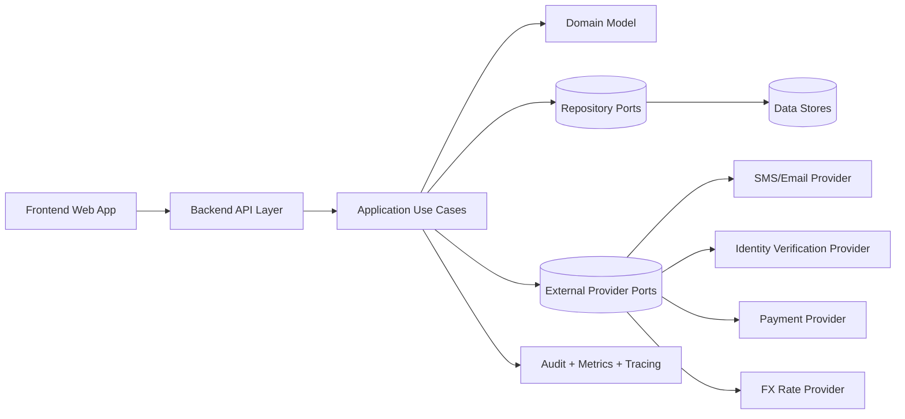
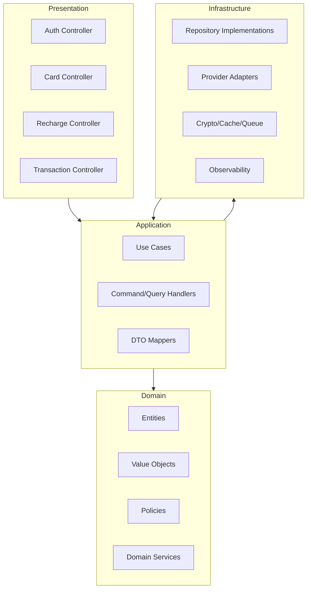
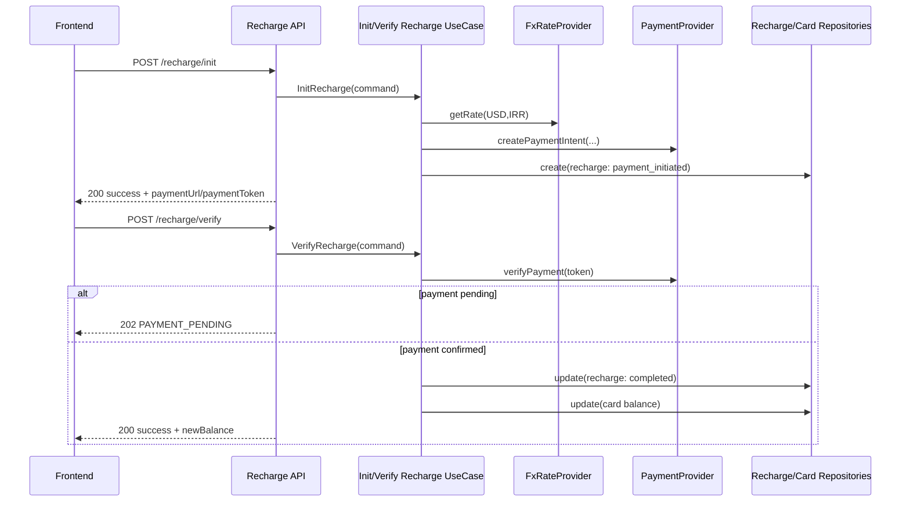
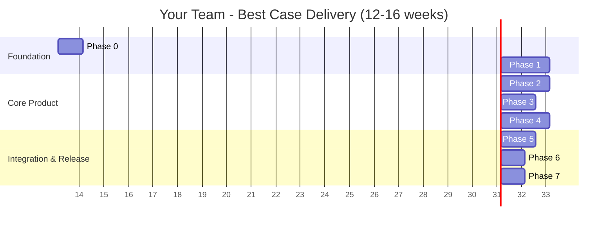
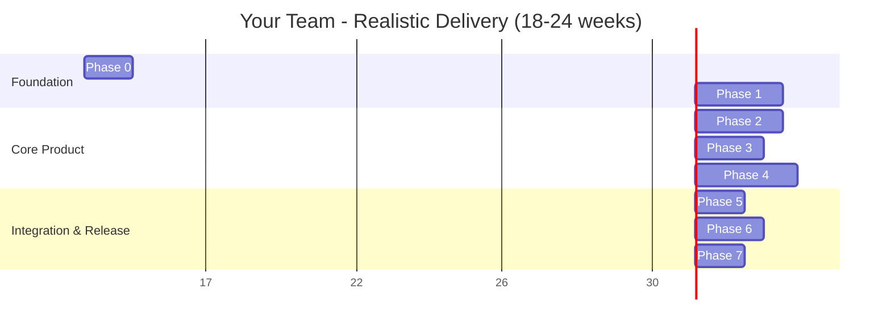
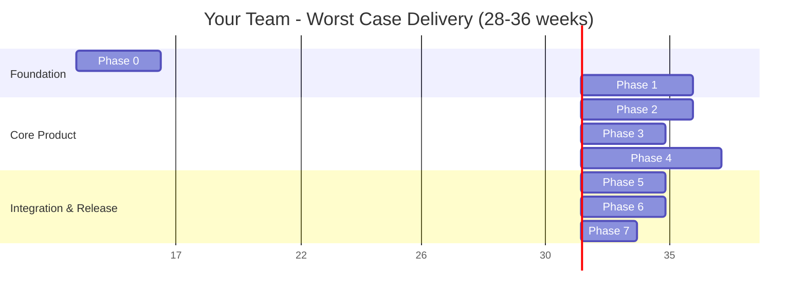
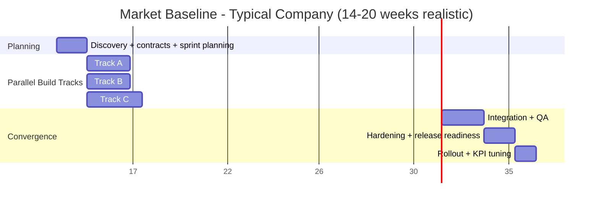

# Backend Clean Architecture Blueprint (Tool-Agnostic)

## 1) Purpose

This document gives a clean, implementation-agnostic backend blueprint for the current frontend application.

It covers:
- All API routes currently used by the frontend.
- Additional routes exposed by the current server.
- Expected/possible responses per route.
- Missing logical phases and response states not fully anticipated by the current app.
- A clean architecture design: layers, use cases, interfaces, providers, and diagrams.

---

## 2) Frontend Needs (What Backend Must Satisfy)

The frontend currently needs these domain capabilities:
- Identity and account lifecycle (OTP, signup, login, profile).
- Session validation for protected routes.
- Card lifecycle (list, details, purchase, status, label, PIN).
- Transactions (by card and cross-card).
- Recharge/top-up lifecycle (init, verify, history).
- Exchange-rate read for recharge estimation.

Cross-cutting backend requirements:
- Authentication and authorization.
- Validation and idempotency.
- Auditing and traceability.
- Error normalization and stable response contracts.
- External integrations (identity verification, OTP delivery, payment gateway, FX/rate provider).

---

## 3) API Inventory

Base path in current implementation: `/make-server-102b7873`

### 3.1 Routes Used By Frontend (`src/api/client.ts`)

| Method | Route | Frontend Use | Domain |
|---|---|---|---|
| POST | `/auth/send-otp` | yes | auth |
| POST | `/auth/verify-otp` | yes | auth |
| POST | `/auth/signup` | yes | auth |
| POST | `/auth/login` | yes | auth |
| POST | `/auth/reset-password` | yes | auth |
| GET | `/auth/profile` | yes | auth |
| PUT | `/auth/profile` | yes | auth |
| GET | `/cards` | yes | cards |
| GET | `/cards/:cardId` | yes | cards |
| POST | `/cards/purchase` | yes | cards |
| PUT | `/cards/:cardId/status` | yes | cards |
| PUT | `/cards/:cardId/label` | yes | cards |
| GET | `/exchange-rate` | yes | recharge |
| POST | `/recharge/init` | yes | recharge |
| POST | `/recharge/verify` | yes | recharge |
| GET | `/recharge/history/:cardId` | yes | recharge |
| GET | `/transactions/:cardId` | yes | transactions |
| GET | `/transactions/:cardId/:transactionId` | yes | transactions |
| GET | `/transactions` | yes | transactions |
| GET | `/cards/:cardId/stats` | yes | transactions/cards |

### 3.2 Routes Exposed By Backend But Not Called By Frontend Client

| Method | Route | Notes |
|---|---|---|
| GET | `/health` | operational |
| GET | `/debug/user/:mobile` | debug-only |
| DELETE | `/debug/user/:mobile` | debug-only, destructive |
| GET | `/debug/users` | debug-only |
| POST | `/auth/send-email-verification` | available but not consumed in client API module |
| POST | `/auth/verify-email` | available but not consumed in client API module |
| POST | `/auth/change-password` | available but not consumed in client API module |
| POST | `/auth/update-email` | available but not consumed in client API module |
| POST | `/auth/update-phone` | available but not consumed in client API module |
| POST | `/cards/:cardId/transaction` | mostly internal/test |
| POST | `/cards/:cardId/change-pin` | available but not consumed in client API module |

---

## 4) Route Contracts: Needed + Possible Responses

Response envelope recommendation (tool-agnostic):
- Success: `{ "success": true, "data": { ... }, "meta": { ... } }`
- Error: `{ "success": false, "error": { "code": "...", "message": "...", "details": ... }, "meta": { "requestId": "..." } }`

Current implementation mostly returns raw objects for success and `{ error: "..." }` for errors. Below includes both observed and recommended states.

### 4.1 Authentication

#### POST `/auth/send-otp`
- Success:
  - `200`: OTP issued and delivery accepted.
- Known errors:
  - `400`: invalid mobile format.
  - `500`: failed to send OTP.
- Missing/needed responses:
  - `429`: too many OTP attempts (rate limit).
  - `202`: accepted for async delivery provider (optional).
  - Domain state for `deliveryStatus` (`queued`, `sent`, `provider_failed`).

#### POST `/auth/verify-otp`
- Success:
  - `200`: OTP verified.
- Known errors:
  - `400`: OTP not found/expired/invalid.
  - `500`: verification failure.
- Missing/needed responses:
  - `409`: OTP already consumed.
  - `429`: too many invalid attempts (temporary lock).
  - `423`: identity action locked due to risk controls.

#### POST `/auth/signup`
- Success:
  - `200` or `201`: user created, session token issued.
- Known errors:
  - `400`: invalid mobile, invalid national ID, user exists, mismatch in identity check.
  - `500`: signup failed.
- Missing/needed responses:
  - `422`: password policy violations.
  - `409`: duplicate identity/email/mobile.
  - `503`: identity provider unavailable (retryable).
  - `202`: pending manual review/compliance review state.

#### POST `/auth/login`
- Success:
  - `200`: authenticated, token returned.
- Known errors:
  - `401`: invalid credentials.
  - `500`: login failed.
- Missing/needed responses:
  - `423`: account temporarily locked.
  - `403`: account disabled/suspended.
  - `428`: MFA/step-up required (if enabled in future).

#### POST `/auth/reset-password`
- Success:
  - `200`: password reset complete.
- Known errors:
  - `404`: user not found.
  - `500`: reset failed.
- Missing/needed responses:
  - `400`: OTP/session for reset not valid.
  - `422`: weak new password.
  - `409`: password reuse policy violation.

#### GET `/auth/profile`
- Success:
  - `200`: user profile.
- Known errors:
  - `401`: unauthorized/invalid session.
  - `404`: user not found.
  - `500`: failure.
- Missing/needed responses:
  - `403`: user exists but access restricted by policy.

#### PUT `/auth/profile`
- Success:
  - `200`: updated profile.
- Known errors:
  - `401`, `404`, `500`.
- Missing/needed responses:
  - `409`: email conflict.
  - `422`: validation per field.
  - `412`: stale version conflict (if optimistic locking enabled).

---

### 4.2 Cards

#### GET `/cards`
- Success:
  - `200`: cards list.
- Known errors:
  - `401`, `500`.
- Missing/needed responses:
  - `200` with empty list should be explicit and expected.

#### GET `/cards/:cardId`
- Success:
  - `200`: card details.
- Known errors:
  - `401`, `403`, `404`, `500`.
- Missing/needed responses:
  - `410`: card permanently closed/retired (optional).

#### POST `/cards/purchase`
- Success:
  - `200` or `201`: card created.
- Known errors:
  - `400`: max card limit reached.
  - `401`, `500`.
- Missing/needed responses:
  - `402`: payment required/payment failure semantics.
  - `409`: duplicate payment reference / idempotency collision.
  - `422`: invalid payment token/ref schema.
  - `202`: purchase initiated but async provisioning pending.

#### PUT `/cards/:cardId/status`
- Success:
  - `200`: status updated.
- Known errors:
  - `400`: invalid status, cannot activate expired card.
  - `401`, `403`, `404`, `500`.
- Missing/needed responses:
  - `409`: invalid transition by state machine.
  - `423`: status lock due to risk/fraud review.

#### PUT `/cards/:cardId/label`
- Success:
  - `200`: label updated.
- Known errors:
  - `400`: invalid label.
  - `401`, `403`, `404`, `500`.
- Missing/needed responses:
  - `422`: profanity/locale/length validation details.

#### POST `/cards/:cardId/change-pin` (exposed, not used by client API module)
- Success:
  - `200`: PIN changed.
- Known errors:
  - `400`: PIN format invalid.
  - `401`, `403`, `404`, `500`.
- Missing/needed responses:
  - `428`: step-up auth required.
  - `429`: too many attempts.

#### POST `/cards/:cardId/transaction` (internal/test)
- Success:
  - `200`: transaction appended.
- Known errors:
  - `400`: inactive card, insufficient balance, quota exceeded.
  - `404`: card not found.
  - `500`: failure.
- Missing/needed responses:
  - `409`: duplicate transaction idempotency key.
  - `422`: invalid merchant/type payload.

---

### 4.3 Recharge

#### GET `/exchange-rate`
- Success:
  - `200`: current rate and lastUpdated.
- Known errors:
  - `500`: failed to fetch.
- Missing/needed responses:
  - `200` with stale-flag metadata (`isStale`, `source`, `ageMs`).
  - `503`: upstream provider unavailable.

#### POST `/recharge/init`
- Success:
  - `200`: recharge created with payment URL/token.
- Known errors:
  - `400`: min/max amount violation.
  - `401`, `403`, `404`, `500`.
- Missing/needed responses:
  - `409`: duplicate init for same intent/idempotency key.
  - `422`: amount precision/currency invalid.
  - `202`: pending gateway token issuance.

#### POST `/recharge/verify`
- Success:
  - `200`: verified; recharge completed; new balance returned.
- Known errors:
  - `400`: payment verification failed / already processed.
  - `401`, `403`, `404`, `500`.
- Missing/needed responses:
  - `202`: payment still pending at gateway.
  - `409`: callback replay/idempotent duplicate verify.
  - `424`: dependency failed (gateway down).

#### GET `/recharge/history/:cardId`
- Success:
  - `200`: recharge history.
- Known errors:
  - `401`, `403`, `404`, `500`.
- Missing/needed responses:
  - pagination metadata (`cursor`, `hasMore`).
  - filtering/sorting parameters.

---

### 4.4 Transactions

#### GET `/transactions/:cardId`
- Success:
  - `200`: transactions array.
- Known errors:
  - `401`, `403`, `404`, `500`.
- Missing/needed responses:
  - pagination/cursor support.
  - `206`: partial data from eventual consistency (optional).

#### GET `/transactions/:cardId/:transactionId`
- Success:
  - `200`: transaction details.
- Known errors:
  - `401`, `403`, `404`, `500`.
- Missing/needed responses:
  - expanded ledger links (`authorization`, `settlement`, `refund`, `chargeback`) relationships.

#### GET `/transactions`
- Success:
  - `200`: all user transactions.
- Known errors:
  - `401`, `500`.
- Missing/needed responses:
  - cursor pagination and date filters.
  - aggregation meta.

#### GET `/cards/:cardId/stats`
- Success:
  - `200`: card usage/statistics.
- Known errors:
  - `401`, `403`, `404`, `500`.
- Missing/needed responses:
  - defined computation window (`from`, `to`, timezone).
  - `422`: invalid date filter range (if added).

---

## 5) Missing Logical Phases The Current Frontend May Not Fully Anticipate

These are important for production behavior and UX:

1. **Asynchronous payment lifecycle**
- Phases needed: `initiated -> pending_gateway -> authorized -> captured -> settled/failed -> reversed`.
- Frontend currently treats verify largely as immediate success/failure.

2. **Idempotency and replay-safe flows**
- Needed for signup, purchase, recharge init/verify, OTP send.
- Requests should accept an idempotency key to avoid duplicates.

3. **Risk and compliance holds**
- States like `under_review`, `restricted`, `blocked`, `manual_kyc_required`.
- Frontend needs explicit status mapping and user guidance messages.

4. **Rate limiting and abuse controls**
- OTP, login, password reset, PIN changes need attempt windows and lockouts.

5. **Session lifecycle detail**
- Refresh, revoke-all, device management, token versioning, and session invalidation reason.

6. **Provider degradation strategy**
- When SMS/payment/FX/identity provider is down, return retryable error codes and retry-after hints.

7. **Pagination and consistency**
- Transaction/history endpoints need stable cursors and deterministic ordering.

8. **Event/audit hooks**
- Security/audit event stream for profile updates, PIN changes, recharge verification, and card status changes.

---

## 6) Tool-Agnostic Clean Architecture

### 6.1 Layered Structure

1. **Presentation / API Layer**
- Controllers/handlers, request parsing, response mapping.
- No domain logic; translates DTOs to use case commands.

2. **Application Layer (Use Cases)**
- Orchestrates business scenarios.
- Defines input/output ports.
- Enforces business policies that span entities/services.

3. **Domain Layer**
- Entities, value objects, domain services, policies.
- Pure business logic and invariants.

4. **Infrastructure Layer**
- Implementations of ports: persistence, messaging, cache, crypto, providers.
- Provider adapters (SMS, payment, KYC, FX, email, observability).

### 6.2 Core Domain Entities (Conceptual)

- `User`
- `Session`
- `OtpChallenge`
- `Card`
- `CardSecurityProfile` (PAN/CVV/PIN references, never raw at rest)
- `Transaction`
- `Recharge`
- `PaymentIntent`
- `ExchangeRateQuote`
- `AuditEvent`

### 6.3 Use Cases (Application Services)

Auth/Identity:
- `SendOtpUseCase`
- `VerifyOtpUseCase`
- `SignUpUseCase`
- `LoginUseCase`
- `ResetPasswordUseCase`
- `GetProfileUseCase`
- `UpdateProfileUseCase`
- `SendEmailVerificationUseCase`
- `VerifyEmailUseCase`
- `ChangePasswordUseCase`
- `UpdateEmailUseCase`
- `UpdatePhoneUseCase`

Cards:
- `ListCardsUseCase`
- `GetCardDetailsUseCase`
- `PurchaseCardUseCase`
- `UpdateCardStatusUseCase`
- `UpdateCardLabelUseCase`
- `ChangeCardPinUseCase`
- `RecordCardTransactionUseCase` (internal/ops)

Recharge/Payments:
- `GetExchangeRateUseCase`
- `InitRechargeUseCase`
- `VerifyRechargeUseCase`
- `GetRechargeHistoryUseCase`

Transactions/Reporting:
- `GetCardTransactionsUseCase`
- `GetTransactionDetailsUseCase`
- `GetUserTransactionsUseCase`
- `GetCardStatsUseCase`

### 6.4 Interfaces / Ports (What to Abstract)

#### Repositories (Persistence Ports)
- `UserRepository`
  - `findById(userId)`
  - `findByMobile(mobile)`
  - `findByEmail(email)`
  - `save(user)`
  - `update(user)`

- `SessionRepository`
  - `create(session)`
  - `findByToken(token)`
  - `revoke(sessionId)`
  - `revokeAllForUser(userId)`

- `OtpRepository`
  - `issue(challenge)`
  - `findActive(target, purpose)`
  - `consume(challengeId)`
  - `incrementAttempt(challengeId)`

- `CardRepository`
  - `listByUser(userId)`
  - `findById(cardId)`
  - `save(card)`
  - `update(card)`
  - `countByUser(userId)`

- `TransactionRepository`
  - `listByCard(cardId, pagination)`
  - `listByUser(userId, pagination)`
  - `findById(transactionId)`
  - `save(transaction)`

- `RechargeRepository`
  - `create(recharge)`
  - `findById(rechargeId)`
  - `listByCard(cardId, pagination)`
  - `update(recharge)`

- `IdempotencyRepository`
  - `claim(key, scope, ttl)`
  - `complete(key, responseDigest)`
  - `lookup(key)`

#### External Service Ports (Provider Interfaces)
- `OtpDeliveryProvider`
  - `sendSmsOtp(mobile, templateData)`
  - `sendEmailOtp(email, templateData)`

- `IdentityVerificationProvider`
  - `verifyNationalIdMobile(nationalId, mobile)`

- `PaymentProvider`
  - `createPaymentIntent(intent)`
  - `verifyPayment(tokenOrReference)`
  - `refund(paymentId, amount)`

- `FxRateProvider`
  - `getRate(baseCurrency, quoteCurrency)`

- `CardProvisioningProvider`
  - `provisionVirtualCard(cardholder, productConfig)`
  - `setCardStatus(cardExternalId, status)`
  - `changePin(cardExternalId, pinSecretRef)`

- `CryptoProvider`
  - `hashPassword(plain)`
  - `verifyPassword(plain, hash)`
  - `encryptSensitive(data)`
  - `decryptSensitive(cipherText)`
  - `tokenize(value)`

- `EventPublisher`
  - `publish(domainEvent)`

- `AuditLogger`
  - `record(actor, action, target, metadata)`

#### Policy/Utility Ports
- `Clock`
- `UniqueIdGenerator`
- `RateLimiter`
- `FeatureFlagProvider`
- `ConfigProvider`

### 6.5 Cross-Cutting Policies

- Authorization policy (`canReadCard`, `canUpdateProfile`, etc.).
- Validation policy (input + business invariant validation).
- Idempotency policy (write operations).
- Retry/backoff/circuit-breaker policy for external providers.
- Consistent error catalog (`AUTH_INVALID_CREDENTIALS`, `PAYMENT_PENDING`, etc.).
- Observability policy (structured logs, metrics, traces, request-id propagation).

---

## 7) Suggested Canonical State Models

### 7.1 Recharge State Machine
- `draft`
- `payment_initiated`
- `payment_pending`
- `payment_verified`
- `completed`
- `failed`
- `cancelled`
- `reversed`

### 7.2 Card State Machine
- `pending_activation`
- `active`
- `inactive`
- `frozen`
- `expired`
- `closed`

### 7.3 OTP Challenge State
- `issued`
- `sent`
- `verified`
- `expired`
- `consumed`
- `locked`

---

## 8) Architecture Diagrams (Tool-Agnostic)

### 8.1 System Context

### 8.2 Clean Architecture Layers

### 8.3 Recharge Sequence (Happy + Pending Path)

---

## 9) Frontend-Backend Contract Checklist

To keep frontend stable while backend evolves, lock these contracts:
- Stable route names and payload schemas.
- Stable error code catalog (machine-readable).
- Stable auth/session header policy.
- Backward-compatible response fields (`data`, `meta`, pagination model).
- Explicit domain status enums (card/recharge/otp/session).

Recommended immediate additions for frontend readiness:
- Handle `202 pending` states in recharge and payment flows.
- Handle `429` and lockout UX for OTP/login/PIN attempts.
- Add generic error parser to map backend `error.code` to UI messages.
- Add pagination support for history and transactions.

---

## 10) Practical Next Step Plan

1. Define canonical API contract (OpenAPI or equivalent spec format).
2. Define error code catalog and status enums.
3. Implement idempotency key handling on write endpoints.
4. Introduce async payment lifecycle states + pending responses.
5. Add rate limiting + risk lock phases for auth-sensitive flows.
6. Add provider adapter interfaces and integration tests against mock adapters.
7. Keep frontend integration concentrated in `src/api/client.ts` and contexts.

This keeps the backend tool-agnostic, cleanly layered, and ready for long-term growth while frontend design updates continue.

---

## 11) Implementation Roadmap and Timeline (Business + Product Aligned)

This roadmap is ordered to reduce delivery risk, control cost, and unlock value early for product teams.

### 11.1 Planning Assumptions

- Team shape (example baseline): `1 backend lead`, `2 backend engineers`, `1 frontend engineer`, `1 QA engineer`, `1 product owner`.
- Estimation format: calendar weeks with parallel work where possible.
- Cost behavior:
  - Early phases focus on architecture and contract stability (low rework cost later).
  - Mid phases focus on revenue-critical flows (signup/login/card purchase/recharge).
  - Late phases focus on resilience, compliance hardening, and operational excellence.

### 11.2 Phase Timeline Overview

| Phase | Duration (est.) | Priority | Business Outcome |
|---|---:|---|---|
| Phase 0 - Alignment and Contracts | 1 week | Critical | Product/engineering aligned on API and error contracts |
| Phase 1 - Foundation and Security Baseline | 2 weeks | Critical | Safe runtime baseline, clean architecture skeleton, observability |
| Phase 2 - Auth + Session + Identity Flows | 2-3 weeks | Critical | Users can register/login reliably with controlled risk |
| Phase 3 - Card Domain Core | 2 weeks | High | Card lifecycle available for core product navigation |
| Phase 4 - Recharge + Payment Lifecycle | 3 weeks | Critical | Revenue path enabled with pending/failed/verified handling |
| Phase 5 - Transactions + Reporting + Pagination | 1-2 weeks | High | User transparency and support operations improved |
| Phase 6 - Hardening + Non-Functional Requirements | 2 weeks | Critical | Production readiness: reliability, abuse controls, DR posture |
| Phase 7 - Controlled Rollout + Optimization | 1-2 weeks | High | Low-risk launch, KPI-driven tuning, cost/perf optimization |

**Total estimate:** `14 to 17 weeks` (including integration and hardening).

### 11.3 Detailed Phase Plan

#### Phase 0 - Alignment and Contracts (Week 1)

**Goal**
- Freeze the contract between frontend and backend before implementation expands.

**Technical requirements**
- Canonical endpoint definitions for all routes used in `src/api/client.ts`.
- Standard response envelope and machine-readable error codes.
- State enum definitions (`card`, `recharge`, `otp`, `session`).
- Idempotency and retry policy specification for write endpoints.

**Deliverables**
- API contract spec document.
- Error catalog and status transition rules.
- Definition-of-done checklist for backend stories.

**Likely bottlenecks**
- Product ambiguity around edge cases.
- Design-driven changes from Figma updates mid-planning.

**Mitigation**
- Weekly contract review with product + frontend.
- Version API contract (`v1`) and only add backward-compatible fields during active sprint.

---

#### Phase 1 - Foundation and Security Baseline (Weeks 2-3)

**Goal**
- Build clean architecture skeleton and mandatory security/observability primitives.

**Technical requirements**
- Layered module structure (presentation/application/domain/infrastructure).
- Interface ports for repositories/providers from section 6.4.
- Request tracing (`requestId`), structured logs, metrics, error telemetry.
- Secret/config abstraction (`ConfigProvider`), environment isolation (dev/stage/prod).
- Remove/disable debug-only runtime routes in production mode.

**Deliverables**
- Bootstrapped clean architecture project with dependency inversion enforced.
- Shared middleware for auth extraction, validation, error mapping.
- Baseline dashboards for API latency, error rates, provider failures.

**Likely bottlenecks**
- Over-design at foundation stage.
- Missing security decisions (token TTLs, password policy, lockouts).

**Mitigation**
- Use a minimal vertical slice first (health + one protected endpoint) before broad scaffolding.
- Run architecture review gate at end of week 3.

---

#### Phase 2 - Auth + Session + Identity Flows (Weeks 4-6)

**Goal**
- Deliver reliable account lifecycle with abuse controls.

**Technical requirements**
- Use cases: `SendOtp`, `VerifyOtp`, `SignUp`, `Login`, `ResetPassword`, `Get/UpdateProfile`.
- Session management with revoke and expiry rules.
- Rate limiting for OTP/login/password flows.
- Risk statuses and lockouts (`423`, `429`, retry windows).
- Optional identity verification provider integration with fallback behaviors.

**Deliverables**
- All auth endpoints production-grade.
- Contract-compliant frontend integration for auth states and errors.
- Audit events for sensitive actions (password change, profile update).

**Likely bottlenecks**
- OTP provider instability and deliverability issues.
- Identity verification latency/failure.

**Mitigation**
- Multi-provider adapter strategy for OTP.
- Queue and retry with dead-letter policy for async delivery failures.
- Return explicit retryable error codes and cooldown metadata.

---

#### Phase 3 - Card Domain Core (Weeks 7-8)

**Goal**
- Deliver stable card lifecycle needed by product core screens.

**Technical requirements**
- Use cases: list/details/purchase/status/label/PIN.
- Card state machine and transition guards.
- Card ownership authorization policy per request.
- Sensitive data handling through `CryptoProvider` and tokenization strategy.

**Deliverables**
- Card APIs with policy-validated transitions and normalized errors.
- Card status events for downstream analytics/support workflows.

**Likely bottlenecks**
- Card provisioning provider constraints.
- Ambiguous product rules on status transitions.

**Mitigation**
- Abstract provisioning with `CardProvisioningProvider` and local simulation adapter for non-prod.
- Keep transition matrix explicit and reviewed by product.

---

#### Phase 4 - Recharge + Payment Lifecycle (Weeks 9-11)

**Goal**
- Enable revenue-critical top-up flow with asynchronous payment handling.

**Technical requirements**
- Use cases: `GetExchangeRate`, `InitRecharge`, `VerifyRecharge`, `GetRechargeHistory`.
- Idempotency keys for init/verify endpoints.
- Payment states and callback replay protection.
- FX rate freshness metadata and fallback strategy.
- Reconciliation job for pending/unknown payment intents.

**Deliverables**
- End-to-end recharge flow with `pending`, `completed`, `failed`, `reversed`.
- Finance-safe audit trail and reconciliation report.

**Likely bottlenecks**
- Payment gateway callback reliability.
- FX provider outages causing pricing uncertainty.

**Mitigation**
- Add reconciliation scheduler and manual replay tooling.
- Use cached/stale rates with explicit `isStale` metadata and policy threshold.

---

#### Phase 5 - Transactions + Reporting + Pagination (Weeks 12-13)

**Goal**
- Improve user visibility and supportability with scalable history endpoints.

**Technical requirements**
- Cursor-based pagination for transactions and recharge history.
- Stable sorting and deterministic filters.
- Card stats aggregation with explicit time-window metadata.

**Deliverables**
- Transaction APIs with pagination contracts.
- Support-ready query views for user disputes and troubleshooting.

**Likely bottlenecks**
- Query performance degradation at scale.

**Mitigation**
- Pre-computed aggregates and indexed query paths.
- Read model optimization (CQRS-style read projection if needed).

---

#### Phase 6 - Hardening + Non-Functional Requirements (Weeks 14-15)

**Goal**
- Make platform production-ready under realistic load and failure conditions.

**Technical requirements**
- Load, resilience, and chaos test scenarios.
- Circuit breaker + retry/backoff policies for external providers.
- Security review: auth, data encryption, secret rotation, audit completeness.
- Incident playbooks and runbooks.

**Deliverables**
- SLOs/SLIs defined and monitored.
- Pen-test findings triaged/remediated.
- Disaster recovery and rollback procedures validated.

**Likely bottlenecks**
- Hidden performance cliffs and provider rate caps.

**Mitigation**
- Early performance budget and thresholds.
- Provider throttling controls + adaptive queueing.

---

#### Phase 7 - Controlled Rollout + Optimization (Weeks 16-17)

**Goal**
- Launch safely and optimize based on real usage and cost.

**Technical requirements**
- Feature flags and progressive rollout controls.
- Canary/blue-green rollout mechanics.
- KPI instrumentation: conversion, payment success, auth success, failure taxonomies.
- Cost telemetry: provider usage, API cost per transaction, cache hit rates.

**Deliverables**
- Gradual launch with rollback safety.
- Post-launch optimization backlog prioritized by data.

**Likely bottlenecks**
- Unexpected behavior under real user traffic.

**Mitigation**
- Stage-gated rollout (% cohorts), rapid rollback criteria, daily war-room metrics.

### 11.4 Critical Path (Must Not Slip)

1. Contract freeze (Phase 0).
2. Auth/session/rate-limit baseline (Phase 2).
3. Recharge/payment async + idempotency + reconciliation (Phase 4).
4. Hardening and security validation (Phase 6).

If any critical-path phase slips, defer lower-impact enhancements (non-core reporting/UI-adjacent APIs) rather than launching without safeguards.

### 11.5 Team and Cost Guidance by Phase

| Phase | Suggested Staffing | Cost Profile | Notes |
|---|---|---|---|
| 0-1 | Backend lead + PO + 1 FE | Low-Medium | Design/contract work reduces expensive rework later |
| 2-4 | Full backend squad + QA + FE integration | High | Core delivery and provider integration |
| 5 | Backend + QA | Medium | Optimization and data-access stabilization |
| 6-7 | Backend lead + SRE/ops + QA + PO | Medium-High | Reliability, launch controls, production guardrails |

### 11.6 Go/No-Go Exit Criteria Per Milestone

- **After Phase 2:** signup/login/reset/profile success rate and lockout behavior validated.
- **After Phase 4:** payment pending/failure/retry/replay flows verified end-to-end.
- **After Phase 6:** SLOs green, security checklist complete, incident runbooks tested.
- **Before launch:** contract compatibility confirmed with frontend on staging.

This roadmap keeps delivery sequence practical for business priorities: first reduce ambiguity, then unlock revenue paths, then harden for scale and trust.

---

## 12) Team-Based Estimation and Cursor Cost (Given Current Team Structure)

This section models delivery using the exact team shape:
- `1 Product Head`
- `1 Business Head`
- `1 CTO`
- `1 Tech Lead + Full-Stack Developer` (primary implementer)

### 12.1 Execution Reality With This Team

The primary constraint is implementation bandwidth:
- Product, business, and technical governance are available.
- Core build throughput is effectively one senior builder.
- This favors a staged roadmap with strict scope control and contract stability.

Implication:
- Architecture quality can be high.
- Delivery speed is limited by single-threaded implementation and integration.
- Rework risk increases if design/API decisions shift during active build sprints.

### 12.2 Total Timeline Scenarios (End-to-End)

| Scenario | Duration (est.) | What You Get | Risk Level |
|---|---:|---|---|
| Lean MVP | 12-16 weeks | Core auth/cards/recharge/transactions integrated and usable | Medium-High |
| Production V1 (recommended) | 18-24 weeks | Stable feature set + reliability controls + rollout readiness | Medium |
| Hardened V1.5 | 24-30 weeks | Strong observability, failure recovery, operational maturity | Low-Medium |

Recommended planning target for this team:
- **5 months** (`~20-22 weeks`) for a confident production launch, including integration, validation, and hardening.

### 12.3 Suggested Calendar Breakdown For This Team

| Time Window | Focus | Ownership Pattern |
|---|---|---|
| Weeks 1-2 | Contract freeze, API definitions, backlog slicing | Product Head + Business Head + CTO + Tech Lead |
| Weeks 3-6 | Auth/session/profile + baseline security | Tech Lead (build), CTO (review), Product (acceptance criteria) |
| Weeks 7-10 | Cards + transactions core | Tech Lead (build), Product/Business (domain validation) |
| Weeks 11-14 | Recharge/payment lifecycle + failure states | Tech Lead + CTO (provider/risk decisions) |
| Weeks 15-18 | End-to-end integration, QA pass, staging validation | Tech Lead + Product + Business |
| Weeks 19-24 | Hardening, controlled rollout, optimization | CTO + Tech Lead + Product/Business for launch gates |

### 12.4 Cost- and Time-Sensitive Controls

To keep both cost and timeline predictable with this team size:
- Freeze contract per phase; avoid multi-phase scope spillover.
- Use feature flags to deploy incomplete but safe increments.
- Prioritize revenue-critical flows first (`login`, `card purchase`, `recharge`).
- Defer non-critical enhancements until after production KPI stabilization.
- Keep integration seams stable in frontend (`src/api/client.ts` and contexts).

### 12.5 Cursor Cost Estimation (Actual Money)

Reference pricing snapshot (monthly):
- **Pro:** `$20 / user / month`
- **Pro+:** `$60 / user / month`
- **Teams:** `$40 / user / month`

#### Practical options for this team

1. **Only Tech Lead on Pro**
- Monthly: `$20`
- 6 months: `$120`

2. **Only Tech Lead on Pro+ (heavy daily usage)**
- Monthly: `$60`
- 6 months: `$360`

3. **All 4 team members on Teams plan**
- Monthly: `4 x $40 = $160`
- 6 months: `$960`

### 12.6 Recommended Cursor Adoption Pattern

For this team composition, highest ROI path:
- Put the `Tech Lead + Full-Stack` on **Pro+** during build-heavy months.
- Keep leadership seats optional unless they need hands-on daily usage.
- Reevaluate seats after first 6-8 weeks based on actual throughput and usage.

Expected AI tooling budget range for the delivery cycle:
- **Low:** `$120` (single seat, Pro, 6 months)
- **Typical:** `$360` (single seat, Pro+, 6 months)
- **Full-team:** `$960` (4 seats, Teams, 6 months)

### 12.7 Summary For Business and Product

- With current staffing, the realistic delivery model is **quality-first, bandwidth-constrained**.
- The most balanced target is **18-24 weeks** for production V1.
- Cursor software cost is relatively small compared to engineering time and can be contained with a single active paid builder seat.

---

## 13) Time-Axis Delivery Diagrams (Best / Realistic / Worst / Market Baseline)

This section visualizes delivery milestones on a time axis so product, business, and technology stakeholders can align on expectation management.

### 13.1 Milestone Legend

- **M1**: Contract freeze complete (API, errors, state enums).
- **M2**: Auth/session baseline production-ready.
- **M3**: Card domain core production-ready.
- **M4**: Recharge/payment lifecycle production-ready.
- **M5**: Integrated end-to-end staging complete.
- **M6**: Production launch gate passed.
- **M7**: Post-launch hardening/optimization complete.

---

### 13.2 Your Team - Best Case (Low Rework, Fast Decisions)

Assumptions:
- Minimal design churn.
- External providers stable.
- Fast product/CTO decisions.

Milestone targets:
- `M1` week 1
- `M2` week 5
- `M3` week 7
- `M4` week 9-10
- `M5` week 12-13
- `M6` week 13-14
- `M7` week 15-16

---

### 13.3 Your Team - Realistic Case (Recommended Planning Baseline)

Assumptions:
- Normal decision latency.
- Some provider/API integration friction.
- Moderate rework from evolving frontend/design inputs.

Milestone targets:
- `M1` week 2
- `M2` week 7-8
- `M3` week 10-11
- `M4` week 14-16
- `M5` week 17-18
- `M6` week 19-21
- `M7` week 22-24

---

### 13.4 Your Team - Worst Case (High Rework + External Delays)

Assumptions:
- Frequent changing requirements.
- Payment/KYC/SMS provider instability.
- Security and compliance changes late in cycle.

Milestone targets:
- `M1` week 3-4
- `M2` week 11-13
- `M3` week 16-18
- `M4` week 23-27
- `M5` week 29-31
- `M6` week 32-34
- `M7` week 35-36

---

### 13.5 Market Baseline - Typical Mid-Size Company Comparison

Typical profile for market baseline:
- 1 product manager, 1 engineering manager/tech lead, 3-5 engineers, 1-2 QA.
- Parallel tracks on auth, cards, and recharge.
- Dedicated QA and release management.

Observed market-pattern ranges for similar fintech web+backend scope:
- **Best-in-class execution:** 10-14 weeks
- **Common realistic:** 14-20 weeks
- **Slow/complex org path:** 20-30 weeks

Interpretation:
- Your timeline is naturally longer than parallelized teams because critical implementation is concentrated in one engineer.
- The realistic plan in Section 12 remains market-consistent for your staffing model.

---

### 13.6 Bottleneck Heatmap by Scenario

| Delivery Area | Best Case | Realistic | Worst Case | Mitigation Priority |
|---|---|---|---|---|
| Product decision latency | Low | Medium | High | Weekly decision SLA and frozen acceptance criteria |
| External providers (OTP/KYC/payment) | Low | Medium | High | Adapter abstraction + retry + fallback policy |
| Rework from design updates | Low | Medium | High | Stable API seams and change windows |
| QA and regression cycles | Medium | Medium | High | Shift-left tests + staging gates |
| Single-implementer throughput | Medium | High | High | Strict WIP limits and phased scope control |

### 13.7 Recommended Use of These Diagrams

- Use **Realistic diagram** as official baseline for planning and stakeholder communication.
- Use **Best case** only for upside forecasting; never for commit-date promises.
- Use **Worst case** for risk buffers, funding runway, and launch communication fallback.
- Re-baseline every 2 weeks after milestone review (`M1`..`M7`).
