# Neivan Pay — Codebase Architecture Review

**Purpose:** Preparation document for a technical code review with the tech lead.  
**Scope:** Neivan Pay backend, admin frontend, merchant integrations, staging topology, database, workers, logging, environments, and architectural quality.  
**Last updated:** June 2026  
**Workspace roots:** `neivan-pay/`, `neivan-pay-admin/`, `neivan-pay-integrations/`, `neivan-stageing/services/pay/`, `neivan-stageing/services/wc-shop/`, `lira-virtual-card/` (Pay client), `Liravirtualmastercardwebapp/` (payer UI)

> **Note:** `new-ui/` is the **Lira Cards consumer wallet** (Zibal/Payping via Lira API). It is **not** part of Neivan Pay. It is listed only to avoid confusion during review.

---

## Table of contents

1. [Executive summary](#1-executive-summary)
2. [Ecosystem map](#2-ecosystem-map)
3. [Backend architecture (neivan-pay)](#3-backend-architecture-neivan-pay)
4. [Features, files, ports, and journeys](#4-features-files-ports-and-journeys)
   - [4.5 Feature architecture diagrams](#45-feature-architecture-diagrams--visual-guide)
5. [Admin frontend (neivan-pay-admin)](#5-admin-frontend-neivan-pay-admin)
6. [Merchant integrations](#6-merchant-integrations)
7. [Database schema](#7-database-schema)
8. [Worker structure](#8-worker-structure)
9. [Logging](#9-logging)
10. [Environment variables](#10-environment-variables)
11. [Principles used in the codebase](#11-principles-used-in-the-codebase)
12. [Architectural debt and violations](#12-architectural-debt-and-violations)
13. [Review checklist for the session](#13-review-checklist-for-the-session)

---

## 1. Executive summary

Neivan Pay is a **multi-tenant payment orchestration platform** written in **Go 1.26**. It:

- Manages **tenants**, **apps**, and **API tokens** for merchants.
- Routes payments to **PSPs** (Zibal, Trawili/Airwallex, stubs for SEP/Pay4).
- Exposes a **merchant API** (`X-App-Token`) and an **admin API** (`X-Admin-Token`).
- Delivers **signed webhooks** to merchant endpoints.
- Runs **background jobs** in a separate worker process (webhooks, reconciliation, Airwallex polling).
- Supports **FX conversion** (Frankfurter + Tetherland) with quotas and caching.
- Supports **shareable payment links** (`/v1/l/{slug}`).

There is **no merchant-branded React portal** in this monorepo. Merchants integrate via **REST**, **WooCommerce plugin**, or **Lira virtual-card invoicing** (server-side Pay client).

**Deployment pattern:** API + Worker + Admin SPA + Swagger, typically behind HAProxy on `pgm.liracards.com` (staging) or `respect.plus/pay/...` (production).

---

## 2. Ecosystem map

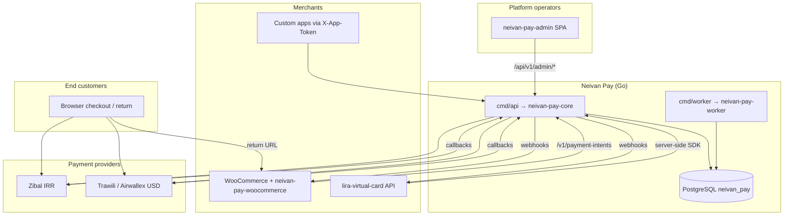
```mermaid
flowchart TB
  subgraph operators["Platform operators"]
    AdminUI["neivan-pay-admin SPA"]
  end

  subgraph merchants["Merchants"]
    Woo["WooCommerce + neivan-pay-woocommerce"]
    LiraVC["lira-virtual-card API"]
    Custom["Custom apps via X-App-Token"]
  end

  subgraph pay["Neivan Pay (Go)"]
    API["cmd/api → neivan-pay-core"]
    Worker["cmd/worker → neivan-pay-worker"]
    PG[("PostgreSQL neivan_pay")]
  end

  subgraph psps["Payment providers"]
    Zibal["Zibal IRR"]
    Trawili["Trawili / Airwallex USD"]
  end

  subgraph shoppers["End customers"]
    Browser["Browser checkout / return"]
  end

  AdminUI -->|"/api/v1/admin/*"| API
  Woo -->|"/v1/payment-intents"| API
  LiraVC -->|server-side SDK| API
  Custom --> API
  API --> PG
  Worker --> PG
  API --> Zibal
  API --> Trawili
  Trawili -->|callbacks| API
  Zibal -->|callbacks| API
  API -->|webhooks| Woo
  API -->|webhooks| LiraVC
  Browser --> Zibal
  Browser --> Trawili
  Browser -->|return URL| Woo
```

### Repositories and roles

| Repository / path | Role |
|-------------------|------|
| `neivan-pay/` | Core payment API + worker + migrations |
| `neivan-pay-admin/` | Operator admin SPA (React/Vite) |
| `neivan-pay-integrations/` | PHP SDK + WooCommerce plugin source |
| `neivan-stageing/services/pay/` | Docker compose for Pay stack on staging |
| `neivan-stageing/services/wc-shop/` | Demo Woo store + mounted plugin |
| `neivan-stageing/infrastructure/haproxy/` | TLS routing (`pgm`, `stg.niwan.net`) |
| `lira-virtual-card/` | Invoicing; calls Pay via `internal/application/invoicing/neivan_pay.go` |
| `Liravirtualmastercardwebapp/` | Cardholder panel; magic pay `/app/pay/l/:token` |
| `new-ui/` | **Separate product** — Lira Cards wallet, not Neivan Pay |

### Staging URLs (reference)

| Surface | URL |
|---------|-----|
| Pay API | `https://pgm.liracards.com/api/v1` |
| Pay Admin | `https://pgm.liracards.com/admin-panel/` |
| OpenAPI / Swagger | `https://pgm.liracards.com/docs/` |
| Woo demo shop | `https://stg.niwan.net/wc/` |
| Virtual card panel | `https://stg.niwan.net/virtual/panel/` |

Docs: `neivan-stageing/docs/pay-pgm-https-selfsigned.md`, `neivan-stageing/services/wc-shop/README.md`

---

## 3. Backend architecture (neivan-pay)

### 3.1 Layer model (ports & adapters)

```
┌─────────────────────────────────────────────────────────────┐
│  delivery/                                                   │
│    httpapi/     — HTTP handlers, middleware, router          │
│    worker/      — 5s tick loop, MultiTickJob               │
└───────────────────────────┬─────────────────────────────────┘
                            │
┌───────────────────────────▼─────────────────────────────────┐
│  application/   — use cases (payment, webhook, fx, tenant…) │
└───────────────────────────┬─────────────────────────────────┘
                            │ depends on
┌───────────────────────────▼─────────────────────────────────┐
│  ports/         — repository & provider interfaces           │
│  domain/        — entities, status constants, rules          │
└───────────────────────────┬─────────────────────────────────┘
                            │ implemented by
┌───────────────────────────▼─────────────────────────────────┐
│  infrastructure/ — postgres, inmemory, providers, fx, webhook│
└─────────────────────────────────────────────────────────────┘

app/ — composition root only (wiring, env, RunAPI / RunWorker)
platform/ — logx, envx, debug, buildinfo
```

**Intended dependency rule:** `delivery → application → ports + domain`; only `app/` and `infrastructure/` know concrete adapters.

**Entry points:**

| Binary | Path | Calls |
|--------|------|-------|
| API | `cmd/api/main.go` | `app.RunAPI()` |
| Worker | `cmd/worker/main.go` | `app.RunWorker()` |
| Migrate CLI | `cmd/migratecli/main.go` | golang-migrate up/down |

**Composition root:** `internal/app/api.go`, `internal/app/worker.go`

### 3.2 Directory reference

```
neivan-pay/
├── cmd/api|worker|migratecli/
├── internal/
│   ├── app/              # Wiring, CORS, repos, provider registry
│   ├── application/
│   │   ├── payment/      # Intents, reconcile, Airwallex poll
│   │   ├── paymentlink/
│   │   ├── webhook/
│   │   ├── fx/
│   │   ├── discovery/
│   │   └── tenant/
│   ├── domain/
│   │   ├── payment/
│   │   ├── paymentlink/
│   │   ├── tenant/
│   │   ├── webhook/
│   │   └── fx/
│   ├── ports/            # 14 interface files
│   ├── infrastructure/
│   │   ├── postgres/
│   │   ├── inmemory/
│   │   ├── providers/
│   │   ├── fx/
│   │   └── webhook/
│   ├── delivery/httpapi/
│   └── delivery/worker/
├── migrations/           # 0001–0022
├── docs/
│   ├── api/openapi.yaml
│   ├── merchant-integration-flow.md
│   └── postman/
├── docker-compose.yml
└── .env.example
```

### 3.3 API surface (router)

All routes under `/v1` — registered in `internal/delivery/httpapi/router.go`.

| Group | Auth | Examples |
|-------|------|----------|
| Health | None | `GET /v1/health`, `/v1/ready` |
| Admin | `X-Admin-Token` + scopes | `/v1/admin/tenants`, `/apps`, `/payment-intents`, `/webhook-subscriptions` |
| Merchant | `X-App-Token` | `/v1/discovery/providers`, `/payment-intents`, `/fx/convert` |
| Public | None | `/v1/l/{slug}`, `/v1/providers/{key}/callbacks`, browser hop pages |

**OpenAPI:** `docs/api/openapi.yaml` — CI validates via `make openapi-validate`, but spec **lags** behind router (FX admin routes, payment links, Airwallex admin ops, admin users).

---

## 4. Features, files, ports, and journeys

### 4.1 Feature matrix

| Feature | Application layer | Domain | Infrastructure | HTTP handlers |
|---------|-------------------|--------|----------------|---------------|
| **Tenants & apps** | `application/tenant/` | `domain/tenant/` | `postgres/tenant_repository.go` | `tenant_handlers.go`, `token_handlers.go` |
| **Admin users & login** | `application/tenant/` | `domain/tenant/` | postgres + in-memory rate limit | `admin_auth_handlers.go`, `admin_user_handlers.go` |
| **Provider routes** | `application/tenant/route_resolve.go` | tenant domain | `provider_route_repository.go` | `provider_route_handlers.go` |
| **Payment intents** | `application/payment/service.go` | `domain/payment/` | `payment_intent_repository.go` | `payment_handlers.go` |
| **Provider callbacks** | payment finalize | payment domain | `providers/*`, `provider_callback_repository.go` | callback/verify handlers |
| **Payment links** | `application/paymentlink/` | `domain/paymentlink/` | `payment_link_repository.go` | `payment_link_*.go` |
| **Discovery** | `application/discovery/` | — | uses routes + optional FX | `discovery_handlers.go` |
| **FX** | `application/fx/` | `domain/fx/` | `infrastructure/fx/`, `fx_repository.go` | `fx_handlers.go` |
| **Webhooks out** | `application/webhook/` | `domain/webhook/` | `webhook/http_sender.go` | subscription + delivery handlers |
| **PSP adapters** | via `ports.PaymentProvider` | — | `infrastructure/providers/` | zibal/trawili browser hops |

### 4.2 Ports (`internal/ports/`)

These are the **stable contracts** between application and infrastructure:

| Port | File | Responsibility |
|------|------|----------------|
| `TenantRepository` | `tenant_repository.go` | Tenants, apps, tokens, admin users |
| `PaymentIntentRepository` | `payment_intent_repository.go` | Intents & attempts CRUD |
| `PaymentIntentPollRepository` | `provider_status_check_repository.go` | Airwallex poll scheduling fields |
| `PaymentLinkRepository` | `payment_link_repository.go` | Shareable links |
| `ProviderRouteRepository` | `provider_route_repository.go` | Currency → provider routing |
| `ProviderCallbackRepository` | `provider_callback_repository.go` | Idempotent callback dedup |
| `ProviderCallbackVerifier` | `provider_callback_verifier.go` | Signature verification |
| `ProviderCallbackParser` | `provider_callback_parser.go` | Parse provider payloads |
| `ProviderStatusCheckRepository` | `provider_status_check_repository.go` | Poll audit trail |
| `PaymentProvider` / `PaymentProviderRegistry` | `payment_provider.go` | Authorize + registry lookup |
| `WebhookSubscriptionRepository` | `webhook_subscription_repository.go` | Merchant webhook config |
| `WebhookDeliveryRepository` | `webhook_delivery_repository.go` | Outbound delivery queue |
| `WebhookSender` | `webhook_sender.go` | HTTP POST to merchant |
| `FXRepository` | `fx_repository.go` | Settings, rate cache, quotas |
| `IdempotencyRepository` | `idempotency_repository.go` | `Idempotency-Key` dedup |

### 4.3 Application-local interfaces (not in `ports/`)

Some features define interfaces inline — worth discussing in review:

| Interface | Location | Purpose |
|-----------|----------|---------|
| `tenantUseCases`, `paymentUseCases`, … | `delivery/httpapi/handler_types.go` | Handler-facing use case surface |
| `discovery.FxConverter` | `application/discovery/service.go` | Optional FX quotes in discovery |
| `fxapp.frankfurterClient`, `tetherlandClient` | `application/fx/service.go` | Upstream FX clients |
| `payment.TrawiliOrderChecker` | reconcile jobs | Trawili order_check fallback |
| `payment.AirwallexGetRequestClient` | `airwallex_status.go` | Poll getrequest API |

### 4.4 Payment providers

| `provider_key` | Implementation | Production readiness |
|----------------|----------------|----------------------|
| `zibal` | `infrastructure/providers/adapters.go` | Real when `ZIBAL_*` env set |
| `trawili_airwallex` | `trawili_provider.go` | USD card via Trawili |
| `trawili_moneyro` | `trawili_provider.go` | International |
| `trawili_ir`, `trawili_ir_wallet` | `trawili_provider.go` | Iran rails |
| `sep`, `pay4` | `adapters.go` | Stub-only |

Registry: `infrastructure/providers/registry.go`  
Catalog metadata: `application/tenant/provider_catalog.go`

### 4.5 Feature architecture diagrams (visual guide)

Use these diagrams in the review session to explain **what each feature does**, **which code layer owns it**, and **how data moves**. All paths are relative to `neivan-pay/` unless noted.

---

#### Diagram 0 — Feature landscape (who uses what)

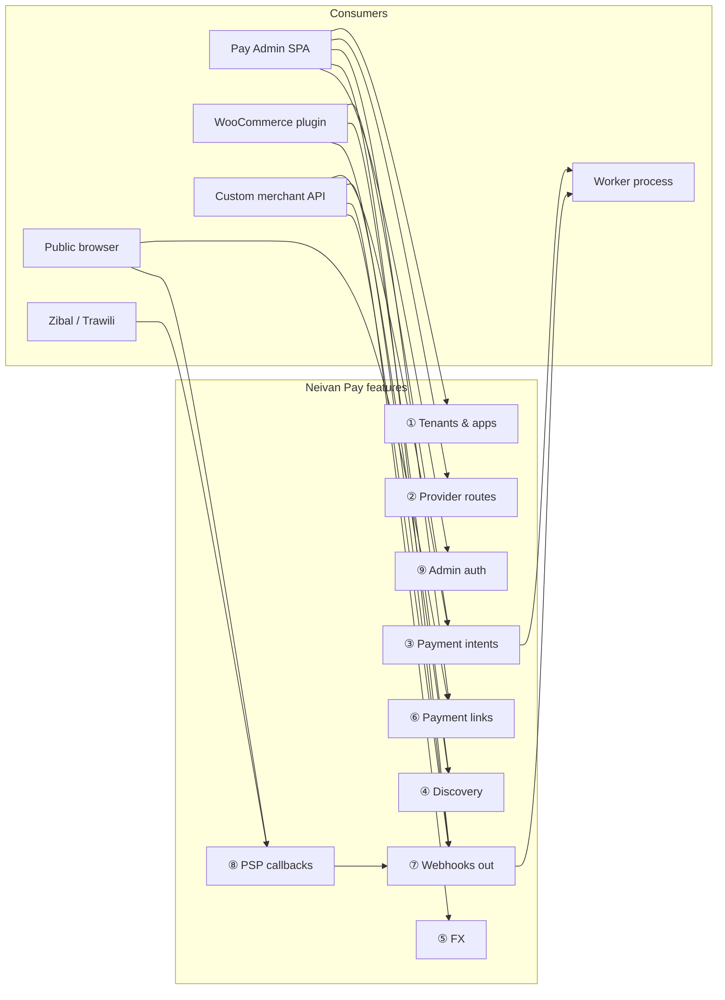
```mermaid
flowchart LR
  subgraph features["Neivan Pay features"]
    F1["① Tenants & apps"]
    F2["② Provider routes"]
    F3["③ Payment intents"]
    F4["④ Discovery"]
    F5["⑤ FX"]
    F6["⑥ Payment links"]
    F7["⑦ Webhooks out"]
    F8["⑧ PSP callbacks"]
    F9["⑨ Admin auth"]
  end

  subgraph consumers["Consumers"]
    Admin["Pay Admin SPA"]
    Woo["WooCommerce plugin"]
    API["Custom merchant API"]
    Public["Public browser"]
    PSP["Zibal / Trawili"]
    Worker["Worker process"]
  end

  Admin --> F1 & F2 & F6 & F7 & F9
  Woo --> F3 & F4 & F7
  API --> F3 & F4 & F5 & F7
  Public --> F6 & F8
  PSP --> F8
  F3 --> Worker
  F7 --> Worker
  F8 --> F7
```

| # | Feature | Primary user | Truth stored in |
|---|---------|--------------|-----------------|
| ① | Tenants, apps, tokens | Operator (admin) | `tenants`, `tenant_apps`, `tenant_api_keys` |
| ② | Provider routes | Operator | `provider_routes` |
| ③ | Payment intents | Merchant integration | `payment_intents`, `payment_attempts` |
| ④ | Discovery | Merchant (pre-checkout) | Routes + optional FX quote |
| ⑤ | FX | Merchant / admin | `fx_rate_cache`, `platform_settings` |
| ⑥ | Payment links | Operator creates; public redeems | `payment_links` |
| ⑦ | Webhooks out | Merchant endpoint | `webhook_deliveries` |
| ⑧ | PSP callbacks | Payment providers | `provider_callbacks` + intent status |
| ⑨ | Admin auth | Operator login | `admin_users` + session token |

---

#### Diagram 1 — Clean architecture slice (same pattern for every feature)

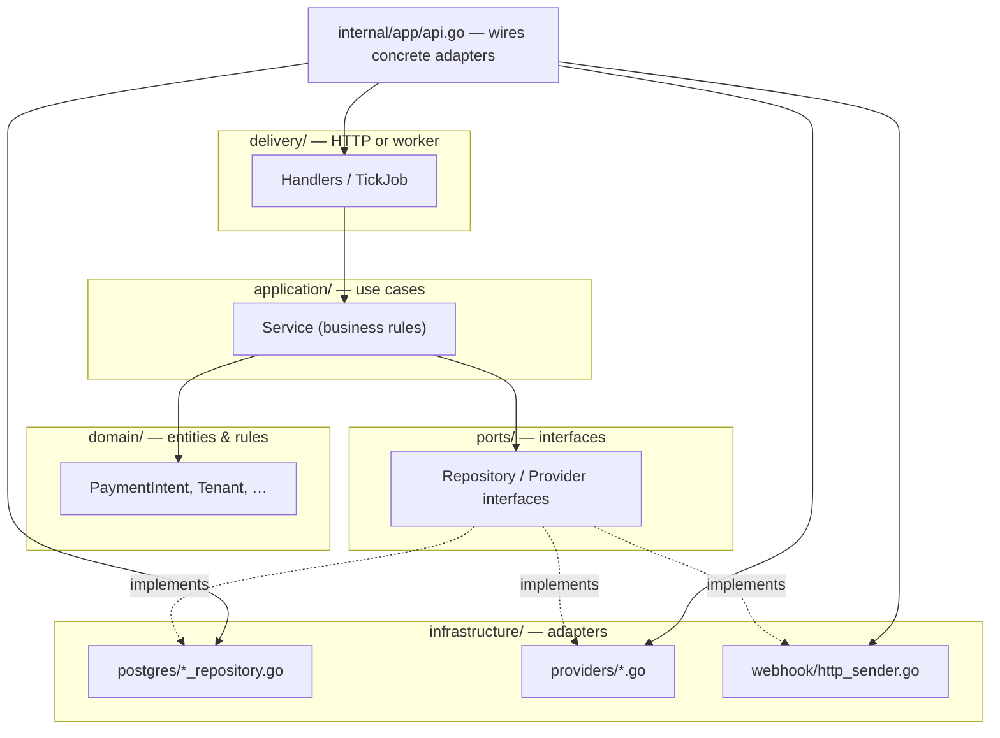
```mermaid
flowchart TB
  subgraph delivery["delivery/ — HTTP or worker"]
    H["Handlers / TickJob"]
  end

  subgraph application["application/ — use cases"]
    S["Service (business rules)"]
  end

  subgraph domain["domain/ — entities & rules"]
    E["PaymentIntent, Tenant, …"]
  end

  subgraph ports["ports/ — interfaces"]
    P["Repository / Provider interfaces"]
  end

  subgraph infrastructure["infrastructure/ — adapters"]
    PG["postgres/*_repository.go"]
    PSP["providers/*.go"]
    HTTP["webhook/http_sender.go"]
  end

  H --> S
  S --> E
  S --> P
  P -.->|implements| PG
  P -.->|implements| PSP
  P -.->|implements| HTTP

  APP["internal/app/api.go — wires concrete adapters"]
  APP --> H
  APP --> PG & PSP & HTTP
```

**Rule of thumb:** handlers never call Postgres directly; they call `application/*` services, which call `ports/*`.

---

#### Diagram 2 — Feature ① Tenants, apps & API tokens

**Purpose:** Isolate merchants (tenants), give each integration an **app** (return URL, routes, FX flag), and issue **API tokens** for `X-App-Token`.

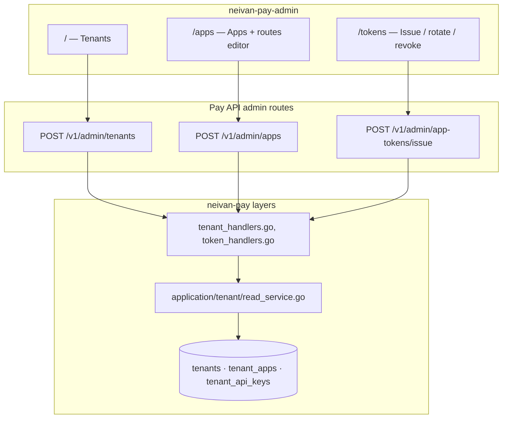
```mermaid
flowchart TB
  subgraph admin_ui["neivan-pay-admin"]
    T["/ — Tenants"]
    A["/apps — Apps + routes editor"]
    K["/tokens — Issue / rotate / revoke"]
  end

  subgraph api_admin["Pay API admin routes"]
    R1["POST /v1/admin/tenants"]
    R2["POST /v1/admin/apps"]
    R3["POST /v1/admin/app-tokens/issue"]
  end

  subgraph layers["neivan-pay layers"]
    H["tenant_handlers.go, token_handlers.go"]
    S["application/tenant/read_service.go"]
    DB[("tenants · tenant_apps · tenant_api_keys")]
  end

  T --> R1
  A --> R2
  K --> R3
  R1 & R2 & R3 --> H --> S --> DB
```

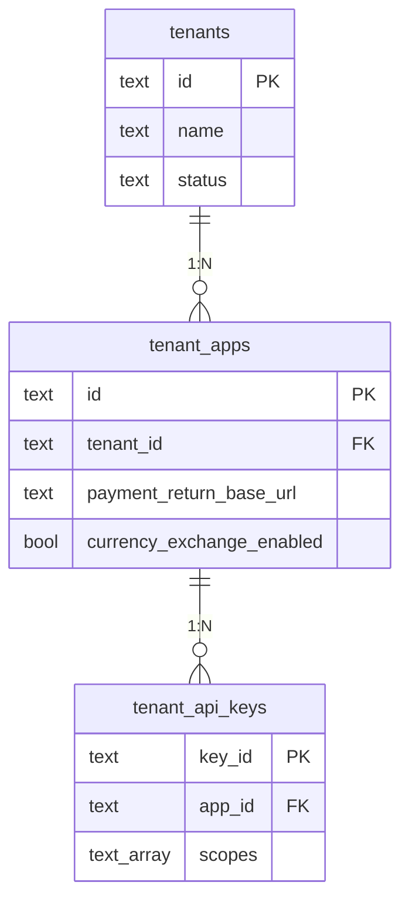
```mermaid
erDiagram
  tenants ||--o{ tenant_apps : "1:N"
  tenant_apps ||--o{ tenant_api_keys : "1:N"
  tenants {
    text id PK
    text name
    text status
  }
  tenant_apps {
    text id PK
    text tenant_id FK
    text payment_return_base_url
    bool currency_exchange_enabled
  }
  tenant_api_keys {
    text key_id PK
    text app_id FK
    text_array scopes
  }
```

**Merchant journey touchpoint:** Operator creates tenant → app (with `payment_return_base_url`) → issues token → merchant pastes token into Woo or custom app.

---

#### Diagram 3 — Feature ② Provider routing

**Purpose:** For a given **app + currency**, decide which PSP(s) are available and in what order.

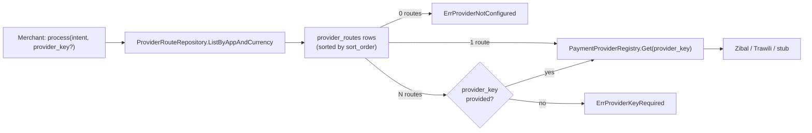
```mermaid
flowchart LR
  REQ["Merchant: process(intent, provider_key?)"]
  LOOKUP["ProviderRouteRepository.ListByAppAndCurrency"]
  ROUTES["provider_routes rows\n(sorted by sort_order)"]
  REG["PaymentProviderRegistry.Get(provider_key)"]
  PSP["Zibal / Trawili / stub"]

  REQ --> LOOKUP --> ROUTES
  ROUTES -->|"0 routes"| ERR["ErrProviderNotConfigured"]
  ROUTES -->|"1 route"| REG
  ROUTES -->|"N routes"| KEY{"provider_key\nprovided?"}
  KEY -->|yes| REG
  KEY -->|no| ERR2["ErrProviderKeyRequired"]
  REG --> PSP
```

| File | Role |
|------|------|
| `application/tenant/route_resolve.go` | Resolve route for intent |
| `application/tenant/provider_catalog.go` | Labels, flow_type metadata |
| `postgres/provider_route_repository.go` | Persist routes |
| Migration `0014` | Multiple providers per currency + `sort_order` |
| Migration `0013` | Seed default IRR → Zibal for all apps |

---

#### Diagram 4 — Feature ③ Payment intents (lifecycle)

**Purpose:** Represent a single charge attempt from creation through PSP authorization to final status.

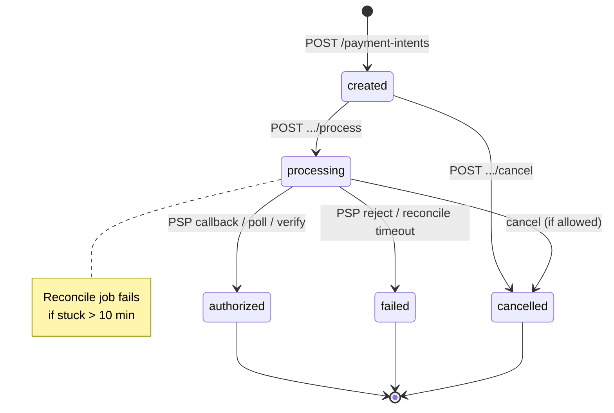
```mermaid
stateDiagram-v2
  [*] --> created: POST /payment-intents
  created --> processing: POST .../process
  created --> cancelled: POST .../cancel
  processing --> authorized: PSP callback / poll / verify
  processing --> failed: PSP reject / reconcile timeout
  processing --> cancelled: cancel (if allowed)
  authorized --> [*]
  failed --> [*]
  cancelled --> [*]

  note right of processing
    Reconcile job fails
    if stuck > 10 min
  end note
```

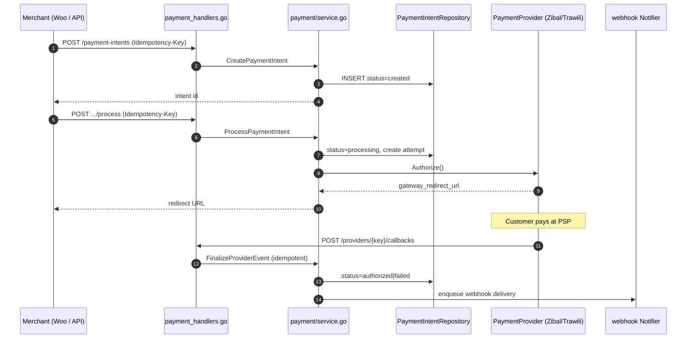
```mermaid
sequenceDiagram
  autonumber
  participant M as Merchant (Woo / API)
  participant H as payment_handlers.go
  participant S as payment/service.go
  participant R as PaymentIntentRepository
  participant P as PaymentProvider (Zibal/Trawili)
  participant W as webhook Notifier

  M->>H: POST /payment-intents (Idempotency-Key)
  H->>S: CreatePaymentIntent
  S->>R: INSERT status=created
  S-->>M: intent id

  M->>H: POST .../process (Idempotency-Key)
  H->>S: ProcessPaymentIntent
  S->>R: status=processing, create attempt
  S->>P: Authorize()
  P-->>S: gateway_redirect_url
  S-->>M: redirect URL

  Note over P: Customer pays at PSP
  P->>H: POST /providers/{key}/callbacks
  H->>S: FinalizeProviderEvent (idempotent)
  S->>R: status=authorized|failed
  S->>W: enqueue webhook delivery
```

| Layer | Files |
|-------|-------|
| HTTP | `delivery/httpapi/payment_handlers.go` |
| Use case | `application/payment/service.go`, `transition_policy.go` |
| Domain | `domain/payment/` (status constants) |
| Port | `ports/payment_intent_repository.go`, `payment_provider.go` |
| Adapter | `postgres/payment_intent_repository.go`, `providers/registry.go` |

---

#### Diagram 5 — Feature ④ Discovery

**Purpose:** Before creating an intent, merchant asks **which providers and currencies** are available for this app (and optional amount).

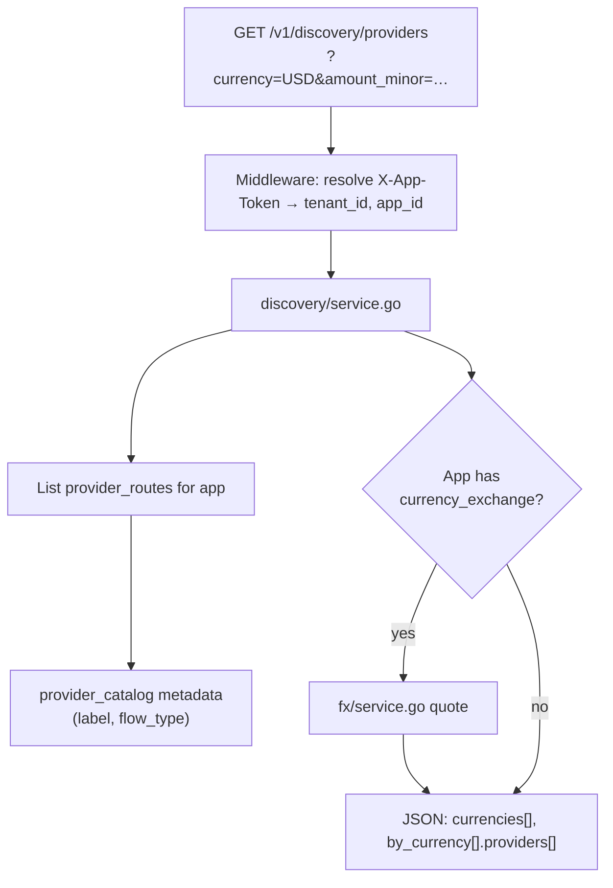
```mermaid
flowchart TB
  REQ["GET /v1/discovery/providers\n?currency=USD&amount_minor=…"]
  AUTH["Middleware: resolve X-App-Token → tenant_id, app_id"]
  SVC["discovery/service.go"]
  ROUTES["List provider_routes for app"]
  CAT["provider_catalog metadata\n(label, flow_type)"]
  FX{"App has\ncurrency_exchange?"}
  FXSVC["fx/service.go quote"]
  RESP["JSON: currencies[], by_currency[].providers[]"]

  REQ --> AUTH --> SVC --> ROUTES --> CAT
  SVC --> FX
  FX -->|yes| FXSVC --> RESP
  FX -->|no| RESP
```

**Woo usage:** `DiscoverCheckoutOptions.php` (server-side) → receipt page shows provider picker when `provider_count > 1`.

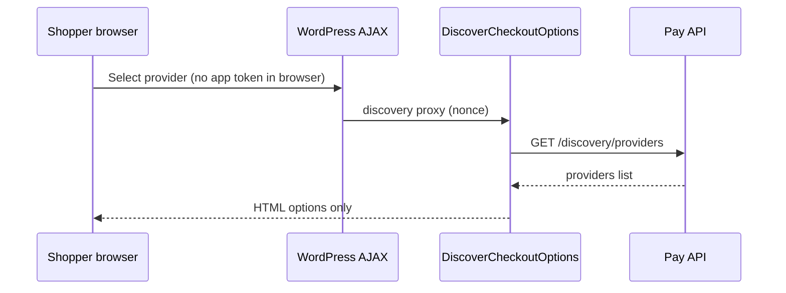
```mermaid
sequenceDiagram
  participant Browser as Shopper browser
  participant WP as WordPress AJAX
  participant D as DiscoverCheckoutOptions
  participant API as Pay API

  Browser->>WP: Select provider (no app token in browser)
  WP->>D: discovery proxy (nonce)
  D->>API: GET /discovery/providers
  API-->>D: providers list
  D-->>Browser: HTML options only
```

---

#### Diagram 6 — Feature ⑤ FX (foreign exchange)

**Purpose:** Convert amounts between currencies using upstream rates (Frankfurter fiat, Tetherland USDT/IRR) with **cache** and **quotas**.

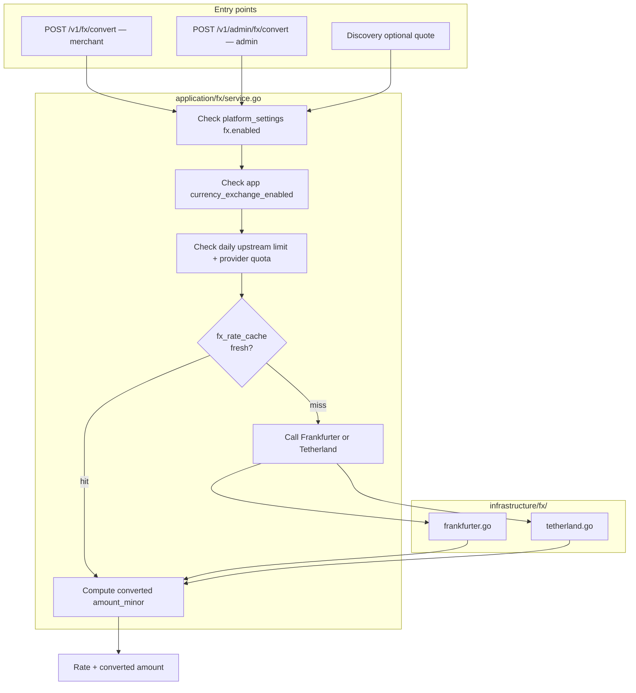
```mermaid
flowchart TB
  subgraph entry["Entry points"]
    M["POST /v1/fx/convert — merchant"]
    A["POST /v1/admin/fx/convert — admin"]
    D["Discovery optional quote"]
  end

  subgraph fx_app["application/fx/service.go"]
    Q1["Check platform_settings fx.enabled"]
    Q2["Check app currency_exchange_enabled"]
    Q3["Check daily upstream limit + provider quota"]
    CACHE{"fx_rate_cache\nfresh?"}
    UP["Call Frankfurter or Tetherland"]
    CALC["Compute converted amount_minor"]
  end

  subgraph infra["infrastructure/fx/"]
    FF["frankfurter.go"]
    TT["tetherland.go"]
  end

  M & A & D --> Q1 --> Q2 --> Q3 --> CACHE
  CACHE -->|hit| CALC
  CACHE -->|miss| UP --> FF & TT --> CALC
  CALC --> RESP["Rate + converted amount"]
```

| Storage | Purpose |
|---------|---------|
| `platform_settings` | `fx.enabled`, `fx.upstream_daily_limit`, quotas |
| `fx_rate_cache` | Cached rates per provider/base/quote |
| `fx_upstream_usage` | Daily upstream call counter |
| `fx_provider_usage` | Per-provider monthly quota (migration 0021) |

---

#### Diagram 7 — Feature ⑥ Payment links

**Purpose:** Operator creates a **shareable URL**; payer opens it without an app token; Pay creates an intent and redirects to PSP.

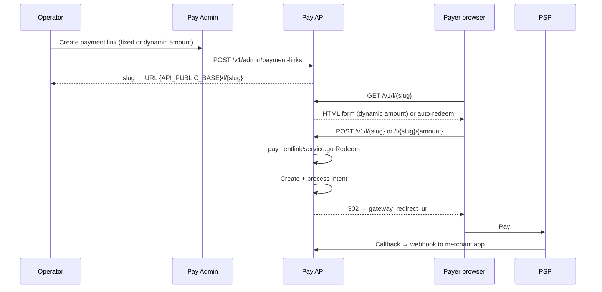
```mermaid
sequenceDiagram
  participant Op as Operator
  participant Admin as Pay Admin
  participant API as Pay API
  participant Payer as Payer browser
  participant PSP as PSP

  Op->>Admin: Create payment link (fixed or dynamic amount)
  Admin->>API: POST /v1/admin/payment-links
  API-->>Op: slug → URL {API_PUBLIC_BASE}/l/{slug}

  Payer->>API: GET /v1/l/{slug}
  API-->>Payer: HTML form (dynamic amount) or auto-redeem
  Payer->>API: POST /v1/l/{slug} or /l/{slug}/{amount}
  API->>API: paymentlink/service.go Redeem
  API->>API: Create + process intent
  API-->>Payer: 302 → gateway_redirect_url
  Payer->>PSP: Pay
  PSP->>API: Callback → webhook to merchant app
```

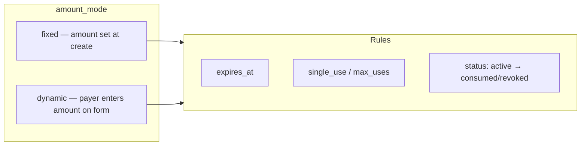
```mermaid
flowchart LR
  subgraph modes["amount_mode"]
    FIXED["fixed — amount set at create"]
    DYN["dynamic — payer enters amount on form"]
  end

  subgraph guards["Rules"]
    EXP["expires_at"]
    USE["single_use / max_uses"]
    STAT["status: active → consumed/revoked"]
  end

  FIXED & DYN --> guards
```

| Layer | Files |
|-------|-------|
| Application | `application/paymentlink/service.go` |
| HTTP | `payment_link_handlers.go`, `payment_link_page.go` |
| Table | `payment_links` (migration 0016) |

---

#### Diagram 8 — Feature ⑦ Outbound webhooks

**Purpose:** Notify merchant systems when a payment intent reaches a **final** state (HMAC-signed JSON).

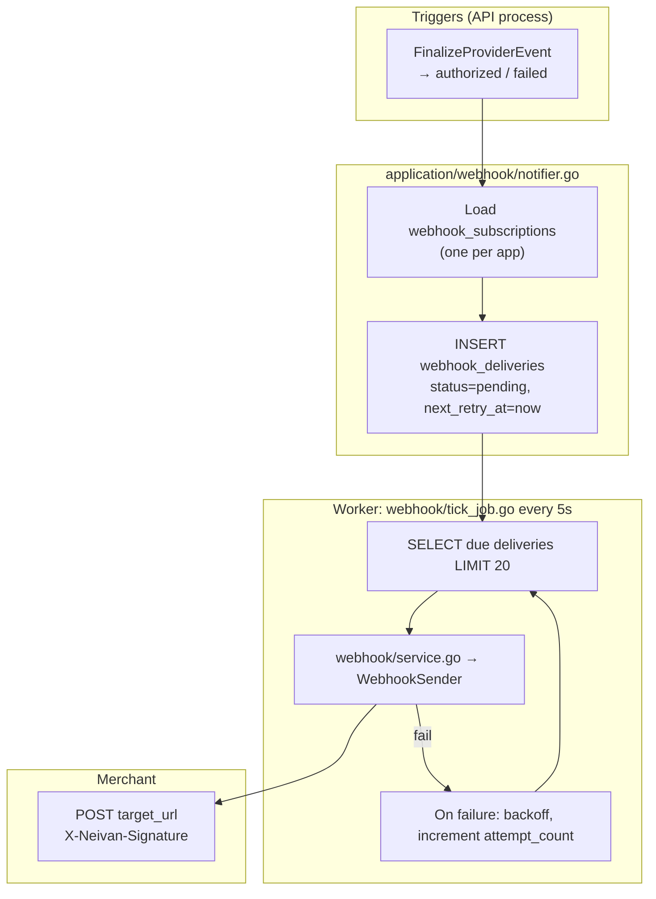
```mermaid
flowchart TB
  subgraph trigger["Triggers (API process)"]
    FIN["FinalizeProviderEvent\n→ authorized / failed"]
  end

  subgraph enqueue["application/webhook/notifier.go"]
    SUB["Load webhook_subscriptions\n(one per app)"]
    INS["INSERT webhook_deliveries\nstatus=pending, next_retry_at=now"]
  end

  subgraph worker_job["Worker: webhook/tick_job.go every 5s"]
    PICK["SELECT due deliveries LIMIT 20"]
    SEND["webhook/service.go → WebhookSender"]
    RETRY["On failure: backoff, increment attempt_count"]
  end

  subgraph merchant["Merchant"]
    EP["POST target_url\nX-Neivan-Signature"]
  end

  FIN --> SUB --> INS
  INS --> PICK --> SEND --> EP
  SEND -->|fail| RETRY --> PICK
```

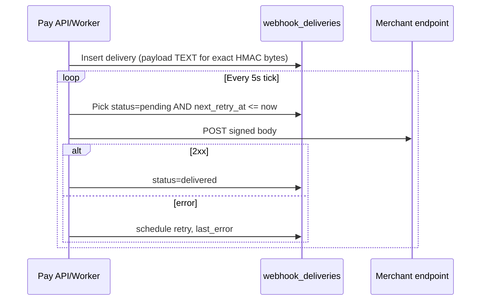
```mermaid
sequenceDiagram
  participant Pay as Pay API/Worker
  participant DB as webhook_deliveries
  participant M as Merchant endpoint

  Pay->>DB: Insert delivery (payload TEXT for exact HMAC bytes)
  loop Every 5s tick
    Pay->>DB: Pick status=pending AND next_retry_at <= now
    Pay->>M: POST signed body
    alt 2xx
      Pay->>DB: status=delivered
    else error
      Pay->>DB: schedule retry, last_error
    end
  end
```

**Admin oversight:** `/webhook-deliveries` — replay via `POST .../replay`.

---

#### Diagram 9 — Feature ⑧ PSP callbacks & browser return

**Purpose:** PSP tells Pay the payment outcome; Pay deduplicates events and finalizes the intent.

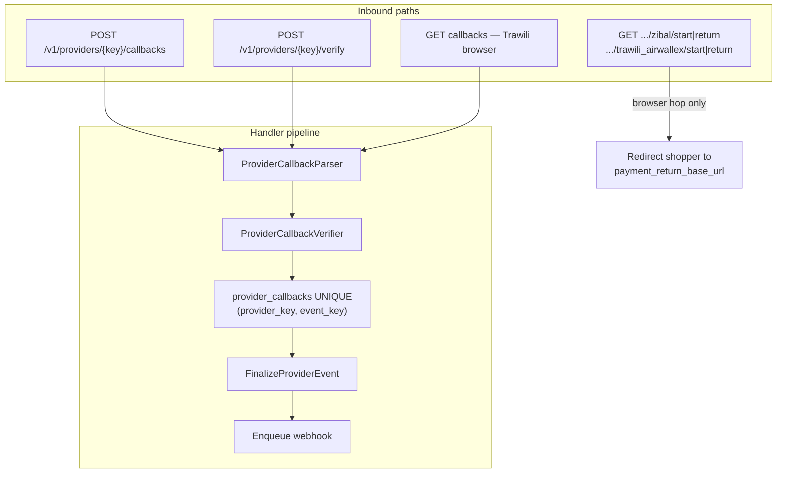
```mermaid
flowchart TB
  subgraph inbound["Inbound paths"]
    CB["POST /v1/providers/{key}/callbacks"]
    VF["POST /v1/providers/{key}/verify"]
    BR["GET callbacks — Trawili browser"]
    HOP["GET .../zibal/start|return\n.../trawili_airwallex/start|return"]
  end

  subgraph pipeline["Handler pipeline"]
    PARSE["ProviderCallbackParser"]
    VERIFY["ProviderCallbackVerifier"]
    DEDUP["provider_callbacks UNIQUE\n(provider_key, event_key)"]
    FIN["FinalizeProviderEvent"]
    WH["Enqueue webhook"]
  end

  CB & VF & BR --> PARSE --> VERIFY --> DEDUP --> FIN --> WH
  HOP -->|"browser hop only"| REDIR["Redirect shopper to\npayment_return_base_url"]
```

| Path type | Authoritative for paid status? |
|-----------|-------------------------------|
| Server callback (`POST callbacks`) | **Yes** (with verify) |
| Browser return (`GET return`, `?neivan_pay_return=1`) | **No** — UX only |
| Webhook to merchant | **Yes** for merchant order state |

---

#### Diagram 10 — Feature ⑨ Admin authentication

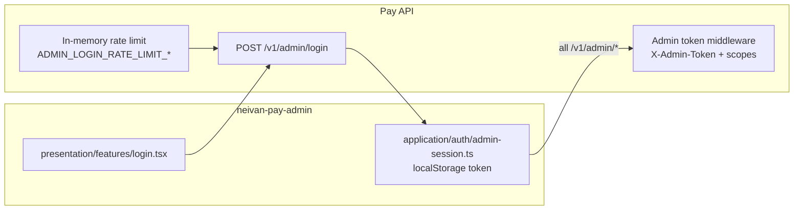
```mermaid
flowchart LR
  subgraph admin_spa["neivan-pay-admin"]
    LOGIN["presentation/features/login.tsx"]
    SESS["application/auth/admin-session.ts\nlocalStorage token"]
  end

  subgraph pay_api["Pay API"]
    AUTH["POST /v1/admin/login"]
    GUARD["Admin token middleware\nX-Admin-Token + scopes"]
    RATE["In-memory rate limit\nADMIN_LOGIN_RATE_LIMIT_*"]
  end

  LOGIN --> AUTH
  RATE --> AUTH
  AUTH --> SESS
  SESS -->|"all /v1/admin/*"| GUARD
```

---

#### Diagram 11 — Worker: how background jobs share one tick

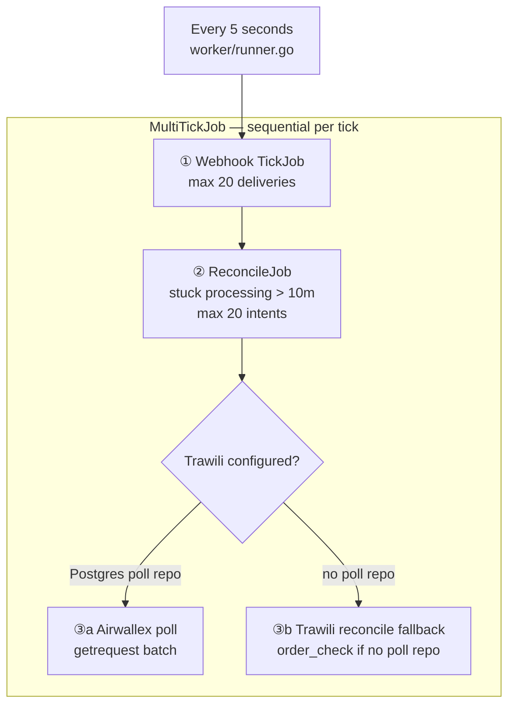
```mermaid
flowchart TB
  TICK["Every 5 seconds\nworker/runner.go"]

  subgraph jobs["MultiTickJob — sequential per tick"]
    J1["① Webhook TickJob\nmax 20 deliveries"]
    J2["② ReconcileJob\nstuck processing > 10m\nmax 20 intents"]
    J3{"Trawili configured?"}
    J4["③a Airwallex poll\ngetrequest batch"]
    J5["③b Trawili reconcile fallback\norder_check if no poll repo"]
  end

  TICK --> J1 --> J2 --> J3
  J3 -->|Postgres poll repo| J4
  J3 -->|no poll repo| J5
```

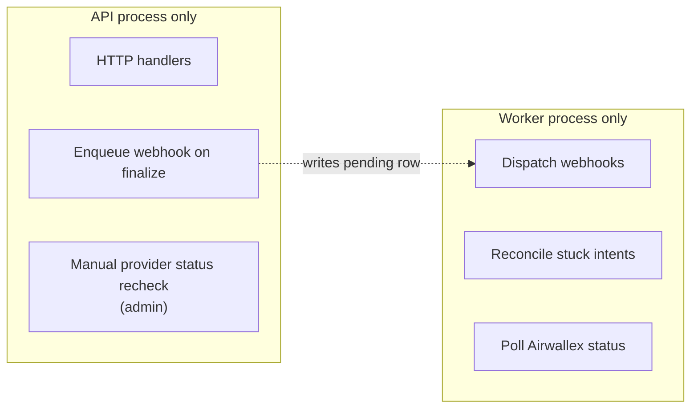
```mermaid
flowchart LR
  subgraph api_only["API process only"]
    A1["HTTP handlers"]
    A2["Enqueue webhook on finalize"]
    A3["Manual provider status recheck\n(admin)"]
  end

  subgraph worker_only["Worker process only"]
    W1["Dispatch webhooks"]
    W2["Reconcile stuck intents"]
    W3["Poll Airwallex status"]
  end

  A2 -.->|"writes pending row"| W1
```

---

#### Diagram 12 — WooCommerce plugin (feature wiring)

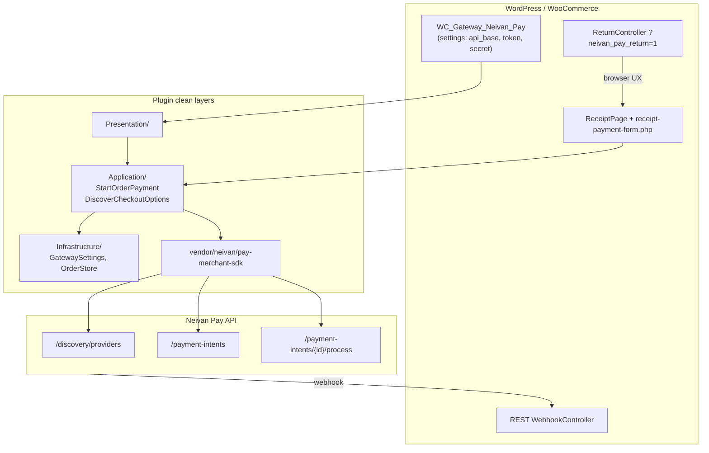
```mermaid
flowchart TB
  subgraph wp["WordPress / WooCommerce"]
    GW["WC_Gateway_Neivan_Pay\n(settings: api_base, token, secret)"]
    RCPT["ReceiptPage + receipt-payment-form.php"]
    WH["REST WebhookController"]
    RET["ReturnController ?neivan_pay_return=1"]
  end

  subgraph plugin_layers["Plugin clean layers"]
    PRES["Presentation/"]
    APP["Application/\nStartOrderPayment\nDiscoverCheckoutOptions"]
    INF["Infrastructure/\nGatewaySettings, OrderStore"]
    SDK["vendor/neivan/pay-merchant-sdk"]
  end

  subgraph pay["Neivan Pay API"]
    DISC["/discovery/providers"]
    INT["/payment-intents"]
    PROC["/payment-intents/{id}/process"]
  end

  GW --> PRES --> APP --> SDK
  APP --> INF
  RCPT --> APP
  SDK --> DISC & INT & PROC
  pay -->|webhook| WH
  RET -->|browser UX| RCPT
```

```mermaid
sequenceDiagram
  participant C as Customer
  participant R as Receipt page
  participant S as StartOrderPayment
  participant API as Pay API
  participant Z as Zibal

  C->>R: Choose provider, submit
  R->>S: execute(order, provider_key, discovery)
  S->>API: POST payment-intents (idempotency wc-{order}-{attempt})
  S->>API: POST process
  API-->>C: HTTP redirect to Z
  C->>Z: Pay
  Z->>API: Callback
  API->>R: Webhook updates order status
  C->>R: Return URL (thank you / processing)
```

---

#### Diagram 13 — Pay Admin UI: screen → API mapping

```mermaid
flowchart LR
  subgraph screens["neivan-pay-admin routes"]
    S1["/ Tenants"]
    S2["/apps"]
    S3["/tokens"]
    S4["/payment-intents"]
    S5["/payment-links"]
    S6["/webhook-subscriptions"]
    S7["/webhook-deliveries"]
    S8["/fx/tools"]
    S9["/providers/health"]
  end

  subgraph apis["Pay API /v1/admin"]
    A1["/tenants"]
    A2["/apps"]
    A3["/app-tokens/*"]
    A4["/payment-intents"]
    A5["/payment-links"]
    A6["/webhook-subscriptions"]
    A7["/webhook-deliveries"]
    A8["/fx/*"]
    A9["/providers/health"]
  end

  S1 --> A1
  S2 --> A2
  S3 --> A3
  S4 --> A4
  S5 --> A5
  S6 --> A6
  S7 --> A7
  S8 --> A8
  S9 --> A9
```

**Data flow in admin SPA:**

```mermaid
flowchart TB
  UI["presentation/features/*.tsx"]
  UC["application/use-cases/*.ts"]
  REPO["domain/contracts/admin-repository.ts"]
  HTTP["infrastructure/http-admin-repository.ts"]
  API["Pay API"]

  UI --> UC --> REPO
  REPO -.->|implements| HTTP --> API
```

---

#### Diagram 14 — End-to-end: one payment, all features touched

```mermaid
flowchart TB
  START(["Operator setup\n① tenant ② app ③ token ④ routes ⑤ webhook"])

  START --> MERCH["Merchant integration"]

  MERCH --> DISC["④ Discovery\nwhich PSP?"]
  DISC --> CREATE["③ Create intent"]
  CREATE --> PROC["③ Process → PSP redirect"]
  PROC --> PSP["⑧ PSP callback"]
  PSP --> FINAL["③ Finalize intent"]
  FINAL --> WH["⑦ Webhook queue"]
  WH --> WORK["Worker ① dispatch webhook"]
  WORK --> MERCH_OK["Merchant marks order paid"]
  PROC --> BROW["⑧ Browser return\n(UX only)"]
  BROW --> MERCH_OK

  style START fill:#e8f4fc
  style MERCH_OK fill:#e8fce8
```

---

### 4.6 User journeys

#### Journey A — Platform operator (Pay Admin)

```mermaid
sequenceDiagram
  participant Op as Operator
  participant Admin as neivan-pay-admin
  participant API as neivan-pay API

  Op->>Admin: Login (/admin-panel/)
  Admin->>API: POST /v1/admin/login
  API-->>Admin: X-Admin-Token (session)
  Op->>Admin: Create tenant, app, issue token
  Op->>Admin: Set payment_return_base_url, provider routes
  Op->>Admin: Create webhook subscription (target + secret)
  Op->>Admin: Monitor payment intents, webhook deliveries
```

**Landing in admin UI:** routes in `neivan-pay-admin/src/presentation/App.tsx` — tenants, apps, tokens, provider health, FX tools, payment intents, payment links, webhook subscriptions/deliveries, admin users.

#### Journey B — WooCommerce merchant + shopper

```mermaid
sequenceDiagram
  participant Shop as WC admin
  participant Cust as Customer
  participant Plugin as neivan-pay-woocommerce
  participant API as Neivan Pay
  participant PSP as Zibal/Airwallex

  Shop->>Plugin: API URL, app token, webhook secret
  Shop->>API: (via Pay Admin) app + webhook + return base
  Cust->>Plugin: Place order, Neivan Pay gateway
  Plugin->>API: discovery → create intent → process
  API-->>Cust: Redirect gateway_redirect_url
  Cust->>PSP: Pay
  PSP->>API: Callback
  API->>Plugin: Webhook (authoritative)
  Cust->>Plugin: Browser return ?neivan_pay_return=1
```

**Key files (Woo):**

- `StartOrderPayment.php` — create + process intent
- `ReceiptPage.php` + `views/receipt-payment-form.php` — shopper provider picker
- `WebhookController.php` — `POST /wp-json/neivan-pay/v1/webhook`
- `ReturnController.php` — browser return handling

**Rule:** Each integration needs **its own Pay app** — shared apps break `payment_return_base_url` (documented in `wc-shop/README.md`).

#### Journey C — Payment link (hosted by Pay API)

1. Operator creates link in admin → public URL `{API_PUBLIC_BASE_URL}/l/{slug}` (slug path on API host).
2. Payer opens link → server-rendered HTML (`payment_link_page.go`).
3. Redeem → redirect to PSP; same callback/webhook path as API merchants.

No separate frontend repo — HTML from Go handlers.

#### Journey D — Lira virtual card invoicing

1. Invoice created in `lira-virtual-card`.
2. Payer uses `Liravirtualmastercardwebapp` (`MagicPayCheckout.tsx`, `/app/pay/l/:token`).
3. Panel API calls Pay **server-side** — not from browser with app token.
4. Return URL must match **virtual-card app** in Pay Admin (not Woo app).

#### Journey E — Custom merchant (REST)

Documented in `neivan-pay/docs/merchant-integration-flow.md`:

1. `GET /v1/discovery/providers`
2. `POST /v1/payment-intents` (+ `Idempotency-Key`)
3. `POST /v1/payment-intents/{id}/process`
4. Redirect customer to `gateway_redirect_url`
5. **Webhook** `payment.intent.finalized` is source of truth; browser return is UX only.

Postman: `docs/postman/Neivan-Pay.postman_collection.json`

---

## 5. Admin frontend (neivan-pay-admin)

### 5.1 Structure (clean architecture)

```
neivan-pay-admin/src/
├── domain/
│   ├── contracts/admin-repository.ts   # Port for all admin API ops
│   └── entities/admin-resources.ts
├── application/
│   ├── use-cases/          # React hooks wrapping repository
│   └── auth/admin-session.ts
├── infrastructure/api/
│   ├── client/http-client.ts
│   └── repositories/
│       ├── http-admin-repository.ts
│       ├── mock-admin-repository.ts
│       └── admin-repository-factory.ts
└── presentation/
    ├── App.tsx             # Routes
    └── features/           # Screen components
```

### 5.2 Routes and features

| Route | Feature file | Pay API area |
|-------|--------------|--------------|
| `/` | `tenant-list.tsx` | `/v1/admin/tenants` |
| `/apps` | `app-list.tsx`, `provider-routes-editor.tsx` | apps, provider routes, return URL |
| `/tokens` | `token-list.tsx` | app token issue/rotate/revoke |
| `/providers/health` | `provider-health-list.tsx` | provider health |
| `/fx/tools` | `fx-tools.tsx` | FX admin |
| `/payment-intents` | `payment-intent-list.tsx` | intent list |
| `/payment-intents/:id` | `payment-intent-detail.tsx` | detail, attempts, recheck |
| `/payment-links` | `payment-link-list.tsx` | payment links |
| `/webhook-subscriptions` | `webhook-subscription-list.tsx` | subscriptions |
| `/webhook-deliveries` | `webhook-delivery-list.tsx` | deliveries + replay |
| `/admin-users` | `admin-user-list.tsx` | admin users |
| login | `login.tsx` | `POST /v1/admin/login` |

**i18n:** English + Persian (RTL) — `src/i18n/en|fa/common.json`

**Auth:** Session token in `localStorage`; `X-Admin-Token` on API calls via `http-client.ts`.

### 5.3 Admin port (TypeScript)

`domain/contracts/admin-repository.ts` mirrors admin API — single interface implemented by HTTP and mock repos. Use cases depend on this port, not axios directly (good clean-arch alignment).

---

## 6. Merchant integrations

### 6.1 neivan-pay-integrations

**Docs:** `neivan-pay-integrations/docs/architecture.md`

Responsibility split:

- **Go (Neivan Pay)** — tenants, routing, PSP, outbound webhooks.
- **PHP (this repo)** — WooCommerce / WordPress connectors only.

**Woo plugin layout** (staging copy under `neivan-stageing/services/wc-shop/plugins/neivan-pay-woocommerce/`):

```
neivan-pay-woocommerce.php
src/
  Plugin.php
  Application/StartOrderPayment.php, DiscoverCheckoutOptions.php
  Infrastructure/GatewaySettings.php, WooCommerceOrderStore.php, ...
  Presentation/
    Gateway/WC_Gateway_Neivan_Pay.php
    Gateway/Receipt/ReceiptPage.php
    Rest/WebhookController.php, ReturnController.php
vendor/neivan/pay-merchant-sdk/
```

Discovery is **always server-side** (AJAX proxy with nonce) — app token never exposed to browser.

### 6.2 PHP SDK

Vendored in plugin: `vendor/neivan/pay-merchant-sdk/` — mirrors API for intents, discovery, process.

---

## 7. Database schema

**Engine:** PostgreSQL  
**Migrations:** `neivan-pay/migrations/` (0001–0022, golang-migrate)  
**DB name (staging):** `neivan_pay` on `shared-postgres`

### 7.1 Entity-relationship overview

```mermaid
erDiagram
  tenants ||--o{ tenant_apps : has
  tenants ||--o{ tenant_api_keys : has
  tenants ||--o{ admin_users : has
  tenant_apps ||--o{ tenant_api_keys : has
  tenant_apps ||--o{ provider_routes : routes
  tenant_apps ||--o{ payment_intents : creates
  tenant_apps ||--o{ payment_links : creates
  tenant_apps ||--o| webhook_subscriptions : one_per_app
  payment_intents ||--o{ payment_attempts : has
  payment_intents ||--o{ provider_callbacks : receives
  payment_intents ||--o{ webhook_deliveries : triggers
  payment_intents ||--o{ payment_provider_status_checks : polls
  payment_links }o--|| payment_intents : last_intent
```

### 7.2 Tables (by migration)

| Migration | Table / change | Purpose |
|-----------|----------------|---------|
| 0001 | `tenants`, `tenant_apps`, `tenant_api_keys` | Multi-tenancy & auth |
| 0002 | `idempotency_keys` | Request dedup for POST |
| 0003 | `payment_intents` | Core payment aggregate |
| 0004 | `payment_attempts` | Per-process attempts |
| 0005 | `provider_routes` | Currency → provider mapping |
| 0006 | `provider_callbacks` | Idempotent PSP events (`UNIQUE provider_key, event_key`) |
| 0007 | `webhook_deliveries` | Outbound queue with retry schedule |
| 0008 | `webhook_subscriptions` | One subscription per `(tenant_id, app_id)` |
| 0009 | webhook replay audit columns | Admin replay tracking |
| 0010 | seed tenant `ten_1`, app `app_1`, token | Dev/bootstrap |
| 0011 | `admin_users` | Admin panel users |
| 0012 | `tenant_apps.payment_return_base_url` | Browser return after PSP |
| 0013 | default IRR Zibal routes for all apps | Bootstrap routing |
| 0014 | multi-provider per currency + `sort_order` | Provider choice |
| 0015 | `payment_intents.provider_key` | Selected provider |
| 0016 | `payment_links` | Shareable pay URLs |
| 0017 | webhook `payload` as TEXT | Byte-exact HMAC preservation |
| 0018 | `merchant_reference` on intents | Woo order id, etc. |
| 0019 | `currency_exchange_enabled` on apps | Per-app FX flag |
| 0020 | `platform_settings`, `fx_rate_cache`, `fx_upstream_usage` | FX platform config |
| 0021 | `fx_provider_usage` | Per-provider monthly quota |
| 0022 | `payment_provider_status_checks` + poll fields on intents | Airwallex getrequest audit |

### 7.3 Key columns on `payment_intents` (evolved)

| Column | Added | Purpose |
|--------|-------|---------|
| `status` | 0003 | Lifecycle: created → processing → authorized/failed/cancelled |
| `provider_key` | 0015 | Which PSP handled the intent |
| `merchant_reference` | 0018 | External order/reference id |
| `next_provider_check_at` | 0022 | Worker poll scheduling (Airwallex) |
| `last_provider_status_raw` | 0022 | Last upstream status snapshot |
| `confirming_started_at` | 0022 | Confirm timeout tracking |

### 7.4 `payment_links` constraints

- `amount_mode`: `fixed` | `dynamic`
- `status`: `active` | `revoked` | `consumed`
- Optional `single_use`, `max_uses`, `use_count`, `expires_at`
- `slug` UNIQUE — public path segment

### 7.5 Postgres adapters

One repository file per aggregate under `internal/infrastructure/postgres/`:

`tenant_repository.go`, `payment_intent_repository.go`, `payment_link_repository.go`, `provider_route_repository.go`, `provider_callback_repository.go`, `idempotency_repository.go`, `webhook_*_repository.go`, `fx_repository.go`, `provider_status_check_repository.go`

**Dev fallback:** If `DATABASE_URL` is empty, `app/` wires **in-memory** repositories — convenient for tests, **unsafe** if deployed without DB.

---

## 8. Worker structure

### 8.1 Process model

| Aspect | Detail |
|--------|--------|
| Entry | `cmd/worker/main.go` → `app.RunWorker()` |
| Loop | `internal/delivery/worker/runner.go` — `time.Ticker` every **5 seconds** (hardcoded) |
| Orchestration | `worker.NewMultiTickJob(...)` runs all jobs sequentially each tick |
| Docker | Same image as API, entrypoint `/usr/local/bin/worker` |

### 8.2 Jobs wired in `internal/app/worker.go`

| Job | Source file | Purpose | Limits |
|-----|-------------|---------|--------|
| **Webhook dispatch** | `application/webhook/tick_job.go` | POST due `webhook_deliveries` | 20 per tick |
| **Processing reconcile** | `application/payment/reconcile_job.go` | Fail intents stuck in `processing` > 10 min | 20 per tick |
| **Airwallex poll** | `application/payment/airwallex_status.go` | Trawili `getrequest` when Postgres + poll repo exist | batch from `TRAWILI_AIRWALLEX_POLL_BATCH` (default 50) |
| **Trawili reconcile (fallback)** | `application/payment/trawili_reconcile_job.go` | `order_check` when poll repo unavailable | 20/tick, 30 min stale |

**API vs worker split:**

- Webhook **enqueue** can happen in API (on finalize); **dispatch** is worker-only.
- Airwallex polling is worker-only; admin can **manual recheck** via API.
- Reconcile runs only in worker.

### 8.3 Worker-related files (index)

| File | Role |
|------|------|
| `cmd/worker/main.go` | Process entry |
| `internal/app/worker.go` | Composition, Trawili config, job list |
| `internal/delivery/worker/runner.go` | Ticker loop |
| `internal/delivery/worker/multi_tick.go` | Chains TickJobs |
| `internal/application/webhook/tick_job.go` | Webhook batch dispatch |
| `internal/application/webhook/service.go` | Retry policy, HMAC signing |
| `internal/application/payment/reconcile_job.go` | Stuck processing cleanup |
| `internal/application/payment/airwallex_status.go` | Poll + map status |
| `internal/application/payment/trawili_reconcile_job.go` | Fallback reconciliation |
| `internal/infrastructure/webhook/http_sender.go` | Outbound HTTP |

### 8.4 Where workers are used in journeys

| Journey step | Worker involvement |
|--------------|-------------------|
| Payment finalized at PSP | API enqueues webhook delivery → **worker dispatches** with retries |
| Merchant never receives webhook | Operator replays from admin → worker picks up replay |
| Intent stuck in `processing` | **Reconcile job** fails intent after timeout |
| Airwallex async confirmation | **Poll job** updates intent from Trawili getrequest |
| Trawili without poll tables | **Trawili reconcile** uses order_check API |

### 8.5 Scalability note (review topic)

There is **no job locking** (`FOR UPDATE SKIP LOCKED`) or queue abstraction. **Multiple worker replicas would duplicate work** on webhooks and reconciliation. Discuss horizontal scaling strategy in review.

---

## 9. Logging

### 9.1 Platform logging (`internal/platform/logx/`)

| Setting | Default | Behavior |
|---------|---------|----------|
| `LOG_LEVEL` | INFO | slog levels DEBUG/INFO/WARN/ERROR |
| `LOG_FILE_PATH` | `logs/neivan-pay.log` | Append + stdout via `io.MultiWriter` |
| Service tag | — | `neivan-pay-api` or `neivan-pay-worker` |

Format: **text** slog handler, custom time `15:04:05`, uppercase level.

### 9.2 Log categories and oversight map

| Category | Primary files | What gets logged | Purpose |
|----------|---------------|------------------|---------|
| **HTTP requests** | `delivery/httpapi/request_logging.go` | method, path, status, duration_ms, remote_ip | Request audit, latency |
| **Worker loop** | `delivery/worker/runner.go` | heartbeat DEBUG, tick errors ERROR | Worker health |
| **Provider upstream** | `infrastructure/providers/provider_log.go` | masked merchant, truncated bodies | PSP debugging |
| **Webhooks** | `application/webhook/service.go` | dispatch, retries, errors | Delivery troubleshooting |
| **FX** | `application/fx/log.go` | `fx step` with `component=fx` | FX orchestration (gated by `FX_DEBUG`) |
| **Webhook signatures** | `application/webhook/signature_debug.go` | secrets + signatures | **Dangerous** — `WEBHOOK_SIGNATURE_DEBUG` |

### 9.3 Debug flags (warn on startup)

| Env | Package | Risk |
|-----|---------|------|
| `PAY_HTTP_DEBUG` | `platform/debug/http_debug.go` | Full HTTP bodies (PSP, callbacks) |
| `WEBHOOK_SIGNATURE_DEBUG` | webhook app | Logs signing secrets |
| `FX_DEBUG` | `platform/debug/fx_debug.go` | Verbose FX + upstream bodies |

### 9.4 Integration-side logging (Woo)

| Env | Where | Purpose |
|-----|-------|---------|
| `NEIVAN_PAY_WC_DEBUG=1` | `wc-shop/.env` | JSON lines: `receipt_submit_start`, `pay_http_request`, `redirect_to_gateway_sending` |
| WooCommerce logs | WP admin → Status → Logs | Source `neivan-pay` when debug on |

**Complete oversight** for a payment flow requires correlating:

1. Pay API logs (`neivan-pay.log` + stdout in Docker)
2. Worker logs (same format, `neivan-pay-worker` service tag)
3. Woo `docker compose logs wordpress | grep neivan-pay-wc` (if enabled)
4. Admin UI payment intent detail (attempts, provider status checks, webhook deliveries)
5. `webhook_deliveries` table (`last_error`, `attempt_count`)

There is **no centralized log aggregation** defined in-repo (no ELK/Datadog wiring in code) — operational gap for production.

---

## 10. Environment variables

### 10.1 Neivan Pay API (`.env.example`)

Grouped by concern:

#### Core server

| Variable | Used in | Purpose |
|----------|---------|---------|
| `ADDR` | `app/api.go` | Listen address (`:8080`) |
| `API_PUBLIC_BASE_URL` | `app/api.go` | External API base; payment link URLs `{base}/l/{slug}` |
| `PAY_PUBLIC_BASE_URL` | provider redirects | Pay-hosted pages (browser hop) |
| `DATABASE_URL` | `app/api.go`, `worker.go` | Postgres; empty → in-memory |
| `LOG_LEVEL`, `LOG_FILE_PATH` | `platform/logx` | Logging |
| `MIGRATIONS_PATH` | `cmd/migratecli` | Migration dir (default `/migrations`) |

#### Zibal (IRR)

| Variable | Purpose |
|----------|---------|
| `ZIBAL_BASE_URL`, `ZIBAL_MERCHANT`, `ZIBAL_CALLBACK_URL`, `ZIBAL_GATEWAY_BASE_URL` | Zibal API + gateway |
| `ZIBAL_BROWSER_HOP_ENABLED` | Return Pay API hop URL for referer control |

#### Trawili / Airwallex

| Variable | Purpose |
|----------|---------|
| `TRAWILI_COM_BASE_URL`, `TRAWILI_IR_BASE_URL` | B2B API hosts |
| `TRAWILI_PUBLIC_KEY`, `TRAWILI_PRIVATE_KEY` | Auth |
| `TRAWILI_CALLBACK_BASE_URL` | PSP callback base |
| `TRAWILI_HTTP_TIMEOUT_SECONDS` | HTTP client timeout |
| `TRAWILI_AIRWALLEX_*` | Status mapping, poll intervals, batch, confirm timeout, browser hop |
| `PROVIDER_HTTP_TIMEOUT_SECONDS` | General provider HTTP timeout |

#### Admin & security

| Variable | Purpose |
|----------|---------|
| `ADMIN_USERNAME`, `ADMIN_PASSWORD` | Bootstrap admin login |
| `ADMIN_APP_TOKEN` | key_id embedded in admin session tokens |
| `ADMIN_LOGIN_RATE_LIMIT_*` | Brute-force protection (in-memory) |
| `CORS_*` | Browser admin SPA cross-origin |

#### FX

| Variable | Purpose |
|----------|---------|
| `FRANKFURTER_BASE_URL` | Fiat rates |
| `TETHERLAND_CURRENCIES_URL` | USDT/IRR |
| `FX_FRESH_TTL_SECONDS`, `FX_MAX_STALE_TTL_SECONDS` | Cache TTLs |

#### Debug (disable in prod)

| Variable | Purpose |
|----------|---------|
| `WEBHOOK_SIGNATURE_DEBUG` | Log HMAC secrets |
| `PAY_HTTP_DEBUG` | Full HTTP bodies |
| `FX_DEBUG` | Verbose FX steps |

#### Deprecated

| Variable | Purpose |
|----------|---------|
| `MERCHANT_PAYMENT_RETURN_BASE_URL` | Use per-app `payment_return_base_url` in admin instead |

### 10.2 Neivan Pay Admin

| File | Typical use |
|------|-------------|
| `.env.example` | Local dev: `VITE_API_BASE_URL=/v1`, Vite proxy to `PAY_API_PROXY_TARGET` |
| `.env.pgm` | Staging: `VITE_APP_BASE_PATH=admin-panel`, `VITE_API_BASE_URL=https://pgm.liracards.com/api/v1` |
| `.env.prod` / `.env.stage` | Docker image builds via `scripts/imageManager.sh` |

| Variable | Purpose |
|----------|---------|
| `VITE_API_BASE_URL` | Pay API base for axios |
| `VITE_APP_BASE_PATH` | Vite `base` (e.g. `admin-panel`) |
| `PAY_API_PROXY_TARGET` | Dev proxy target |
| `VITE_ADMIN_TOKEN` | Optional pre-seeded token for dev |

### 10.3 Staging Pay compose (`neivan-stageing/services/pay/docker-compose.yml`)

Uses `IMAGE_REGISTRY`, `IMAGE_TAG` for image names. Services: `neivan-pay-core`, `neivan-pay-worker`, `neivan-pay-admin`, `neivan-pay-swagger`. Networks: `internal-shared`, `public-shared`.

Env values documented in `neivan-stageing/docs/pay-pgm-https-selfsigned.md` — must align `API_PUBLIC_BASE_URL` with HAProxy strip prefix.

### 10.4 WooCommerce shop (`wc-shop/.env`)

| Variable | Purpose |
|----------|---------|
| `NEIVAN_PAY_API_BASE_URL` | Default `https://pgm.liracards.com/api/v1` |
| `NEIVAN_PAY_WC_DEBUG` | Plugin debug logging |
| `WP_HOME`, `WP_SITEURL` | `https://stg.niwan.net/wc` |

### 10.5 Environment topology diagram

```mermaid
flowchart LR
  subgraph env_files["Env files"]
    PayEnv["neivan-pay/.env"]
    AdminEnv["neivan-pay-admin/.env.pgm"]
    WcEnv["wc-shop/.env"]
    Compose["stageing/services/pay/docker-compose.yml"]
  end

  subgraph runtime["Runtime"]
    HAProxy["HAProxy pgm.liracards.com"]
    Core["neivan-pay-core"]
    Admin["neivan-pay-admin nginx"]
    WC["wc-shop-wordpress"]
  end

  PayEnv --> Core
  Compose --> Core
  AdminEnv --> Admin
  WcEnv --> WC
  HAProxy --> Core
  HAProxy --> Admin
  WC -->|HTTPS| HAProxy
```

---

## 11. Principles used in the codebase

### 11.1 Explicitly followed

| Principle | Evidence |
|-----------|----------|
| **Ports & adapters** | `internal/ports/` + postgres/inmemory implementations |
| **Composition root** | `internal/app/` only wires concrete types |
| **Domain-driven statuses** | `domain/payment` transition policy, webhook event types |
| **Idempotency** | `Idempotency-Key` header + `idempotency_keys` table; callback `event_key` UNIQUE |
| **Webhook as source of truth** | Documented in merchant guide; browser return is UX-only |
| **Separation API / worker** | Distinct binaries and Docker services |
| **Structured logging** | `log/slog` with consistent attribute keys |
| **Repository per aggregate** | One postgres file per bounded context |
| **Admin frontend clean arch** | domain contracts → use cases → infrastructure → presentation |
| **Integration boundary** | PHP repo only connects merchants; Go owns payment truth |
| **Defense in depth for admin** | Rate limit on login, scoped admin tokens |

### 11.2 Partially followed

| Principle | Gap |
|-----------|-----|
| **Dependency rule** | Application imports `infrastructure/providers` types in places |
| **KISS** | Multiple router constructors; duplicate FX wiring (`app/fx_wiring.go` + `httpapi/fx_wiring.go`) |
| **Contract-first API** | OpenAPI incomplete vs live router |
| **Scalability** | Single-worker tick, no distributed locking |
| **Reliability** | In-memory fallback without DB; idempotency keys never expire |

---

## 12. Architectural debt and violations

Use this section to drive review discussion. Severity: **H** high, **M** medium, **L** low.

### 12.1 Clean architecture violations

| ID | Issue | Location | Severity |
|----|-------|----------|----------|
| CA-1 | Delivery imports `inmemory` and `providers` directly | `delivery/httpapi/router.go` | M |
| CA-2 | Handlers call `os.Getenv` for PSP config | `zibal_return_handler.go`, `airwallex_start_handler.go`, `trawili_browser_callback_handler.go` | M |
| CA-3 | Application imports infrastructure types | `airwallex_status.go` → `providers.AirwallexGetRequestResult`; `paymentlink/service.go` | M |
| CA-4 | Airwallex result type not on port boundary | Should live in `ports/` or domain DTO | M |

### 12.2 KISS / maintainability

| ID | Issue | Location | Severity |
|----|-------|----------|----------|
| K-1 | Five+ router factory variants | `httpapi/router.go` | L |
| K-2 | Duplicate FX client wiring | `app/fx_wiring.go`, `httpapi/fx_wiring.go` | M |
| K-3 | Hardcoded 5s worker interval for all jobs | `app/worker.go` | M |
| K-4 | OpenAPI drift from implementation | `docs/api/openapi.yaml` vs `router.go` | M |

### 12.3 Scalability & reliability

| ID | Issue | Impact | Severity |
|----|-------|--------|----------|
| S-1 | No worker job locking | Duplicate webhook/reconcile on multiple replicas | H |
| S-2 | In-memory admin rate limiter | Not shared across API pods | M |
| S-3 | `DATABASE_URL` empty → in-memory | Silent data loss in misconfigured deploy | H |
| S-4 | Idempotency table unbounded | DB growth over time | M |
| S-5 | In-memory callback verifier always used | No persistent signature audit | L |

### 12.4 Security & operations

| ID | Issue | Severity |
|----|-------|----------|
| O-1 | Debug envs can log secrets (`WEBHOOK_SIGNATURE_DEBUG`) | H if enabled in prod |
| O-2 | No centralized observability stack in repo | M |
| O-3 | CORS off by default — must enable for browser admin in prod | M |

### 12.5 Positive patterns (acknowledge in review)

- Payment intent **transition policy** centralized in application layer
- Webhook payload stored as **TEXT** (migration 0017) for HMAC byte accuracy
- **Provider route** multi-provider with sort order (0014)
- **Postgres + in-memory** dual repos enable fast unit tests
- Merchant integration doc + Postman collection for onboarding
- Woo plugin keeps app token **server-side only**

---

## 13. Review checklist for the session

Suggested agenda for the tech lead session:

### Architecture
- [ ] Confirm target deployment topology (single vs multi replica API/worker)
- [ ] Validate dependency rule remediation priority (CA-1–CA-4)
- [ ] Decide OpenAPI-as-contract policy vs router-first

### Features & journeys
- [ ] Walk through operator setup: tenant → app → token → webhook → routes
- [ ] Walk through Woo journey vs virtual-card journey (separate apps)
- [ ] Payment links: who hosts HTML, slug URL on which host

### Data
- [ ] Review migration 0022 poll fields — retention and indexing
- [ ] Idempotency key TTL strategy
- [ ] FX quota tables (`fx_upstream_usage`, `fx_provider_usage`) ops model

### Workers
- [ ] Is 5s tick appropriate for webhooks vs 30s+ Airwallex poll?
- [ ] Distributed locking / queue introduction timeline
- [ ] Trawili reconcile fallback vs poll — when each activates

### Logging & ops
- [ ] Production log aggregation plan
- [ ] Debug flag governance
- [ ] Correlation id across API → worker → webhook delivery

### Frontends
- [ ] Admin SPA auth model (localStorage token) — acceptable?
- [ ] Mock repository for offline dev — test coverage gap?

### Environments
- [ ] `pgm.liracards.com` vs `respect.plus/pay` — single doc for all envs?
- [ ] CORS origins per environment checklist

### Debt prioritization
- [ ] Rank CA/S/K/O items for next sprint
- [ ] `new-ui` explicitly out of scope for Pay team?

---

## Appendix A — Quick file index

| Topic | Path |
|-------|------|
| API router | `neivan-pay/internal/delivery/httpapi/router.go` |
| Production wiring | `neivan-pay/internal/app/api.go` |
| Worker wiring | `neivan-pay/internal/app/worker.go` |
| Payment service | `neivan-pay/internal/application/payment/service.go` |
| Provider registry | `neivan-pay/internal/infrastructure/providers/registry.go` |
| Merchant guide | `neivan-pay/docs/merchant-integration-flow.md` |
| OpenAPI | `neivan-pay/docs/api/openapi.yaml` |
| Migrations | `neivan-pay/migrations/` |
| Pay env template | `neivan-pay/.env.example` |
| Admin routes | `neivan-pay-admin/src/presentation/App.tsx` |
| Admin repository port | `neivan-pay-admin/src/domain/contracts/admin-repository.ts` |
| Woo StartOrderPayment | `neivan-stageing/.../StartOrderPayment.php` |
| Integration arch | `neivan-pay-integrations/docs/architecture.md` |
| HAProxy Pay routes | `neivan-stageing/infrastructure/haproxy/haproxy.cfg` |
| Staging Pay compose | `neivan-stageing/services/pay/docker-compose.yml` |
| Virtual card → Pay | `lira-virtual-card/internal/application/invoicing/neivan_pay.go` |
| Magic pay UI | `Liravirtualmastercardwebapp/.../MagicPayCheckout.tsx` |

## Appendix B — Payment intent status flow (simplified)

```
created → processing → authorized | failed | cancelled
                ↑           ↑
         process()    PSP callback / poll / reconcile
```

Detailed rules: `internal/application/payment/transition_policy.go`, `internal/domain/payment/`.

## Appendix C — Related existing docs

| Document | Path |
|----------|------|
| Developer handbook | `docs/developer-handbook.md` |
| Architecture deep dive (workspace) | `docs/architecture-deep-dive.md` |
| Pay PGM HTTPS staging | `neivan-stageing/docs/pay-pgm-https-selfsigned.md` |
| Woo staging shop | `neivan-stageing/services/wc-shop/README.md` |

---

*Generated for internal code review. Update this document when major features or migrations land.*
