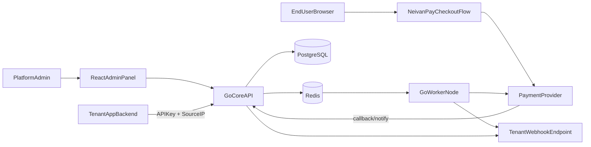
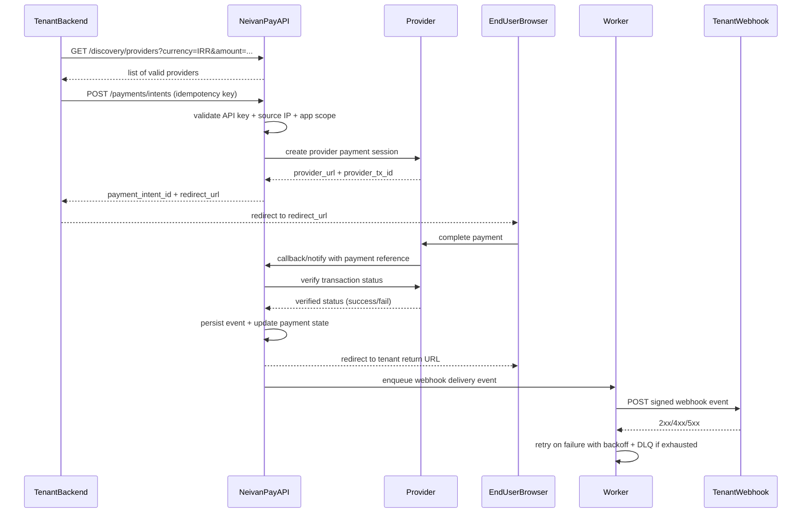
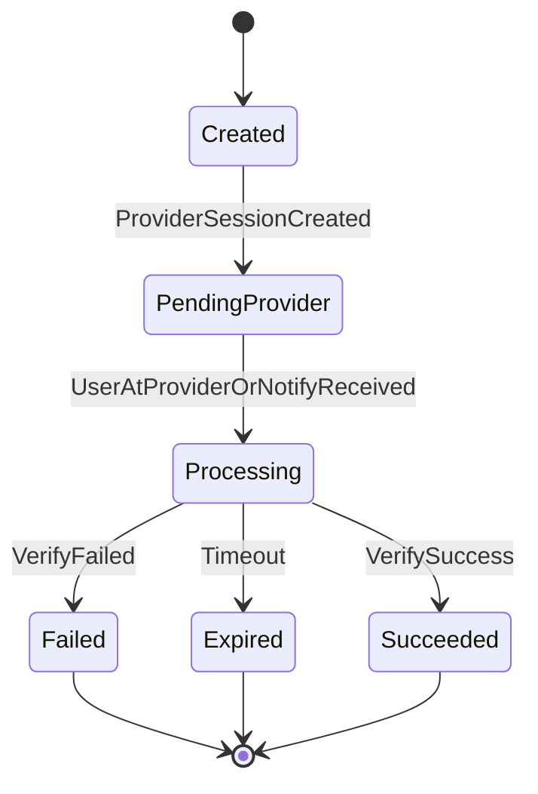
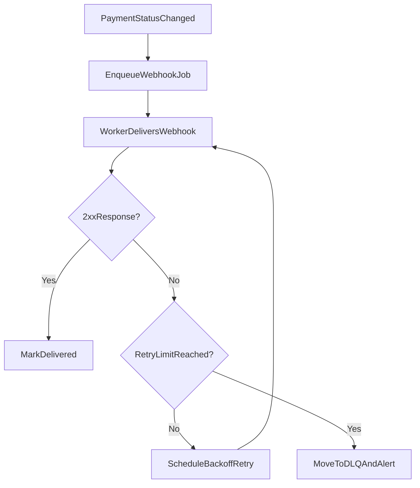

# Neivan Pay V1 - Product and System Blueprint

## 1) What This System Is

Neivan Pay is a multi-tenant payment orchestration platform.

- Platform admins manage tenants.
- Each tenant can register multiple apps.
- Tenant apps call Neivan Pay APIs using API keys (plus IP whitelist checks).
- Neivan Pay discovers valid payment providers per currency and context.
- End users complete payment at provider pages, then return through Neivan Pay.
- Neivan Pay verifies the result and notifies tenant systems through webhooks.

V1 stack:
- Go (core API + worker node)
- PostgreSQL (system of record)
- Redis (queues, async jobs, retries)
- React (admin panel)

## 2) Actors and Responsibilities

- **Platform Admin**: creates and manages tenants, apps, provider configs, keys, and whitelist rules.
- **Tenant App (backend)**: integrates with discovery and payment APIs.
- **End User**: chooses provider and pays.
- **Payment Provider**: processes payment and sends callback/notify.
- **Neivan Pay Core API**: orchestrates payment lifecycle and authorization.
- **Neivan Pay Worker**: handles async verification, webhooks, retries, reconciliation.

## 3) High-Level System Architecture

## 4) End-to-End Journey (0 to 100)

### Phase 0 - Platform Setup
- Deploy Core API, Worker, PostgreSQL, Redis, Admin UI.
- Seed currencies and provider catalog.
- Configure provider connectors.

### Phase 1 - Tenant Onboarding
- Admin creates tenant.
- Admin registers one or more tenant apps.
- Admin issues API key(s) for app integration.
- Admin configures IP whitelist and allowed redirect URLs.
- Admin enables providers per currency for that tenant.

### Phase 2 - Runtime Payment Flow
- Tenant app requests discovery for target currency/amount.
- Neivan Pay returns available providers.
- End user selects provider and starts payment.
- Neivan Pay creates payment intent and provider session.
- End user is redirected to provider URL.
- Provider redirects/notify back to Neivan Pay.
- Neivan Pay verifies payment with provider.
- Neivan Pay updates final status and redirects end user to tenant return URL.
- Neivan Pay sends webhook event(s) to tenant backend.

### Phase 3 - Operations and Reliability
- Worker retries failed webhooks with backoff.
- Provider health checks run periodically.
- Reconciliation jobs compare internal records vs provider records.
- Audit logs capture admin changes and sensitive actions.

## 5) Detailed Runtime Sequence

## 6) Security Model (V1)

- API authentication by tenant API key.
- API authorization by key scopes (minimum: discovery, payment create/read).
- Source IP must match tenant app whitelist (CIDR/IP entries).
- API keys are stored hashed (secret shown only at creation time).
- Redirect URLs are allowlisted per tenant app.
- Webhooks are signed (HMAC SHA256 + timestamp + replay window).
- Idempotency key required for payment creation.
- Callback handling is idempotent to prevent duplicate settlement updates.

## 7) Payment State Machine

## 8) Suggested PostgreSQL Core Tables

- `tenants`
- `tenant_apps`
- `tenant_api_keys`
- `tenant_ip_whitelist`
- `providers`
- `currencies`
- `tenant_provider_configs`
- `payment_intents`
- `payment_attempts`
- `payment_events`
- `webhook_subscriptions`
- `webhook_deliveries`
- `reconciliation_runs`
- `reconciliation_items`
- `audit_logs`

Design notes:
- Store monetary values in minor units (integer) to avoid float errors.
- Keep payment events immutable for traceability.
- Separate intent (business state) from attempts (provider-level calls).

## 9) Redis Queues and Worker Jobs

- `queue:webhooks:deliver`
- `queue:provider:verify`
- `queue:provider:healthcheck`
- `queue:reconciliation:run`
- `dlq:webhooks`
- `dlq:provider_verify`

Retry strategy:
- Exponential backoff
- Max attempts per job type
- Dead-letter routing after retry exhaustion
- Manual replay from admin operations page

## 10) Admin Panel Modules (React)

- Tenant management (create, suspend, update metadata)
- Tenant app management (register app, return URLs, status)
- API key management (issue, rotate, revoke, usage metadata)
- IP whitelist management (CIDR/IP CRUD with validation)
- Provider config by tenant/currency
- Operations pages:
  - webhook delivery monitor + replay
  - provider health board
  - reconciliation run history
  - audit log explorer

## 11) Operational Flow Diagram

## 12) V1 Boundaries

Included now:
- Admin-controlled tenancy
- API key + IP whitelist security
- Discovery by currency
- Payment intent + redirect flow
- Callback verification
- Signed webhooks + retries
- Operations visibility (health/reconciliation/audit)

Deferred for later:
- Tenant self-service onboarding
- Advanced routing/auto failover by ML/scoring
- Wallet/escrow ledger model
- Full dispute/refund workflows
- Fine-grained RBAC beyond admin-only

## 13) Definition of Done (V1)

- Admin can onboard tenant + app and configure whitelist/provider access.
- Tenant app can discover providers and create payment intents.
- End-user payment completes through provider and returns cleanly.
- Neivan Pay verifies and finalizes payment state correctly.
- Tenant receives signed webhook notifications with retry guarantees.
- Ops can inspect failures, replay deliveries, and run reconciliation checks.
