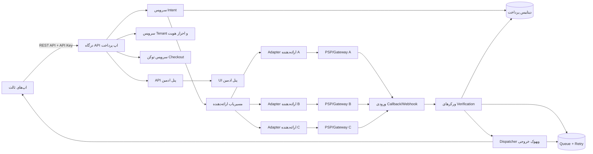
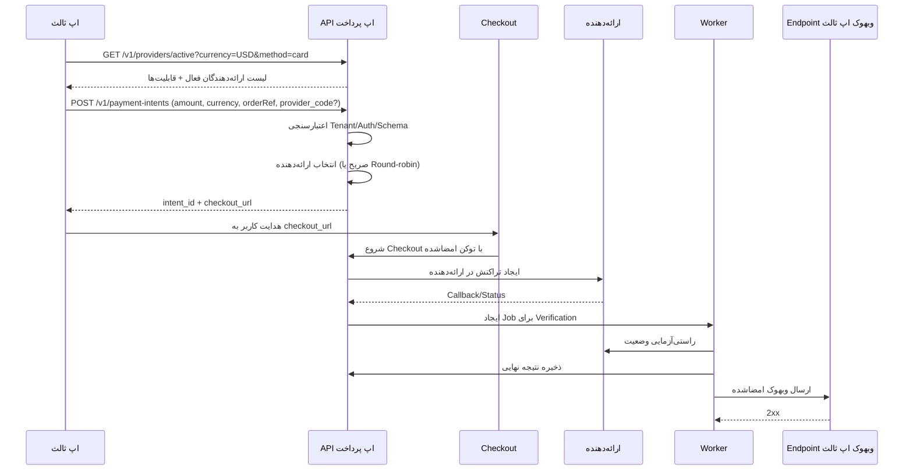
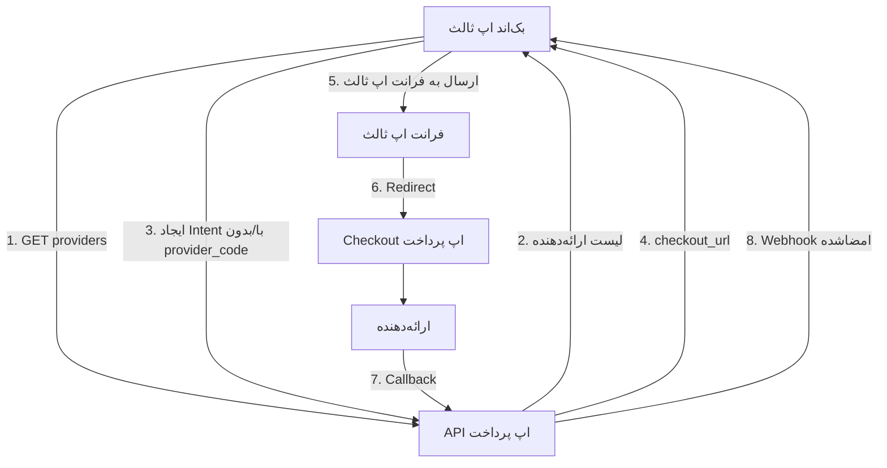
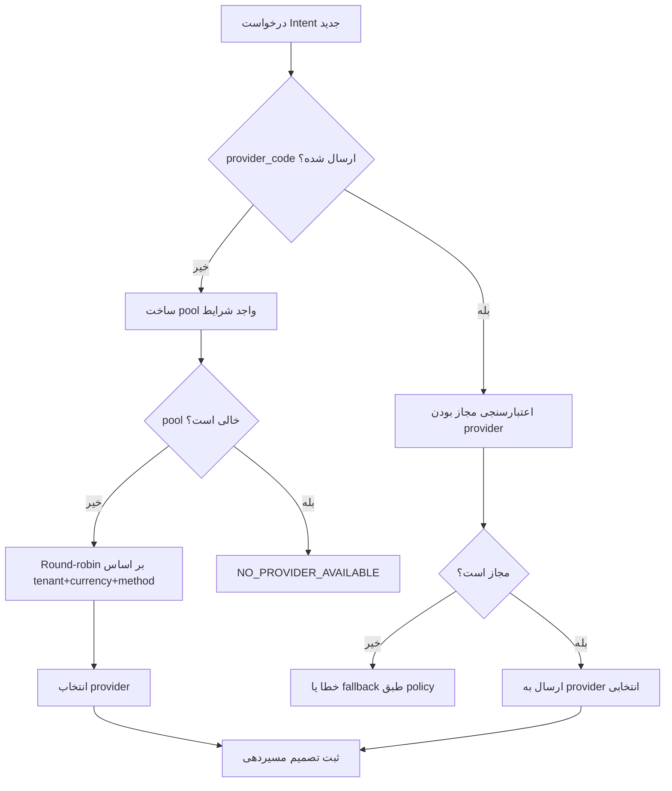

# مستند جامع اپ پرداخت مستقل (۰ تا ۱۰۰)

## ۱) این سیستم چیست؟

اپ پرداخت (Pay App) یک پلتفرم مستقل «میانجی پرداخت» است که بین این دو قرار می‌گیرد:

- اپلیکیشن‌های ثالث (Third-party Apps) که نیاز به قابلیت پرداخت دارند
- درگاه‌ها/پردازنده‌های پرداخت (PSP/Acquirer/Gateway)

این سیستم خودِ اپ کسب‌وکار نیست؛ بلکه یک لایه استاندارد، امن و قابل‌مقیاس است تا اپ‌های ثالث بتوانند:

- پرداخت ایجاد کنند
- کاربر را به صفحه پرداخت هدایت کنند
- نتیجه پرداخت را قابل اتکا دریافت کنند
- گزارش‌گیری، تطبیق مالی و حسابرسی انجام دهند

---

## ۲) ارزش اصلی پلتفرم

- یک قرارداد API پایدار برای همه اپ‌های ثالث
- پشتیبانی چند‌ارائه‌دهنده (Multi-provider)
- انتخاب اختیاری ارائه‌دهنده توسط کاربر نهایی
- مسیر‌دهی خودکار Round-robin وقتی انتخابی انجام نشود
- پشتیبانی چندارزی (فیات + کریپتو)
- جلوگیری از درخواست تکراری با Idempotency
- ارسال وبهوک امن با امضا و Retry
- لاگ حسابرسی کامل

---

## ۳) بازیگران سیستم

- **اپ ثالث**
  - درخواست ایجاد پرداخت می‌دهد
  - می‌تواند لیست ارائه‌دهندگان فعال را دریافت کند
  - نتیجه را از webhook یا API وضعیت دریافت می‌کند

- **کاربر نهایی**
  - در جریان پرداخت، ارائه‌دهنده را انتخاب می‌کند (اختیاری)
  - یا سیستم به‌صورت خودکار ارائه‌دهنده را انتخاب می‌کند

- **اپ پرداخت**
  - مدیریت Intent و Attempt
  - مسیر‌دهی به ارائه‌دهنده مناسب
  - راستی‌آزمایی نتیجه نهایی
  - ارسال رویداد امضاشده برای اپ ثالث

- **ارائه‌دهنده پرداخت**
  - اجرای واقعی تراکنش
  - ارسال Callback/Status

---

## ۴) دیاگرام معماری سطح‌بالا

---

## ۵) قابلیت‌های اصلی

- **Onboarding Tenant**
  - تعریف Tenant
  - صدور API Key و Webhook Secret
  - تنظیم ارائه‌دهندگان، ارزها و محدودیت‌ها

- **مدیریت Payment Intent**
  - Create / Read / Cancel / Expire
  - نگهداری Metadata، مبلغ، ارز، مرجع سفارش

- **کشف ارائه‌دهنده (Provider Discovery)**
  - `GET /v1/providers/active`
  - خروجی بر اساس Tenant، ارز، روش پرداخت، سقف/کف مبلغ، سلامت ارائه‌دهنده

- **مسیر‌دهی هوشمند**
  - اگر `provider_code` ارسال شود، همان ارائه‌دهنده (در صورت معتبر بودن) استفاده می‌شود
  - اگر ارسال نشود، Round-robin روی pool واجد شرایط اعمال می‌شود

- **چندارزی**
  - فیات: مانند IRR, USD, EUR
  - کریپتو: مانند BTC, ETH, USDT
  - مدیریت دقت (decimals)، حداقل/حداکثر، شبکه کریپتو، زمان اعتبار Quote

- **وبهوک و نهایی‌سازی**
  - تأیید وضعیت توسط Worker
  - ارسال وبهوک امضاشده به اپ ثالث
  - Retry با backoff + Dead-letter

---

## ۶) جریان کامل پرداخت

---

## ۷) مدل وضعیت پرداخت

- `CREATED`
- `CHECKOUT_STARTED`
- `PROCESSING`
- `PENDING_VERIFY`
- `SUCCEEDED`
- `FAILED`
- `CANCELLED`
- `EXPIRED`
- `REFUND_PENDING` / `REFUNDED` / `PARTIALLY_REFUNDED`

قواعد:

- انتقال وضعیت باید با State Machine کنترل شود
- حالت‌های نهایی نباید دوباره به حالت غیرنهایی برگردند
- callback/webhook تکراری نباید اثر مالی تکراری ایجاد کند

---

## ۸) مدل داده حداقلی

- **Tenant**
  - مشخصات، کلید API هش‌شده، تنظیمات ارائه‌دهنده، webhook، rate limit

- **PaymentIntent**
  - مبلغ، ارز، وضعیت، زمان انقضا، `selected_provider`، `route_strategy`

- **PaymentAttempt**
  - provider، provider_ref، وضعیت، خطا، payload خام درخواست/پاسخ

- **ProviderCatalog**
  - ارائه‌دهنده‌های فعال، ارز/روش‌های پشتیبانی‌شده، سلامت، محدودیت‌ها

- **CurrencyConfig**
  - نوع ارز (`fiat|crypto`)، decimals، limits، شبکه، quote TTL

- **WebhookDelivery**
  - وضعیت ارسال، شمارش retry، کد آخرین پاسخ

- **IdempotencyKey**
  - کلید، hash درخواست، snapshot پاسخ

- **AuditLog**
  - ثبت قبل/بعد همه عملیات حساس

---

## ۹) قرارداد API (حداقل)

- `GET /v1/providers/active`
- `POST /v1/payment-intents` (با `Idempotency-Key` و `provider_code` اختیاری)
- `GET /v1/payment-intents/{id}`
- `POST /v1/payment-intents/{id}/cancel`
- `GET /v1/payment-intents/{id}/attempts`
- `GET /v1/currencies`
- `POST /v1/quotes` (اختیاری برای سناریوی cross-currency)
- `POST /v1/webhooks/{eventId}/replay` (ادمین/اپراتور)
- `POST /v1/refunds` (اختیاری)

اصول پاسخ:

- کد خطای پایدار و استاندارد
- `request_id` در همه پاسخ‌ها
- زمان‌بندی UTC (ISO-8601)

---

## ۱۰) نحوه اتصال اپ ثالث

۱) دریافت API Key و Webhook Secret  
۲) (اختیاری) دریافت لیست ارائه‌دهندگان فعال برای نمایش به کاربر  
۳) ایجاد Intent با `provider_code` اختیاری  
۴) هدایت کاربر به Checkout  
۵) دریافت نتیجه از Webhook + امکان Pull از API وضعیت  
۶) Reconciliation دوره‌ای

---

## ۱۱) دیاگرام اتصال اپ ثالث

---

## ۱۱.۱) دیاگرام تصمیم مسیر‌دهی ارائه‌دهنده

---

## ۱۲) اجزای داخلی ضروری

- API Gateway
- Intent Service
- Provider Router
- Provider Adapters
- Currency Engine
- Checkout Service
- Verification Workers
- Webhook Dispatcher
- Reporting/Reconciliation Service
- Admin API

---

## ۱۲.۱) پنل ادمین فرانت‌اند (ضروری)

پنل ادمین باید به‌عنوان «Control Plane» رسمی سیستم وجود داشته باشد.

ماژول‌ها:

- ورود امن + MFA
- داشبورد عملیاتی
- مرورگر پرداخت‌ها (جست‌وجوی پیشرفته + Timeline)
- مدیریت ارائه‌دهندگان
- مدیریت Routing Policy
- مدیریت ارزها (فیات/کریپتو)
- عملیات وبهوک (retry/replay)
- تطبیق مالی و گزارش‌گیری
- مدیریت Tenant و دسترسی‌ها (RBAC)
- مشاهده لاگ حسابرسی

مسیرهای حداقلی:

- `/admin/login`
- `/admin/dashboard`
- `/admin/payments`
- `/admin/payments/{intentId}`
- `/admin/providers`
- `/admin/routing-policies`
- `/admin/currencies`
- `/admin/webhooks`
- `/admin/reconciliation`
- `/admin/tenants`
- `/admin/access`
- `/admin/audit-logs`

---

## ۱۳) قابلیت اطمینان و مقیاس‌پذیری

- APIهای Stateless پشت Load Balancer
- DB پایدار + Replica
- صف پایدار برای کارهای async
- پردازش idempotent در Workerها
- جلوگیری از اثر دوباره با dedupe key

---

## ۱۴) امنیت (Must-have)

- نگهداری secrets در Secret Manager
- هش‌کردن API Key در دیتابیس
- TLS کامل
- امضای HMAC برای ورودی/خروجی webhook
- محافظت Replay (nonce + timestamp)
- RBAC واقعی سمت بک‌اند
- Audit trail غیرقابل‌تغییر

---

## ۱۵) مانیتورینگ و مشاهده‌پذیری

متریک‌های کلیدی:

- نرخ موفقیت ایجاد Intent
- نرخ موفقیت/شکست به تفکیک provider
- نسبت انتخاب کاربر vs auto-route
- شاخص عدالت Round-robin
- عملکرد به تفکیک ارز
- زمان callback تا finalization
- نرخ موفقیت ارسال webhook

---

## ۱۶) سناریوهای خطا

- Timeout provider -> `PENDING_VERIFY` + retry
- callback تکراری -> بدون اثر مالی تکراری
- provider انتخاب‌شده در لحظه در دسترس نیست -> fallback یا خطای قابل اقدام
- endpoint وبهوک اپ ثالث قطع است -> retry + dead-letter + replay

---

## ۱۷) Roadmap محصول

- **MVP**
  - Intent، Checkout، کشف provider، حداقل دو adapter، Round-robin، webhook امضاشده، پنل ادمین پایه

- **Growth**
  - Refund، Reconciliation پیشرفته، چندارزی فیات کامل، rails کریپتو اختیاری

- **Enterprise**
  - Smart routing بر اساس هزینه/تاخیر/موفقیت، مدیریت ریسک، معماری چندمنطقه‌ای، کنترل خزانه و cross-currency

---

## ۱۸) چک‌لیست اپ‌های ثالث

- پیاده‌سازی Idempotency-Key
- پیاده‌سازی دریافت و اعتبارسنجی webhook
- dedupe رویدادها با event_id
- مدیریت precision مبلغ/ارز
- پیاده‌سازی discovery اختیاری provider در UI
- Reconciliation دوره‌ای

---

## ۱۹) جمع‌بندی

این اپ پرداخت باید به‌صورت یک پلتفرم مستقل و عمومی طراحی شود که:

- به یک ارائه‌دهنده خاص وابسته نباشد
- انتخاب ارائه‌دهنده را برای کاربر/اپ ثالث ممکن کند
- در نبود انتخاب، به‌صورت Round-robin و منصفانه مسیر‌دهی کند
- همزمان برای ارزهای فیات و کریپتو آماده بهره‌برداری باشد
- از نظر امنیت، حسابرسی و پایداری در سطح عملیاتی واقعی قرار بگیرد
