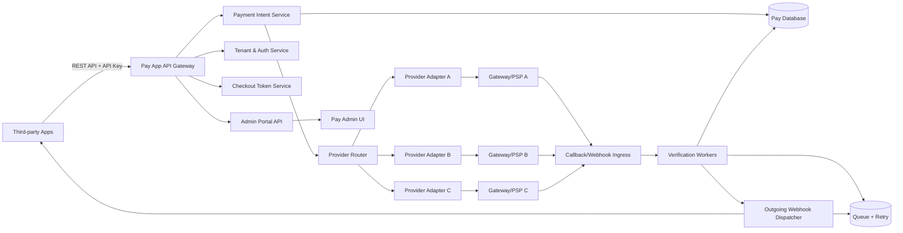
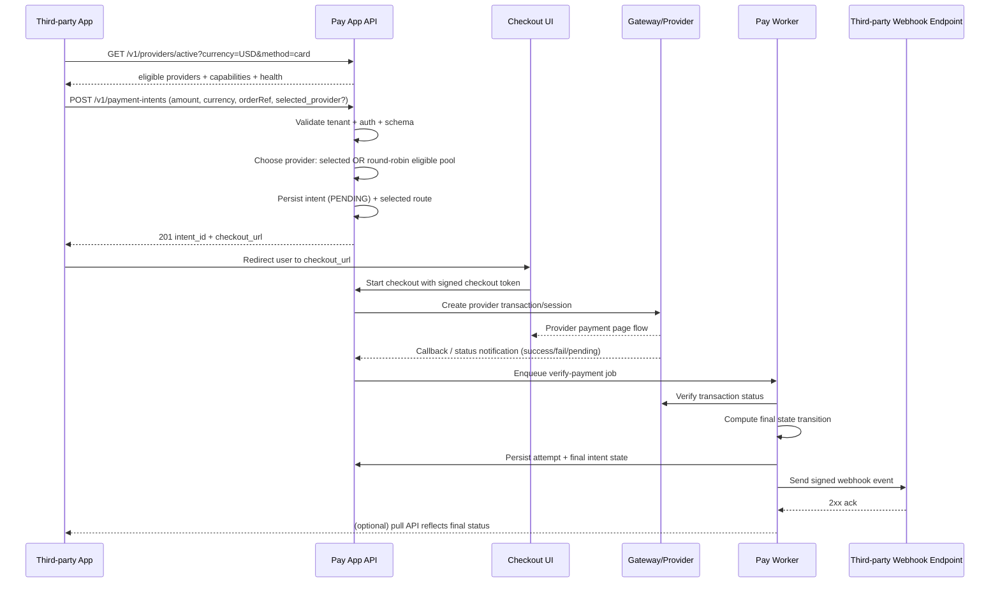
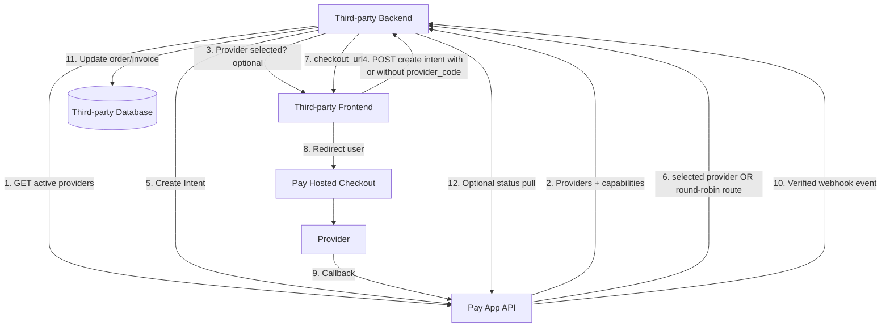
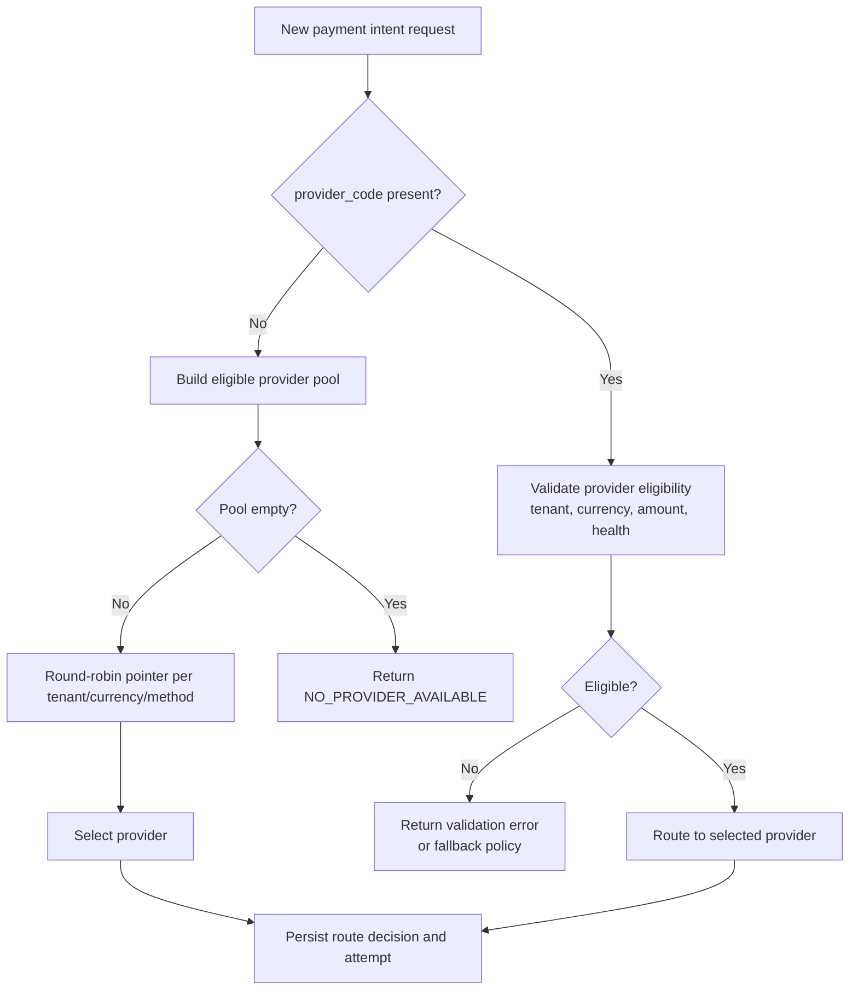
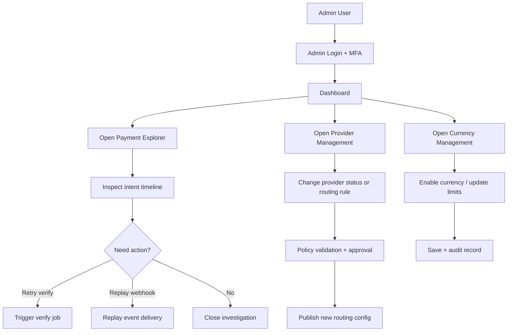

# Standalone Pay App (0 to 100)

## 1) What this system is

Pay App is a standalone payment orchestration platform that sits between:

- Third-party business applications (clients who need payment features)
- Payment gateways/acquirers/processors (bank or PSP providers)

Pay App is not the merchant business app itself. It acts as a secure and standardized middle layer so third-party apps can:

- Create payment intents
- Redirect users to checkout
- Receive payment outcomes
- Reconcile and audit every transaction
- Handle retries, failures, refunds, and disputes consistently

---

## 2) Core value proposition

Pay App gives third-party apps one stable integration while Pay App handles many provider details internally.

- One API contract for all third-party apps
- Provider discovery API for dynamic checkout choices
- Multi-provider routing and fallback
- Automatic round-robin load balancing when provider is not selected
- Multi-currency engine (fiat and crypto rails)
- Idempotency and duplicate protection
- Secure webhook/event delivery
- Strong audit trail and reconciliation
- Tenant-level configuration and policy controls

---

## 3) Actors and boundaries

- Third-party app
  - Wants to collect payment for order/invoice/subscription
  - Calls Pay App APIs
  - Receives asynchronous events/callbacks

- End user (payer)
  - Interacts with hosted checkout
  - Completes payment with selected provider

- Pay App
  - Creates/manages intents and attempts
  - Talks to providers
  - Verifies and finalizes payment states
  - Sends trusted outcome webhooks to third-party apps

- Payment provider
  - Executes actual payment authorization/capture
  - Sends callback or status response

---

## 4) High-level architecture

---

## 5) Main business capabilities

- Tenant onboarding
  - Create tenant profile
  - Issue tenant API credentials
  - Configure allowed providers/currency/callback URLs

- Payment intent management
  - Create, read, expire, cancel intent
  - Support metadata, amount, currency, customer reference
  - Track every attempt against an intent

- Hosted checkout
  - Secure tokenized checkout page
  - Optional payment provider selection by end user
  - Provider list can be sourced from Pay App active provider discovery
  - Redirect to provider and return flow handling

- Provider orchestration
  - Route by policy (tenant, country, method, risk, cost, currency support)
  - If third-party app or user does not choose provider, use round-robin across eligible providers
  - Failover/fallback strategy
  - Provider-specific adapter isolation

- Provider catalog
  - Expose active providers per tenant, payment method, and currency
  - Return capabilities (supports refunds, supports capture, min/max amount, countries)
  - Return health status and temporary availability

- Currency and asset orchestration
  - Support multi-fiat (for example IRR, USD, EUR) and crypto assets (for example BTC, ETH, USDT)
  - Normalize precision/decimals per currency
  - Handle quote/lock windows for volatile assets
  - Enforce per-tenant allowed currency list

- Verification and finalization
  - Async verification job after callback
  - Idempotent status transitions
  - Immutable audit event stream

- Merchant notification
  - Signed outgoing webhooks
  - Retry with exponential backoff + dead-letter queue
  - Event replay endpoint for recovery

- Operations and governance
  - Admin panel for tenants/intents/deliveries
  - Monitoring, alerting, reconciliation reports
  - Compliance controls and security policies

---

## 6) End-to-end payment lifecycle

---

## 7) Payment state model (recommended)

- `CREATED` - intent created, not started
- `CHECKOUT_STARTED` - user entered checkout flow
- `PROCESSING` - provider interaction in progress
- `PENDING_VERIFY` - callback received, verifying
- `SUCCEEDED` - verified paid
- `FAILED` - verified failure
- `CANCELLED` - cancelled by tenant/user/system
- `EXPIRED` - timed out by policy
- `REFUND_PENDING` / `REFUNDED` / `PARTIALLY_REFUNDED` (optional extension)

Rules:

- State transitions must be explicit and validated by finite-state rules.
- Final states are immutable except refund/dispute extensions.
- Duplicate callbacks/webhooks must never create duplicate success postings.

---

## 8) Required data model (minimum)

- Tenant
  - id, name, status, api_key_hash, webhook_url, webhook_secret, provider_settings, rate_limits

- PaymentIntent
  - id, tenant_id, merchant_order_ref, amount, currency, status, expires_at, metadata, selected_provider, route_strategy, created_at, updated_at

- PaymentAttempt
  - id, intent_id, provider, provider_ref, status, error_code, error_message, raw_request, raw_response, created_at

- ProviderCatalog
  - id, code, display_name, enabled, supported_methods, supported_currencies, priority_weight, health_status, limits, settlement_capabilities

- CurrencyConfig
  - currency_code, currency_type(fiat|crypto), decimals, min_amount, max_amount, quote_ttl_seconds, network(optional), enabled

- FxQuote (optional but recommended for cross-currency)
  - id, base_currency, quote_currency, rate, source, valid_until, created_at

- WebhookDelivery
  - id, tenant_id, event_type, event_id, payload_hash, status, attempt_count, last_http_status, next_retry_at

- AuditLog
  - id, actor_type, actor_id, action, entity_type, entity_id, before, after, created_at

- IdempotencyKey
  - id, tenant_id, key, request_hash, response_snapshot, ttl, created_at

---

## 9) Public API contract (minimum required)

Authentication:

- Tenant API key (`Authorization: Bearer <tenant_api_key>`) or mTLS/JWT alternative
- Per-tenant scopes and rate limits

Required endpoints:

- `GET /v1/providers/active`
  - Returns active providers filtered by tenant, method, currency, country, amount
  - Enables third-party apps to show provider choices to users

- `POST /v1/payment-intents`
  - Create intent
  - Must support idempotency key header
  - Must support optional provider selection:
    - `provider_code` (optional)
    - If omitted, Pay App auto-routes using round-robin over eligible providers

- `GET /v1/payment-intents/{id}`
  - Read latest status and references

- `POST /v1/payment-intents/{id}/cancel`
  - Cancel if not final

- `GET /v1/payment-intents/{id}/attempts`
  - Operational visibility

- `POST /v1/webhooks/{eventId}/replay` (admin/ops scope)
  - Recovery and replay

- Optional:
  - `POST /v1/refunds`
  - `GET /v1/reconciliation/export`
  - `GET /v1/currencies`
  - `POST /v1/quotes` (if cross-currency checkout is enabled)

Response conventions:

- Stable error codes (`INVALID_REQUEST`, `AUTH_FAILED`, `PROVIDER_TIMEOUT`, `DUPLICATE_IDEMPOTENCY_KEY`)
- Correlation/request ID in all responses
- ISO-8601 UTC timestamps

---

## 10) How third-party apps should integrate

### Step A: Onboarding

- Register tenant
- Receive:
  - API key
  - Webhook signing secret
  - Allowed callback/return URLs

### Step B: Create payment intent

- Optional discovery step:
  - Call `GET /v1/providers/active` and show providers in third-party UI
  - Send selected provider back in create-intent request

- Third-party app sends:
  - amount, currency, order reference, customer reference
  - return URL/cancel URL (if allowed by tenant policy)
  - idempotency key per logical order
  - optional `provider_code`

### Step C: Redirect user to hosted checkout

- Use `checkout_url` from create-intent response
- Third-party app may either:
  - Let user choose provider before create-intent
  - Skip selection and rely on Pay App round-robin auto-routing
- Do not build provider-specific transport logic in third-party app

### Step D: Handle asynchronous webhook

- Verify webhook signature
- Enforce event idempotency in third-party app
- Update local order/invoice only after verified event

### Step E: Reconcile

- Periodically compare third-party records with Pay App status API/exports
- Replay missed events if necessary

---

## 11) Third-party integration pattern diagram

---

## 11.1) Provider routing decision diagram

---

## 12) Internal component responsibilities

- API Gateway
  - AuthN/AuthZ, schema validation, rate limiting, request IDs

- Payment Intent Service
  - Intent lifecycle, state machine, idempotency

- Provider Router
  - Provider selection, fallback policy, circuit breaker
  - Deterministic round-robin per routing key (tenant + currency + method)
  - Health-aware exclusion from eligible pool

- Provider Adapters
  - Gateway-specific request/response mapping
  - Signature verification and error normalization

- Currency Engine
  - Currency metadata (decimals, min/max, enabled rails)
  - Fiat and crypto amount normalization
  - Optional quote and conversion lock service
  - Settlement and display currency separation

- Checkout Service
  - Short-lived signed tokens, intent ownership checks

- Worker Orchestrator
  - Verification jobs, expiration jobs, webhook retries

- Webhook Dispatcher
  - Signed delivery, retry scheduling, dead-letter handling

- Admin & Reporting
  - Tenant config, live monitoring, audit and reconciliation exports

---

## 12.1) Pay Admin Panel (Frontend) - Product Definition

Pay App must include a dedicated web admin panel. This is not optional. It is the control plane for operators, finance teams, and tenant admins.

### Primary frontend modules

- Auth and session
  - Secure login with MFA support (recommended)
  - Role-based route guards
  - Session management and device/audit visibility

- Dashboard
  - Real-time payment volume and success rate
  - Provider health and routing distribution
  - Currency mix (fiat vs crypto) and anomaly indicators

- Payment explorer
  - Search intents/attempts by order ID, customer ID, provider ref, tx hash, amount, currency, date
  - Deep payment timeline view (created -> routed -> callback -> verified -> webhook delivered)
  - Manual actions (cancel, retry verification, replay webhook) based on permissions

- Provider management
  - Enable/disable providers per tenant
  - Configure provider priority/weights and strict-selection vs fallback policy
  - View provider SLA metrics and outage windows

- Routing policies
  - Configure round-robin pools by tenant/currency/method/country
  - Configure smart rules (cost, latency, success-rate thresholds)
  - Simulate routing decision before applying policy

- Currency management
  - Configure enabled currencies and rails per tenant
  - Configure decimals, min/max amount, quote TTL, crypto network constraints
  - Monitor FX quote sources and stale quote alarms

- Webhook operations
  - View outgoing webhook delivery log per event
  - Retry/replay failed deliveries
  - Verify signature and response diagnostics

- Reconciliation and reports
  - Settlement reports by provider/currency/date
  - Mismatch detection and case tracking
  - Export CSV/JSON for finance systems

- Tenant and access management
  - Tenant onboarding/offboarding
  - API key rotation, webhook secret rotation
  - Role management: Super Admin, Operations, Finance, Support, Read-only Auditor

### Admin panel page map (minimum)

- `/admin/login`
- `/admin/dashboard`
- `/admin/payments`
- `/admin/payments/{intentId}`
- `/admin/providers`
- `/admin/routing-policies`
- `/admin/currencies`
- `/admin/webhooks`
- `/admin/reconciliation`
- `/admin/tenants`
- `/admin/access`
- `/admin/audit-logs`

### Admin frontend architecture requirements

- Componentized UI with clear domain boundaries (payments, providers, currencies, webhook ops)
- Server-side pagination/filtering for large datasets
- Saved filters and shareable query URLs for operations teams
- Real-time updates for payment state transitions (polling or websocket)
- Optimistic UI only for safe operations; destructive actions require confirmation + audit reason
- Internationalization and locale-aware number/date/currency formatting
- Accessibility baseline (keyboard navigation, contrast, screen-reader labels)

### Admin security requirements

- RBAC enforced both in frontend and backend (backend is source of truth)
- Step-up auth for sensitive operations (key rotation, policy changes, refund/replay at scale)
- Full audit trail for every admin action (who, when, before, after)
- IP allow-list and optional SSO/SAML/OIDC for enterprise tenants

### Admin user workflow diagram

### Admin panel non-functional targets

- Dashboard initial load p95 under target SLA (for example < 2.5s)
- Filtered payment search p95 under target SLA with large datasets
- Zero unauthorized privileged action execution
- 100% auditability for configuration changes

---

## 13) Reliability and scaling model

- Stateless API pods behind load balancer
- Shared durable DB (primary + replicas)
- Redis/queue for background processing
- Horizontal worker scaling by queue partition
- Idempotent processing for all asynchronous handlers
- Exactly-once business effect via at-least-once messaging + dedupe keys

---

## 14) Security baseline (must exist)

- Secrets manager (no secrets in code/repo)
- API key hashing at rest
- TLS everywhere (client, provider, internal service mesh if present)
- HMAC signature verification for inbound callbacks
- HMAC signature generation for outbound webhooks
- Nonce/timestamp replay protection
- RBAC for admin APIs
- PII minimization + field-level encryption where needed
- Immutable audit logs for critical state changes

---

## 15) Observability baseline (must exist)

- Structured logs with correlation ID, tenant ID, intent ID, attempt ID
- Metrics:
  - intent create success rate
  - payment success/failure ratio by provider
  - provider selection distribution (selected vs auto-routed)
  - round-robin fairness index per provider pool
  - currency-level failure and latency rates
  - callback-to-finalization latency
  - webhook delivery success rate and retry depth
- Traces across API -> worker -> provider -> webhook
- Alerts:
  - provider outage/circuit open
  - webhook retry storm
  - reconciliation mismatch threshold exceeded

---

## 16) Compliance and governance

- PCI scope strategy (prefer tokenized hosted checkout to reduce PCI burden)
- Data retention policy for logs/events/raw provider payloads
- Regional data residency where required
- Consent and legal basis for storing customer references
- Incident response and key rotation runbooks

---

## 17) Deployment topologies

### Single-region (starter)

- API + workers + DB + Redis in one region
- Good for low latency and lower complexity

### Multi-region active-passive

- Primary write region, secondary warm standby
- DNS or traffic manager failover

### Multi-region active-active (advanced)

- Requires global idempotency strategy and careful data partitioning
- Recommended only at high scale with strong SRE maturity

---

## 18) Failure scenarios and expected behavior

- Provider timeout
  - Mark as `PENDING_VERIFY`, schedule verification retries

- Duplicate callback
  - Detect by provider reference + dedupe, no duplicate state effect

- Selected provider unavailable at runtime
  - If fallback enabled, reroute to next eligible provider with audit reason
  - If strict selection policy, fail with actionable error

- Third-party webhook endpoint down
  - Retry with backoff, dead-letter after threshold, replay available

- Internal worker crash
  - Queue resume from durable broker; no data loss due to persisted state

- Database temporary outage
  - API returns retriable errors; workers pause/retry with jitter

---

## 19) MVP vs enterprise feature roadmap

MVP:

- Intents, hosted checkout, provider discovery endpoint, at least two provider adapters, round-robin router, verify worker, signed webhooks, admin basic dashboard

Growth:

- Smart provider eligibility policies, refund APIs, reconciliation exports, replay tools, stronger rate limits, multi-fiat support and optional crypto settlement rails

Enterprise:

- Smart routing by cost/success/latency, dispute handling, risk scoring, active-active resilience, tenant self-service portal, cross-currency pricing and treasury controls

---

## 20) Integration checklist for third-party teams

- Received and stored API key securely
- Implemented idempotency key per order/payment request
- Implemented optional provider discovery UI flow
- Added webhook endpoint with signature verification
- Implemented webhook deduplication by event ID
- Added retry-safe order status update logic
- Implemented currency validation and amount precision handling
- Added reconciliation job against Pay App status/export
- Monitored failures and alerting hooks

---

## 21) Non-functional acceptance criteria

- 99.9% API availability target
- p95 create-intent latency under agreed SLA
- Provider discovery API p95 latency under agreed SLA
- No provider starvation under round-robin pools in steady traffic
- Zero duplicate successful financial posting under callback/webhook duplicates
- End-to-end auditability for every intent and attempt
- Deterministic recovery path for missed webhooks

---

## 22) Summary

Pay App should be treated as an independent payment orchestration platform with:

- Stable API contracts for third-party apps
- Provider-agnostic integration with optional user-driven selection
- Automatic provider load balancing when selection is omitted
- Multi-currency readiness across fiat and crypto payment rails
- Clear separation between orchestration and provider specifics
- Strong async reliability and idempotency
- Security, audit, and reconciliation built in from day one

This model allows any third-party product to add payment capability quickly without owning gateway complexity.
