# Neivan API Gateway Interface — User Journey

Admin and Tenant web UI for managing Neivan API Gateway tenants, API sets, routes, tokens, replay secrets, usage analytics, and IP whitelisting.

**Stack:** Next.js App Router, React, TypeScript, Tailwind CSS v4  
**Backend:** Set `NEXT_PUBLIC_API_BASE_URL` in `.env` (see `.env.example`)

---

## Table of contents

1. [Roles and portals](#roles-and-portals)
2. [Page map](#page-map)
3. [Feature inventory](#feature-inventory)
4. [Admin user journeys](#admin-user-journeys)
5. [Tenant user journeys](#tenant-user-journeys)
6. [Admin vs tenant responsibilities](#admin-vs-tenant-responsibilities)
7. [UI patterns](#ui-patterns)

---

## Roles and portals

| Portal | Login URL | Home after login | Authentication |
|--------|-----------|------------------|----------------|
| **Admin** | `/admin/login` | `/admin/dashboard` | `POST /admin/auth/login` → JWT in `localStorage` |
| **Tenant** | `/tenant/login` | `/tenant/dashboard` | `POST /tenant/auth/login` → JWT in `localStorage` |

- Root `/` redirects: tenant token present → `/tenant/dashboard`; otherwise → `/tenant/login`.
- Protected pages use `AuthGate` (`src/shared/lib/AuthGate.tsx`).
- Most create/edit/delete actions open as **intercepting route modals** over the dashboard.

> **Note:** Mermaid node labels must not use `[/text/]` syntax (that denotes a trapezoid shape). Routes appear in the tables below; diagrams use plain descriptive labels for GitHub compatibility.

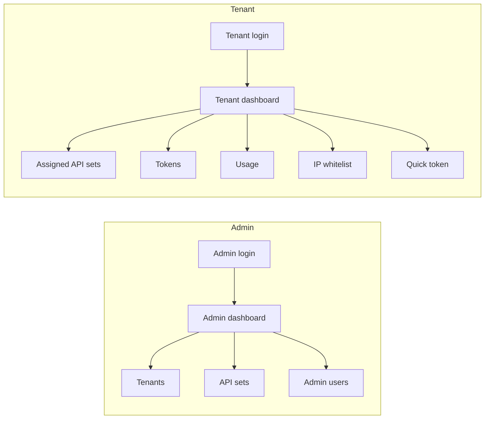
```mermaid
flowchart LR
  subgraph Admin
    AL["Admin login"] --> AD["Admin dashboard"]
    AD --> AT[Tenants]
    AD --> AS["API sets"]
    AD --> AU["Admin users"]
  end
  subgraph Tenant
    TL["Tenant login"] --> TD["Tenant dashboard"]
    TD --> TAS["Assigned API sets"]
    TD --> TT[Tokens]
    TD --> TU[Usage]
    TD --> TIP["IP whitelist"]
    TD --> QT["Quick token"]
  end
```

---

## Page map

### Admin routes

| Route | Purpose |
|-------|---------|
| `/admin/login` | Admin sign-in |
| `/admin/dashboard` | Hub: tenants, API sets, link to admin users |
| `/admin/admins` | List admin panel users |
| `/admin/tenants-create` | Create tenant (modal) |
| `/admin/tenants/[id]/view` | Tenant detail: tokens, usage, IP whitelist |
| `/admin/tenants/[id]/edit` | Edit tenant |
| `/admin/tenants/[id]/delete` | Delete tenant |
| `/admin/tenants/[id]/tokens-create` | Create API key for tenant |
| `/admin/tenants/[id]/usage-policy` | Rate limits / usage policy |
| `/admin/api-sets/create` | Create API set (+ optional Postman import) |
| `/admin/api-sets/[id]/view` | API set: requirements, routes, usage |
| `/admin/api-sets/[id]/edit` | Edit API set |
| `/admin/api-sets/[id]/delete` | Delete API set |
| `/admin/api-sets/[id]/add-route` | Add single route |
| `/admin/api-sets/[id]/assign-tenant` | Assign API set to tenants |
| `/admin/api-sets/[id]/replay-secret` | Replay secret per tenant + API set |
| `/admin/api-sets/[id]/import-from-postman` | Bulk import routes from Postman |
| `/admin/api-sets/[id]/routes/[routeId]/docs` | Edit route documentation |
| `/admin/admins/create` | Create admin user |
| `/admin/admins/[id]/edit` | Edit admin user |

### Tenant routes

| Route | Purpose |
|-------|---------|
| `/tenant/login` | Tenant sign-in |
| `/tenant/dashboard` | Hub: API sets, tokens, usage, IP whitelist |
| `/tenant/tokens/create` | Create API token |
| `/tenant/quick-token` | Request builder: cURL, replay headers, test call |
| `/tenant/api-sets/[id]/routes` | View routes for assigned API set |
| `/tenant/api-sets/[id]/routes/[routeId]/docs` | Read route documentation |

---

## Feature inventory

| Concept | Description |
|---------|-------------|
| **API set** | Named group of gateway routes; optional replay protection |
| **Route** | HTTP method, gateway path, match type (exact/prefix), upstream mapping, backend target |
| **Token (API key)** | Scoped to all assigned API sets or specific sets; shown once at creation |
| **Replay protection** | HMAC headers; admin configures secret; tenant uses raw secret in Quick Token |
| **Usage analytics** | Request log with 24h / 7d filters and pagination |
| **Usage policy** | Rate limits per tenant scoped to API set or route |
| **IP whitelist** | CIDR/IP at tenant-global or per–API-set scope |
| **Requirements** | Headers/query params injected on proxied requests (admin, per API set) |
| **Postman** | Admin imports collections; tenant downloads generated collection |

---

## Admin user journeys

### Authentication

1. Open `/admin/login`.
2. Enter username and password → **Submit**.
3. Redirect to `/admin/dashboard`.

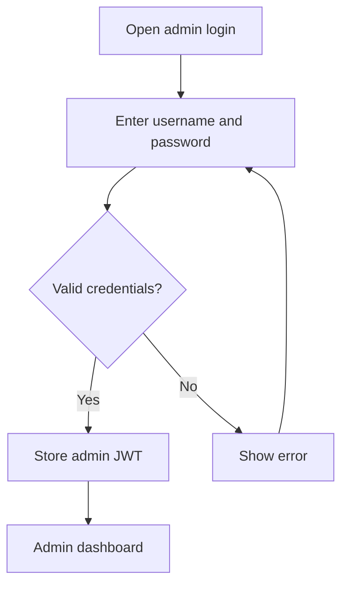
```mermaid
flowchart TD
  A["Open admin login"] --> B["Enter username and password"]
  B --> C{Valid credentials?}
  C -->|Yes| D["Store admin JWT"]
  D --> E["Admin dashboard"]
  C -->|No| F["Show error"]
  F --> B
```

---

### Admin users (panel access)

**Where:** Dashboard → **Admin users** → `/admin/admins`

| Action | Steps |
|--------|--------|
| List | View admin users on dedicated page |
| Create | **Create admin user** → optional display name, username, password → save |
| Edit | Row action → update user |

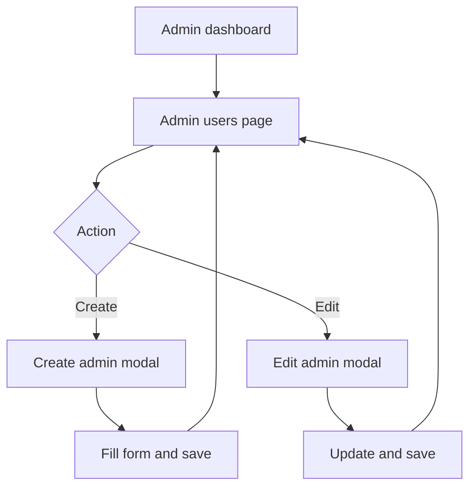
```mermaid
flowchart TD
  A["Admin dashboard"] --> B["Admin users page"]
  B --> C{Action}
  C -->|Create| D["Create admin modal"]
  D --> E["Fill form and save"]
  E --> B
  C -->|Edit| F["Edit admin modal"]
  F --> G["Update and save"]
  G --> B
```

---

### Tenants

**Where:** Dashboard → **Tenants** section

| Action | Steps |
|--------|--------|
| **List** | Name, slug, status, created date |
| **Create** | **Create tenant** → name, slug, optional password → save |
| **View** | Row **View** → details, tokens, usage, IP whitelist |
| **Edit** | Row **Edit** → update fields |
| **Delete** | Row **Delete** → confirm |

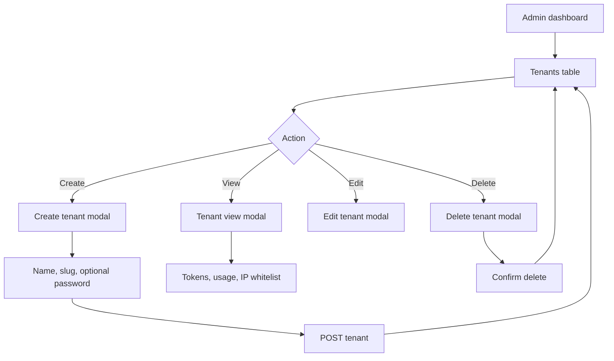
```mermaid
flowchart TD
  A["Admin dashboard"] --> B["Tenants table"]
  B --> C{Action}
  C -->|Create| D["Create tenant modal"]
  D --> E["Name, slug, optional password"]
  E --> F["POST tenant"]
  F --> B
  C -->|View| G["Tenant view modal"]
  G --> H["Tokens, usage, IP whitelist"]
  C -->|Edit| I["Edit tenant modal"]
  C -->|Delete| J["Delete tenant modal"]
  J --> K["Confirm delete"]
  K --> B
```

**Inside tenant View:**

| Sub-feature | Steps |
|-------------|--------|
| **Tokens** | **Create tenant token** → name, scope, optional API sets, expiry → copy API key once → revoke from table |
| **Usage** | Filter Last 24h / 7d; paginate request log |
| **Usage policy** | **Usage policy** → scope (API set or route), limits → save |
| **IP whitelist** | Add tenant-global or API-set IP; filter; delete |

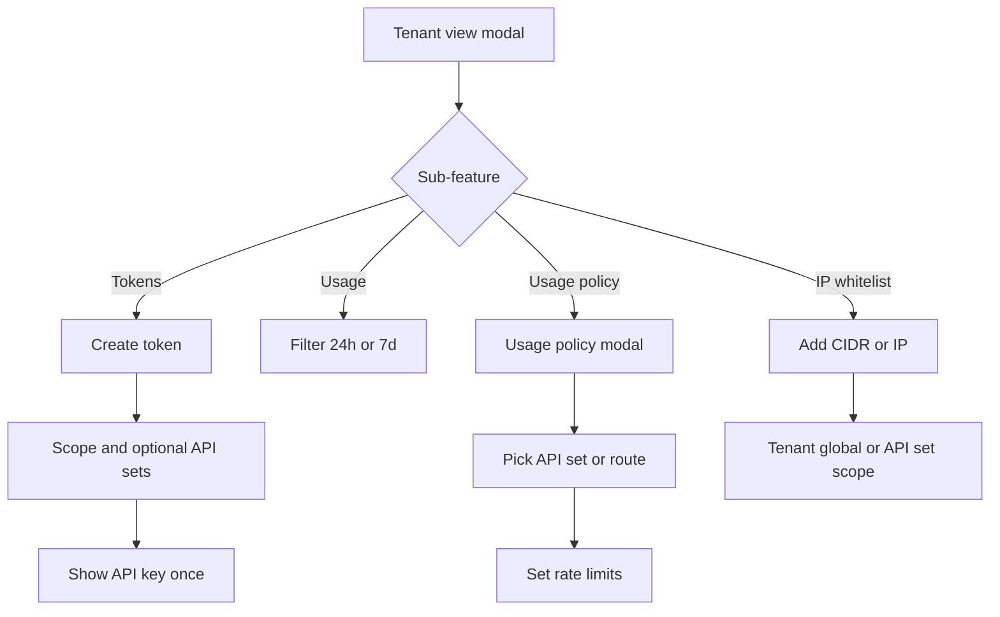
```mermaid
flowchart TD
  A["Tenant view modal"] --> B{Sub-feature}
  B -->|Tokens| C["Create token"]
  C --> D["Scope and optional API sets"]
  D --> E["Show API key once"]
  B -->|Usage| F["Filter 24h or 7d"]
  B -->|Usage policy| G["Usage policy modal"]
  G --> H["Pick API set or route"]
  H --> I["Set rate limits"]
  B -->|IP whitelist| J["Add CIDR or IP"]
  J --> K["Tenant global or API set scope"]
```

---

### API sets

**Where:** Dashboard → **API sets** section

| Action | Steps |
|--------|--------|
| **List** | Name, description, replay protection badge |
| **Create** | Name, description, replay toggle; optional Postman import on same form |
| **View** | Requirements, routes, per–API-set usage |
| **Edit** | Update name, description, replay flag |
| **Delete** | Confirm deletion |
| **Add route** | Method, path, match, upstream, backend |
| **Assign to tenants** | Checkbox list → submit `tenantIds[]` |
| **Replay secret** | Pick tenant, generate/paste raw secret → upsert; copy once |
| **Import from Postman** | From View → paste/upload v2.1 JSON → preview → select routes → import |

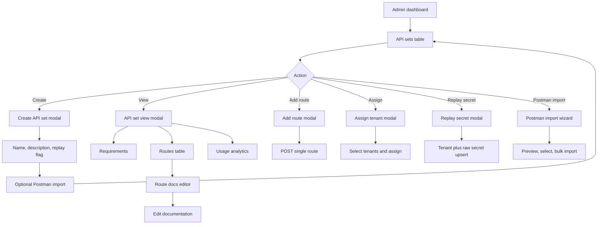
```mermaid
flowchart TD
  A["Admin dashboard"] --> B["API sets table"]
  B --> C{Action}
  C -->|Create| D["Create API set modal"]
  D --> E["Name, description, replay flag"]
  E --> F["Optional Postman import"]
  F --> B
  C -->|View| G["API set view modal"]
  G --> R[Requirements]
  G --> RT["Routes table"]
  G --> U["Usage analytics"]
  C -->|Add route| H["Add route modal"]
  H --> I["POST single route"]
  C -->|Assign| J["Assign tenant modal"]
  J --> K["Select tenants and assign"]
  C -->|Replay secret| L["Replay secret modal"]
  L --> M["Tenant plus raw secret upsert"]
  C -->|Postman import| N["Postman import wizard"]
  N --> O["Preview, select, bulk import"]
  RT --> P["Route docs editor"]
  P --> Q["Edit documentation"]
```

---

### Route documentation (admin)

1. Open API set **View**.
2. On a route row, open **Documentation**.
3. Edit summary, parameters, body, gateway/backend responses.
4. Optionally use **Import from Postman** section for doc candidates.
5. Save → tenant can read docs (read-only).

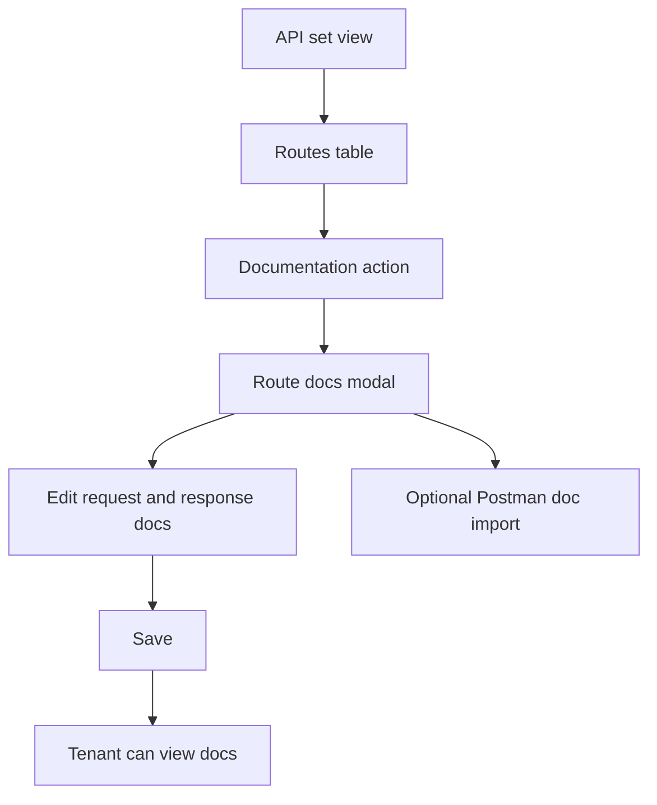
```mermaid
flowchart TD
  A["API set view"] --> B["Routes table"]
  B --> C["Documentation action"]
  C --> D["Route docs modal"]
  D --> E["Edit request and response docs"]
  D --> F["Optional Postman doc import"]
  E --> G[Save]
  G --> H["Tenant can view docs"]
```

---

### Replay secret (admin)

Used when API set has **replay protection On**.

1. API sets table → **Replay protection secret** (shield action).
2. Select tenant.
3. **Generate** or paste raw secret.
4. Submit → secret stored server-side; **copy raw secret once** and share with tenant securely.
5. Optional: revoke existing secret.

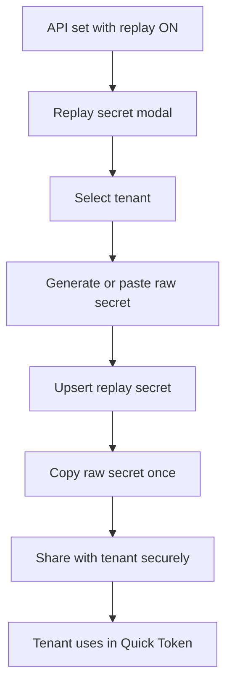
```mermaid
flowchart TD
  A["API set with replay ON"] --> B["Replay secret modal"]
  B --> C["Select tenant"]
  C --> D["Generate or paste raw secret"]
  D --> E["Upsert replay secret"]
  E --> F["Copy raw secret once"]
  F --> G["Share with tenant securely"]
  G --> H["Tenant uses in Quick Token"]
```

---

### Typical admin greenfield onboarding

End-to-end chain to onboard a new tenant:

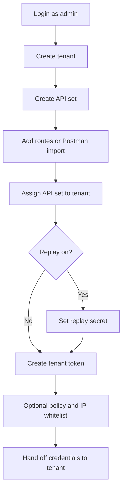
```mermaid
flowchart TD
  A["Login as admin"] --> B["Create tenant"]
  B --> C["Create API set"]
  C --> D["Add routes or Postman import"]
  D --> E["Assign API set to tenant"]
  E --> F{Replay on?}
  F -->|Yes| G["Set replay secret"]
  F -->|No| H["Create tenant token"]
  G --> H
  H --> I["Optional policy and IP whitelist"]
  I --> J["Hand off credentials to tenant"]
```

**Step-by-step:**

1. **Login** → `/admin/login` → dashboard.
2. **Create tenant** → name, slug, password (for tenant login).
3. **Create API set** → enable replay protection if required.
4. **Configure routes** → add route manually or **Import from Postman**.
5. **Assign API set** → check tenant in assign modal.
6. **Replay secret** (if enabled) → upsert for that tenant + API set; copy raw secret.
7. **Create token** → from tenant View or let tenant self-serve.
8. **Optional** → usage policy, IP whitelist, route docs, API set requirements.
9. **Hand off** → tenant slug/password, API key, replay raw secret (if applicable).

---

## Tenant user journeys

### Authentication

1. Open `/tenant/login`.
2. Enter credentials → **Submit**.
3. Redirect to `/tenant/dashboard`.

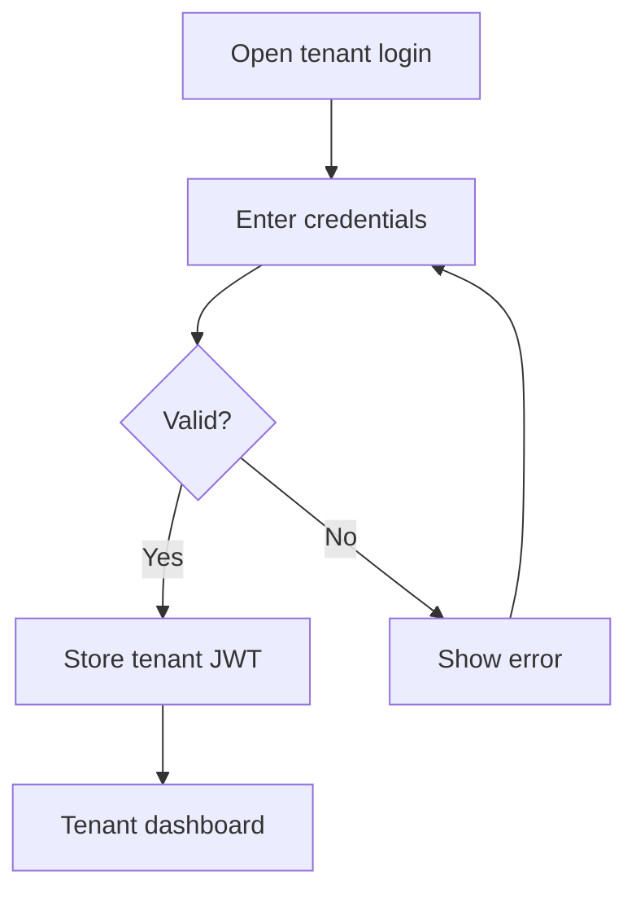
```mermaid
flowchart TD
  A["Open tenant login"] --> B["Enter credentials"]
  B --> C{Valid?}
  C -->|Yes| D["Store tenant JWT"]
  D --> E["Tenant dashboard"]
  C -->|No| F["Show error"]
  F --> B
```

---

### Dashboard overview

| Section | Actions |
|---------|---------|
| **Assigned API sets** | List sets; **View routes** per set |
| **Tokens** | List; **Create**; **Revoke** active tokens |
| **Usage** | Own request history (24h/7d, pagination) |
| **IP whitelist** | Add/delete; filter by API set |
| **Header** | Download Postman collection; **Quick token** |

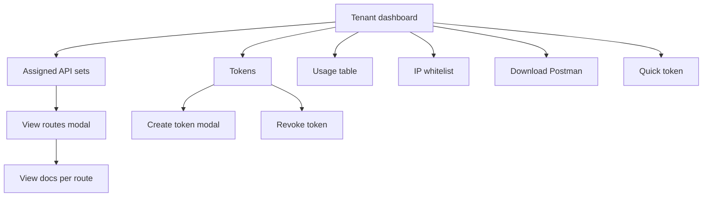
```mermaid
flowchart TD
  A["Tenant dashboard"] --> B["Assigned API sets"]
  A --> C[Tokens]
  A --> D["Usage table"]
  A --> E["IP whitelist"]
  A --> F["Download Postman"]
  A --> G["Quick token"]
  B --> H["View routes modal"]
  H --> I["View docs per route"]
  C --> J["Create token modal"]
  C --> K["Revoke token"]
```

---

### Create and use an API token

1. Dashboard → **Create tenant token** (or `/tenant/tokens/create`).
2. Enter name, scope (`ALL_ASSIGNED_API_SETS` or `SPECIFIC_API_SETS` + pick API sets), optional expiry.
3. **Copy API key** when shown (one-time only).
4. Use key in Quick Token, Postman, or your application.
5. **Revoke** from tokens table if compromised.

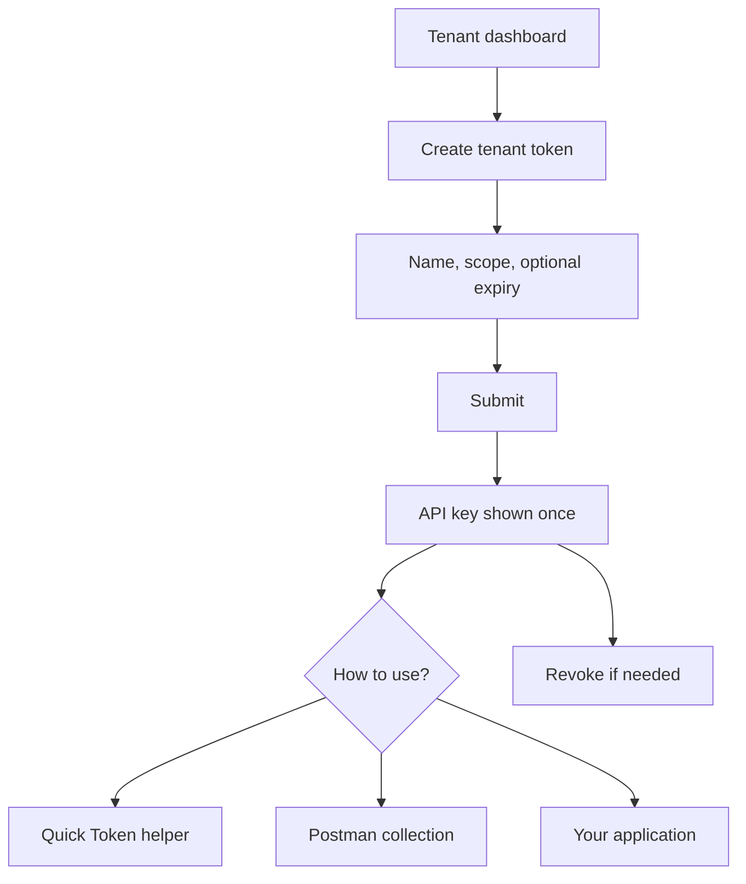
```mermaid
flowchart TD
  A["Tenant dashboard"] --> B["Create tenant token"]
  B --> C["Name, scope, optional expiry"]
  C --> D[Submit]
  D --> E["API key shown once"]
  E --> F{How to use?}
  F --> G["Quick Token helper"]
  F --> H["Postman collection"]
  F --> I["Your application"]
  E --> J["Revoke if needed"]
```

*Admin may also create tokens from tenant View; same one-time copy rule applies.*

---

### View routes and documentation

1. Dashboard → assigned API set → **View routes**.
2. Review method, path, match type, docs indicator.
3. **View docs** on a route (if admin added documentation).
4. If empty: message to contact admin.

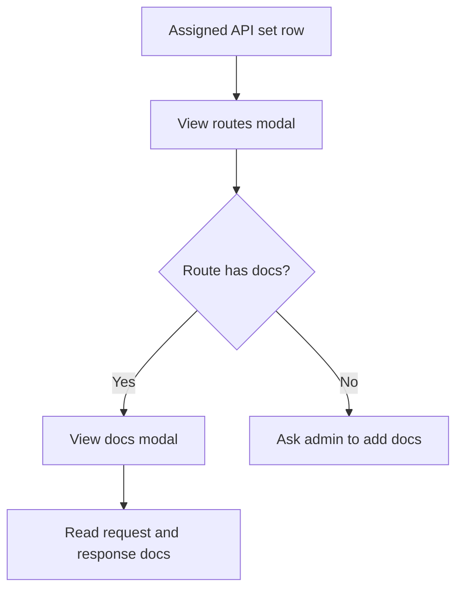
```mermaid
flowchart TD
  A["Assigned API set row"] --> B["View routes modal"]
  B --> C{Route has docs?}
  C -->|Yes| D["View docs modal"]
  D --> E["Read request and response docs"]
  C -->|No| F["Ask admin to add docs"]
```

---

### Quick token (gateway test helper)

1. Dashboard → **Open quick token**.
2. Select API set.
3. Paste full API key.
4. Choose HTTP method and gateway path; optional request body.
5. If replay protection **On**:
   - Enter raw replay secret (from admin).
   - **Generate replay headers** (nonce, timestamp, HMAC-SHA256).
   - Copy headers or full cURL.
6. Optionally **Send** request to `{API_BASE}/gateway{path}` and inspect response.
7. Reuse recent inputs from session history.

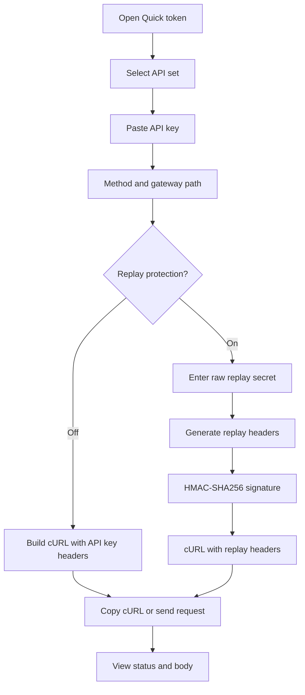
```mermaid
flowchart TD
  A["Open Quick token"] --> B["Select API set"]
  B --> C["Paste API key"]
  C --> D["Method and gateway path"]
  D --> E{Replay protection?}
  E -->|Off| F["Build cURL with API key headers"]
  E -->|On| G["Enter raw replay secret"]
  G --> H["Generate replay headers"]
  H --> I["HMAC-SHA256 signature"]
  I --> J["cURL with replay headers"]
  F --> K["Copy cURL or send request"]
  J --> K
  K --> L["View status and body"]
```

**Replay header algorithm (client-side):**

- Canonical string: `METHOD\npath\napiSetId\nnonce\ntimestamp`
- Key: `SHA256(rawSecret)`
- Signature: `HMAC-SHA256(key, canonical)` → hex in `X-Replay-Signature`

---

### IP whitelist (tenant)

1. Dashboard → **IP whitelist** section.
2. Filter by API set (optional).
3. **Add tenant-global IP** → scope `TENANT_GLOBAL`, enter CIDR or IP.
4. Or add **API-set** scoped entry → pick API set + CIDR/IP.
5. **Delete** row with confirmation.

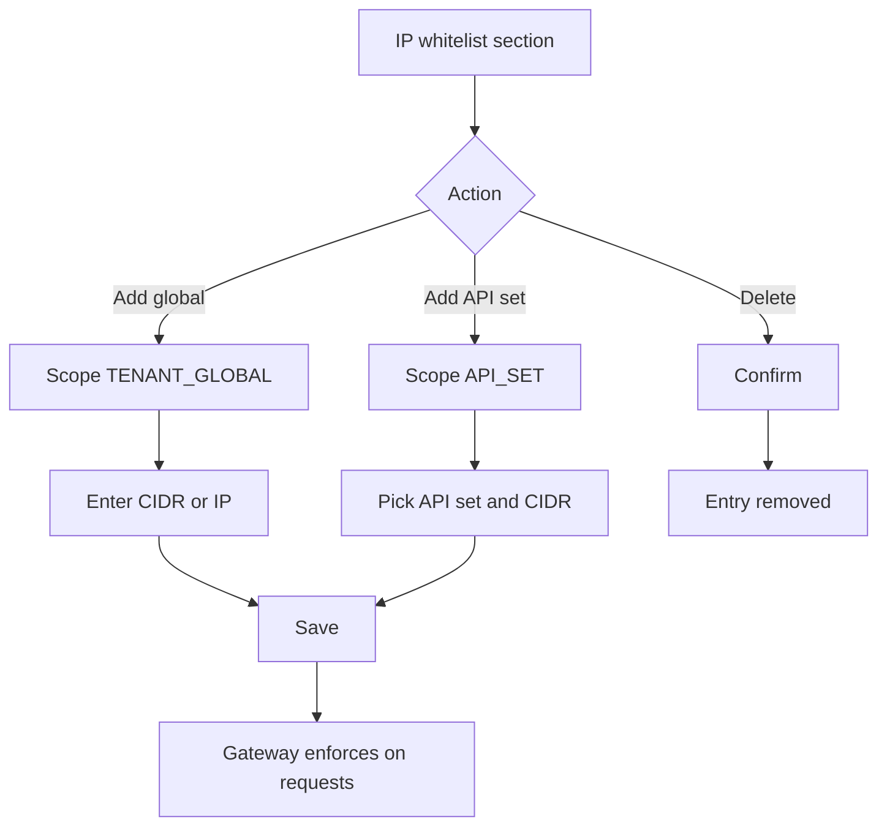
```mermaid
flowchart TD
  A["IP whitelist section"] --> B{Action}
  B -->|Add global| C["Scope TENANT_GLOBAL"]
  C --> D["Enter CIDR or IP"]
  D --> E[Save]
  B -->|Add API set| F["Scope API_SET"]
  F --> G["Pick API set and CIDR"]
  G --> E
  B -->|Delete| H[Confirm]
  H --> I["Entry removed"]
  E --> J["Gateway enforces on requests"]
```

---

### Postman collection download

1. Dashboard header → **Download Postman collection**.
2. Disabled if no assigned API sets.
3. Import JSON into Postman; set `baseUrl` and `apiKey` variables.
4. Call routes through the gateway.

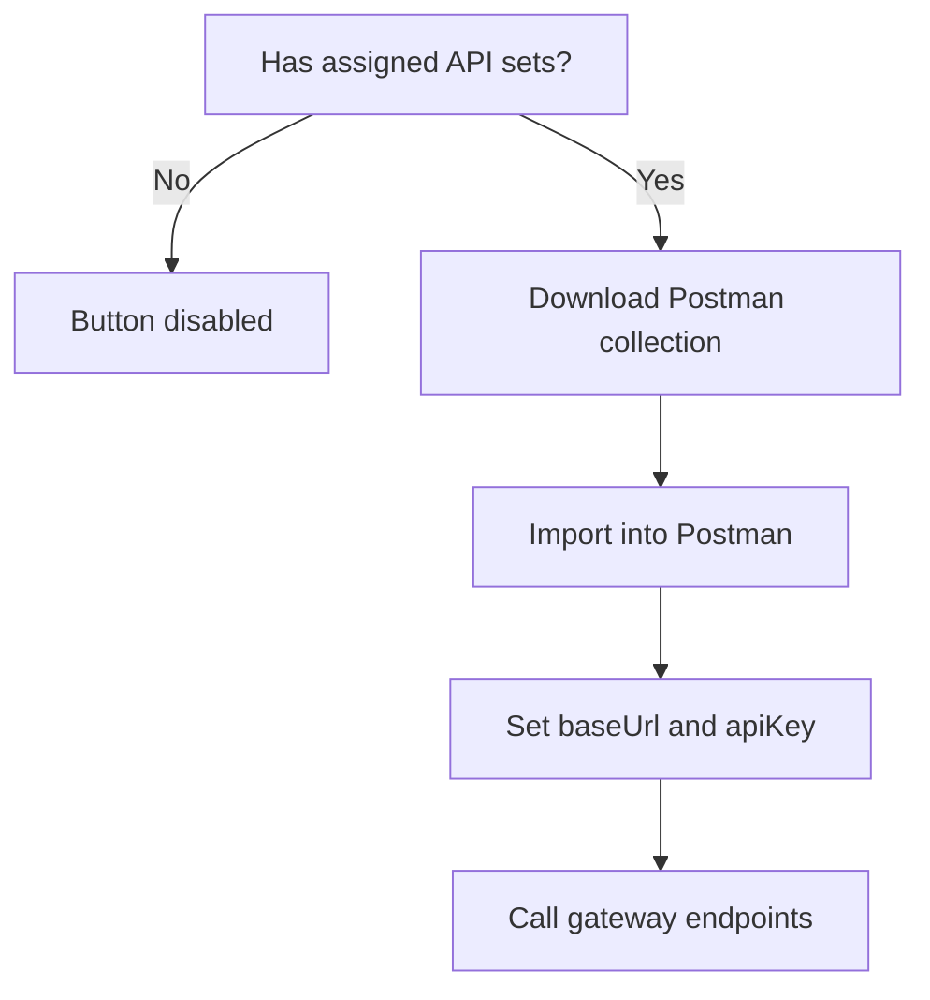
```mermaid
flowchart TD
  A["Has assigned API sets?"] -->|No| B["Button disabled"]
  A -->|Yes| C["Download Postman collection"]
  C --> D["Import into Postman"]
  D --> E["Set baseUrl and apiKey"]
  E --> F["Call gateway endpoints"]
```

---

### Typical tenant journey (after admin setup)

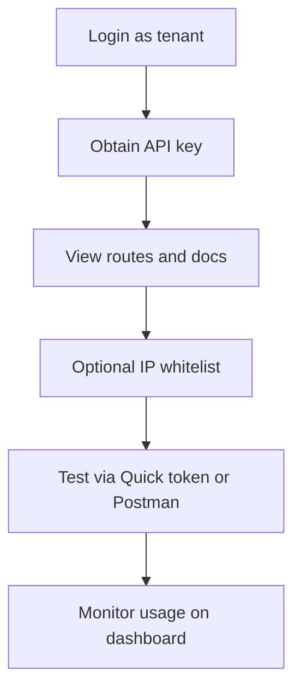
```mermaid
flowchart TD
  A["Login as tenant"] --> B["Obtain API key"]
  B --> C["View routes and docs"]
  C --> D["Optional IP whitelist"]
  D --> E["Test via Quick token or Postman"]
  E --> F["Monitor usage on dashboard"]
```

**Step-by-step:**

1. **Login** with slug/password from admin.
2. **Obtain API key** — self-create token or use admin-created key.
3. **Explore** assigned API sets and route documentation.
4. **Configure** IP whitelist if your integration requires it.
5. **Test** via Quick Token or downloaded Postman collection.
6. **Monitor** usage table for errors, latency, and volume.

---

## Admin vs tenant responsibilities

| Capability | Admin | Tenant |
|------------|:-----:|:------:|
| Create/edit/delete tenants | ✅ | — |
| Create/edit/delete API sets & routes | ✅ | — |
| Assign API sets to tenants | ✅ | — |
| Route documentation | ✅ edit | ✅ read |
| Replay secrets | ✅ configure | ✅ use in Quick Token |
| Create tokens | ✅ (for tenant) | ✅ (self) |
| Revoke tokens | ✅ | ✅ (own) |
| Usage policy (rate limits) | ✅ | — |
| Usage analytics | ✅ per tenant / API set | ✅ own |
| IP whitelist | ✅ per tenant | ✅ self-service |
| API set requirements | ✅ | — |
| Postman import (routes) | ✅ | — |
| Postman export (collection) | — | ✅ download |
| Test gateway calls (browser) | — | ✅ Quick Token |

---

## UI patterns

1. **Modal-first CRUD** — Lists stay on dashboard; create/edit/delete open as overlays. Close with modal dismiss or browser back.
2. **Custom events** — e.g. `admin-tenants-changed`, `admin-api-sets-changed` refresh lists after saves.
3. **One-time secrets** — API keys and replay raw secrets shown once with copy buttons.
4. **i18n** — Labels in `src/shared/i18n/en.ts`.

---

## Related documentation

- [README.md](../README.md) — setup and development
- [API_DOCUMENTATION.md](./API_DOCUMENTATION.md) — gateway API reference
- [PRD_PRODUCT_REQUIREMENTS.md](./PRD_PRODUCT_REQUIREMENTS.md) — product requirements
- [TECH_SPEC.md](./TECH_SPEC.md) — technical specification
