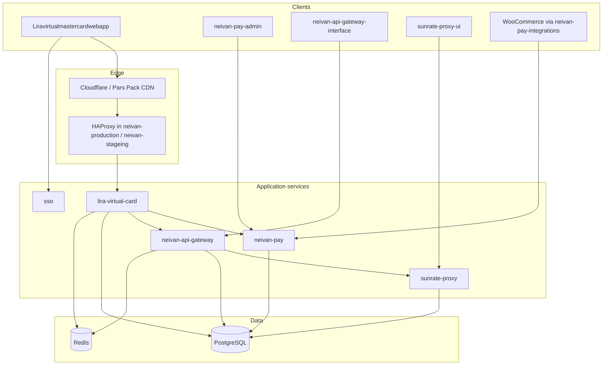

# Lira / Neivan Platform — Architecture Deep Dive

This document explains how the listed projects fit together, why they are structured the way they are, the principles behind that structure, and how to extend or debug each system.

**Scope:** the repositories you maintain under `/Users/ubank/Documents/lira/`:

| Repo | Role |
|------|------|
| `lira-virtual-card` | Virtual card BFF/API (Go) |
| `Liravirtualmastercardwebapp` | End-user panel (React/Vite) |
| `neivan-api-gateway` | Multi-tenant API gateway + admin/tenant APIs (Go) |
| `neivan-api-gateway-interface` | Gateway admin + tenant UI (Next.js) |
| `neivan-pay` | Payment orchestration API (Go) |
| `neivan-pay-admin` | Pay operations console (React/Vite) |
| `neivan-pay-integrations` | PHP SDK + WooCommerce/Joomla connectors |
| `sunrate-proxy` | USD card upstream proxy (Go) |
| `sunrate-proxy-ui` | Sunrate proxy admin (React/Vite) |
| `sso` | Identity / Lira signup-login (Spring Boot) |
| `new-ui` | Next-generation product UI (React/Vite) |
| `neivan-production` | Production Compose + HAProxy (`respect.plus`) |
| `neivan-stageing` | Staging/prod-on-one-host Compose + HAProxy |
| `ingress-manifest` | Legacy host-based HAProxy assembler |
| `observability-stack` | Loki + Grafana + Alloy log shipping |

Each folder is its **own Git repository**. The root `README.md` only groups them for navigation; commits and CI run per repo.

---

## 1. Platform mental model

### 1.1 What we are building

The platform splits into four layers:

1. **Identity** — `sso` issues and validates users for Lira flows (`/api/sso/lira/*`).
2. **Product** — `lira-virtual-card` + `Liravirtualmastercardwebapp` (cards, KYC, invoices, top-up, delegation).
3. **Platform services** — `neivan-api-gateway` (route tenants to backends), `sunrate-proxy` (USD issuer upstream), `neivan-pay` (payment intents, providers, webhooks).
4. **Operations** — `neivan-production` / `neivan-stageing` (routing, TLS at CDN, Compose), `observability-stack` (central logs), `ingress-manifest` (older Iran edge vhosts).



### 1.2 Why separate repositories

| Reason | Effect |
|--------|--------|
| **Independent release** | Pay can ship without redeploying the virtual-card panel. |
| **Different runtimes** | Go APIs, Next admin, Java SSO, PHP integrations each have their own toolchain and Docker image. |
| **Security boundary** | Gateway holds tenant API keys; Pay holds provider secrets; Lira holds cardholder data — smaller blast radius. |
| **Path-based hosting** | Frontends are built with fixed `base` paths (`/virtual/panel/`, `/gateway/panel/`, etc.); backends are stripped at HAProxy. |

### 1.3 Cross-repo contracts (read this before any feature)

| From | To | Contract |
|------|-----|----------|
| `Liravirtualmastercardwebapp` | `lira-virtual-card` | REST under `/v1/*`; JWT/session from SSO or Lira auth |
| `lira-virtual-card` | `neivan-pay` | Optional Rial payments (`NEIVAN_PAY_*` env) |
| `lira-virtual-card` | `neivan-api-gateway` | USD card program via gateway API set (`GATEWAY_*`) |
| `neivan-api-gateway` | `sunrate-proxy` | Proxied routes to upstream card APIs |
| `neivan-pay` | merchants | App token + discovery + payment intents + webhooks |
| `neivan-pay-integrations` | `neivan-pay` | Same HTTP API; PHP SDK wraps it |
| All deployable services | `neivan-production` / `neivan-stageing` | Container names + path prefixes in `haproxy.cfg` |

**Rule:** security-sensitive decisions (limits, eligibility, payment state) live in **backend** responses. Frontends display and collect input only.

---

## 2. Architectural principles (why the code looks this way)

These recur across Go services and are documented in repo READMEs / `TECH_SPEC` files.

### 2.1 Hexagonal / clean architecture (Go)

Typical layout:

```
cmd/<binary>/main.go          # thin entry
internal/
  domain/                     # entities, invariants, domain errors
  ports/                      # interfaces (repositories, providers)
  application/                # use cases (orchestration)
  infrastructure/             # postgres, redis, HTTP clients, providers
  delivery/http|httpapi/      # handlers, routers, middleware
  app/                        # composition root (wiring, RunFromEnv)
```

**Reasons:**

- **Testability** — use cases tested with mocks; handlers tested with `httptest`.
- **Swap adapters** — Zibal vs Trawili, in-memory vs Postgres, without touching handlers.
- **Stable API errors** — domain errors mapped once in delivery (`error_mapper.go`, envelope helpers).

### 2.2 Composition root pattern

`internal/app/` (or `internal/app/api.go`) is the only place that:

- Reads environment / config
- Opens DB pools
- Constructs repositories and use cases
- Registers routes

**Do not** construct Postgres inside handlers.

### 2.3 API versioning and envelopes

- Public HTTP APIs use a **`/v1`** prefix (Lira, Pay) or role prefixes (`/admin`, `/tenant`, `/gateway` on gateway).
- Lira returns JSON envelopes (`success`, `error.code`) — see `internal/delivery/http/response/envelope.go`.
- Pay maps domain errors to stable codes in `internal/delivery/httpapi/error_mapper.go`.

### 2.4 Async work

| Service | Pattern |
|---------|---------|
| `lira-virtual-card` | `cmd/worker` + Redis queues (fulfillment, notify) |
| `neivan-pay` | `cmd/worker` polls Postgres (~5s) for webhooks + reconcile |
| `neivan-api-gateway` | Synchronous proxy + usage recording |
| `sunrate-proxy` | Goroutines for JWT renewal per tenant |

### 2.5 Frontend architecture split

| Style | Repos | Layers |
|-------|-------|--------|
| **Feature folders + contexts** | `Liravirtualmastercardwebapp`, `new-ui` | `src/app` or `src/screens`, `contexts/`, `api/client.ts` |
| **Clean architecture** | `neivan-pay-admin` | `presentation` → `application` → `domain` → `infrastructure` |
| **Next App Router modules** | `neivan-api-gateway-interface` | `src/app/(admin)`, `src/admin/<resource>/`, `src/shared/lib/http.ts` |
| **Thin admin** | `sunrate-proxy-ui` | `pages/`, `api/client.ts`, API key auth |

### 2.6 Infrastructure principles

- **Single-host path routing** (Neivan): one HAProxy, many backends on Docker networks `public-shared` / `internal-shared`.
- **CDN terminates TLS** on production (`respect.plus`); origin speaks HTTP to HAProxy.
- **Staging dual stack** (`neivan-stageing`): separate Compose **project names** for stg vs prod gateway/wrapper on the same machine.
- **Observability**: push logs to Loki with tenant header `X-Scope-OrgID`; Alloy agents on each host.

### 2.7 Product development phases (workspace rule)

From root `README.md` — every major feature should go through:

1. **Analysis** — `docs/epics/<name>/analysis.md`
2. **Roadmap** — contract first, backend before security-sensitive UI
3. **Implementation** — backend contract, then frontend integration
4. **Validation** — cross-repo acceptance checks

Epic index: `docs/epics/README.md`.

---

## 3. Repository deep dives

### 3.1 `lira-virtual-card` (Go 1.26)

**Purpose:** BFF for virtual cards — auth, KYC, cards, invoices, pricing, fulfillment, admin APIs, Neivan Pay / gateway integration.

**Entry points:**

| Binary | Path | Boot |
|--------|------|------|
| API | `cmd/api/main.go` | `internal/app.RunFromEnv()` |
| Worker | `cmd/worker/main.go` | `internal/app.RunWorkerFromEnv()` |
| CLIs | `cmd/kvcli`, `kycli`, `cardlimitcli`, `admincli`, `gatewayprobe` | Ops / seeding |

**Request path:**

1. `RunFromEnv` → `config.FromEnv()` + `observability.InitFromEnv()`
2. `buildHandler` in `internal/app/wiring.go` wires repos and use cases
3. `internal/app/handler.go` mounts `mux.Handle("/v1/", http.StripPrefix("/v1", router))`
4. `internal/delivery/http/router.go` (chi) registers routes + middleware (JWT, rate limit, CORS, recover, request ID)

**Key files:**

| File | Role |
|------|------|
| `internal/config/config.go` | All env vars |
| `internal/app/wiring.go` | Dependency injection |
| `internal/delivery/http/router.go` | Route table |
| `internal/ports/*.go` | Interfaces |
| `internal/application/*` | Use cases |
| `internal/infrastructure/postgres`, `redisqueue` | Adapters |
| `.env.example` | Required configuration |
| `docs/TECH_SPEC.md`, `docs/PRD.md` | Product/tech reference |

**Data:** PostgreSQL (migrations), Redis (OTP, rate limits, job queues).

**Adding a feature:**

1. Define domain types / errors in `internal/domain` if needed.
2. Add method to `internal/ports` repository or service interface.
3. Implement use case in `internal/application/<feature>/`.
4. Implement adapter in `internal/infrastructure/`.
5. Add handler in `internal/delivery/http/handlers/`.
6. Register route in `router.go`; add handler to `RouterOpts` in `wiring.go`.

**Debugging:**

- `LOG_LEVEL=debug`, `GATEWAY_DEBUG`, `WEBHOOK_SIGNATURE_DEBUG`
- Health: `GET /v1/health`, ready: `GET /v1/ready`
- Run: `go run ./cmd/api` or `docker compose up` (see `docker-compose.yml`)

---

### 3.2 `neivan-pay` (Go 1.26)

**Purpose:** Multi-tenant payment orchestration — discovery, payment intents, provider callbacks (Zibal, Trawili/Airwallex), webhooks, payment links, admin APIs.

**Entry points:**

| Binary | Path | Boot |
|--------|------|------|
| API | `cmd/api/main.go` | `internal/app.RunAPI()` |
| Worker | `cmd/worker/main.go` | `internal/app.RunWorker()` |
| Migrate | `cmd/migratecli/main.go` | SQL migrations |

**Request path:**

1. `envx.LoadDotEnv(".env")` + `logx.New("neivan-pay-api")`
2. `makeRepositories` in `internal/app/api.go`
3. `internal/delivery/httpapi/router.go` — stdlib `ServeMux` with Go 1.22 method patterns (`GET /v1/...`)
4. Middleware: app token, admin token in same package

**Key files:**

| File | Role |
|------|------|
| `NEIVAN_PAY_V1_ARCHITECTURE.md` | System design |
| `internal/delivery/httpapi/router.go` | All routes |
| `internal/delivery/httpapi/error_mapper.go` | Stable API errors |
| `internal/application/payment`, `webhook`, `discovery` | Use cases |
| `internal/infrastructure/providers/` | Zibal, Trawili |
| `docs/merchant-integration-flow.md` | Merchant integration |
| `docs/api/openapi.yaml` | Contract |

**Adding a feature:**

1. `internal/domain/<area>/`
2. `internal/application/<area>/`
3. `internal/ports` + `internal/infrastructure/postgres`
4. Handler in `internal/delivery/httpapi/` + `registerRoutes` in `router.go`
5. Wire in `internal/app/api.go`

**Debugging:**

- `LOG_LEVEL=debug`, `PAY_HTTP_DEBUG`, `WEBHOOK_SIGNATURE_DEBUG`
- Log file: `LOG_FILE_PATH` (default `logs/neivan-pay.log`)
- Postman: `trawili_B2B.postman_Airwallex.json`

---

### 3.3 `neivan-api-gateway` (Go 1.24)

**Purpose:** Tenant API key auth, rate limiting, request proxy to configured backends, admin/tenant management APIs, usage metrics.

**Entry point:** `cmd/main.go` → `config.LoadConfig()` (Viper + `.env`) → `infrastructure.Setup()` → `app.NewHTTPServer()`.

**Route map** (`internal/app/server.go`):

| Prefix | Purpose |
|--------|---------|
| `/livez`, `/readyz`, `/health`, `/metrics` | Ops |
| `POST /admin/auth/login`, `POST /tenant/auth/login` | JWT issuance |
| `/admin/*` | Admin CRUD (tenants, API sets, routes) |
| `/tenant/*` | Tenant self-service |
| `/gateway/*` | Token auth + `GatewayHandler` dynamic proxy |

**Key files:**

| File | Role |
|------|------|
| `internal/config/config.go` | Viper env |
| `internal/delivery/http/gateway_handler.go` | Proxy core |
| `infrastructure/backend_resolver.go` | Route → upstream URL |
| `infrastructure/repository/` | Postgres repos |
| `README.md` | Large operational guide |

**Adding a feature:**

- **New admin/tenant endpoint:** domain → `application/usecase` → repository → handler → `AdminRouter` / `TenantRouter`.
- **New proxied API:** DB route rows + backend resolver; clients call `/gateway/...`.

**Debugging:** Prometheus `/metrics`; gateway decision logs; integration tests with `TEST_POSTGRES_URL` / `TEST_REDIS_URL`.

---

### 3.4 `sunrate-proxy` (Go 1.26)

**Purpose:** Multi-tenant wrapper around Sunrate/USD card upstream — API keys, encrypted credentials, JWT cache, card lifecycle endpoints.

**Entry point:** `cmd/server/main.go` — manual DI: config → GORM DB → `tenant.Manager` → `transport/http/router.go`.

**Routes** (`internal/transport/http/router.go`): `GET /health`, USD card routes with `X-Api-Key` + `User-Identifier`, `/admin/` when CORS set.

**Key files:**

| File | Role |
|------|------|
| `internal/tenant/manager.go` | Upstream login + request execution |
| `internal/transport/http/handler/usdcards/` | Card endpoints |
| `internal/config/config.go` | `DATABASE_URL`, `CREDENTIALS_ENCRYPTION_KEY`, upstream URLs |

**Note:** Production Lira often reaches cards via **gateway**, not direct sunrate-proxy.

---

### 3.5 `sso` (Java 17, Spring Boot 3)

**Purpose:** Central SSO — users, roles, permissions, Lira-specific signup/login, password reset, Zeepay Feign client.

**Entry point:** `src/main/java/com/farda/sso/SsoApplication.java` (port **8095** default).

**Structure:**

```
controller/     # REST endpoints
service/        # business logic
model/entity|dto|mapper/   # JPA + MapStruct
config/security/SecurityConfig.java
client/zeepay/  # OpenFeign
```

**Key routes:** `/api/sso/lira/signup`, `/api/sso/lira/login`, `/api/sso/users`, admin paths — see `SecurityConfig` permit list.

**Config:** `src/main/resources/application.yml` (profiles, datasource, Redis, JWT public key).

**Adding a feature:** DTO → service → repository → controller; update `SecurityConfig` if the route must be public.

---

### 3.6 Frontends

#### `Liravirtualmastercardwebapp`

- **Stack:** React 18, Vite 6, Tailwind 4, React Router 7.
- **Entry:** `index.html` → `src/main.tsx` → `src/app/App.tsx` → `src/app/routes.tsx`.
- **API:** `src/api/client.ts` (`VITE_API_BASE_URL`, session bearer).
- **State:** `AuthContext`, `CardsContext`, `KycContext`, `LanguageContext`.
- **Deploy base:** `/virtual/panel/` in `vite.config.ts`.
- **Add feature:** screen in `src/app/components/screens/`, route in `routes.tsx`, API in `src/api/`.

#### `neivan-api-gateway-interface`

- **Stack:** Next.js 16 App Router, React 19, strict TypeScript.
- **Entry:** `src/app/layout.tsx`, routes under `src/app/(admin)/admin/` and `(tenant)/tenant/`.
- **API:** `src/shared/lib/http.ts` + tokens in localStorage (`neivan_admin_token`, `neivan_tenant_token`).
- **Add feature:** follow README pattern — types → `admin/<resource>/api.ts` → list UI → `@modal` parallel routes.

#### `neivan-pay-admin`

- **Stack:** React 19, Vite 6, clean architecture folders, i18next (en/fa).
- **Entry:** `src/main.tsx` → `src/presentation/App.tsx` (inline routes).
- **API:** `src/infrastructure/api/client/http-client.ts`; **no `VITE_API_BASE_URL` → mock repository**.
- **Add feature:** `presentation/features/`, domain contract, HTTP repo, translations in `src/i18n/en|fa/`.

#### `new-ui`

- **Stack:** React 18, Vite 6, TanStack Query, axios, strict TS.
- **Entry:** `src/main.tsx` → `src/App.tsx` (`AnimatedRoutes`).
- **API:** `src/services/ApiClient.ts` + `services/modules/`.
- **Partial mocks:** `src/utils/mockData.ts`.

#### `sunrate-proxy-ui`

- **Stack:** React 19, Vite 7, API key auth.
- **Entry:** `src/main.tsx` → `src/App.tsx`.
- **Base path:** `/sunrate/admin-panel/`.
- **API:** `src/api/client.ts` with `X-Api-Key`.

---

### 3.7 `neivan-pay-integrations` (PHP monorepo)

**Layout:**

| Path | Role |
|------|------|
| `packages/php-sdk/` | `neivan/pay-merchant-sdk` — Domain / Application / Infrastructure |
| `woocommerce/` | WC gateway plugin (Phase 1 ship target) |
| `wordpress/`, `joomla/` | Future phases |
| `docs/architecture.md`, `implementation-rules.md` | Standards |

**Woo entry:** `woocommerce/neivan-pay-woocommerce.php` → `src/Plugin.php` → gateway + REST webhook.

**Flow:** discovery on checkout → provider selection → redirect → return URL + **authoritative webhook** (`wp-json/neivan-pay/v1/webhook`).

---

### 3.8 Deployment repos

#### `neivan-production`

- Host: **respect.plus** (Cloudflare → origin HTTP).
- Path routing in `infrastructure/haproxy/haproxy.cfg`.
- Services under `services/*` each with `docker-compose.yml`.
- Pay public base example: `https://respect.plus/pay/api/v1`.

#### `neivan-stageing`

- Hosts: `stg.niwan.net`, `niwan.net` (prod gateway/wrapper), `pgm.liracards.com` (Pay on :443).
- **Critical:** separate Compose project names for stg vs prod (`neivan-gateway-stg` vs `neivan-gateway-prod`).
- Docs: `docs/stg-niwan-net-urls.md`, `docs/gateway-sunrate-troubleshooting.md`.

#### `ingress-manifest`

- Legacy **host-based** HAProxy; assembler builds `haproxy/assembler/dist/haproxy.cfg`.
- Not the same model as Neivan path-prefix routing.

#### `observability-stack`

- `deploy/docker-compose.yml` — Loki, Grafana, Alloy.
- Fleet: `fleet/inventory/hosts.yaml` → `make fleet-render` → per-host Alloy config.

---

## 4. How services are wired in production

### 4.1 Path routing (production example)

| Public path | Backend | Strip prefix? |
|-------------|---------|---------------|
| `/virtual/api/` | `liravirtualcards-core:8080` | yes |
| `/virtual/panel/` | `liravirtualcards-panel:80` | yes |
| `/gateway/api/` | `neivan-gateway-core:8080` | yes |
| `/gateway/panel/` | `neivan-gateway-panel:3000` | **no** |
| `/sunrate/api/` | `cardwrapper-core:8080` | yes |
| `/pay/api/` | `neivan-pay-core:8080` | yes |
| `/pay/admin-panel/` | `neivan-pay-admin:80` | yes |

Frontends **must** be built with matching `base` / `NEXT_PUBLIC_BASE_PATH` or assets break.

### 4.2 Staging Pay host

On `pgm.liracards.com`, paths are `/api`, `/admin-panel`, `/docs` (not under `/pay/...`). WooCommerce shop uses `NEIVAN_PAY_WC_DEBUG` and plugin copied from integrations repo.

---

## 5. Adding a feature end-to-end (playbook)

### 5.1 Backend-only API change (Go)

1. Write or update epic docs under `docs/epics/<feature>/`.
2. Extend OpenAPI or TECH_SPEC if the contract is public.
3. Implement domain → application → infrastructure → handler → route.
4. Add `_test.go` at use-case and handler level.
5. Run `go test ./...` in that repo.
6. Update `.env.example` for new env vars.
7. If deployed: update service `.env` in `neivan-production` or `neivan-stageing` and reload HAProxy if paths change.

### 5.2 Full-stack feature (Lira example)

1. **Contract** — define request/response in epic `roadmap.md`.
2. **Backend** — `lira-virtual-card` handler + migration if needed.
3. **Frontend** — `Liravirtualmastercardwebapp` screen + `client.ts` method.
4. **Integration** — point `VITE_API_BASE_URL` at local `:8080/v1` or staging `/virtual/api/v1`.
5. **Deploy** — rebuild panel image with correct base path; run API migration.

### 5.3 Payment / merchant feature

1. `neivan-pay` API + worker behavior if async.
2. `neivan-pay-admin` if operators need visibility.
3. `neivan-pay-integrations` SDK + Woo plugin if merchants need it.
4. `docs/merchant-integration-flow.md` update.
5. Staging: refresh vendored plugin under `neivan-stageing/services/wc-shop/plugins/`.

### 5.4 Gateway / USD cards

1. Route + API set in `neivan-api-gateway` (DB seed or admin API).
2. Upstream behavior in `sunrate-proxy` if new issuer endpoint.
3. Consumer config in `lira-virtual-card` (`GATEWAY_*`).
4. Verify via `gatewayprobe` CLI or gateway metrics.

---

## 6. Debugging architecture (where failures hide)

### 6.1 Layered diagnosis

```text
Browser → CDN → HAProxy ACL → Docker network → App handler → Use case → DB/Redis → External provider
```

| Symptom | First checks |
|---------|----------------|
| 404 on assets | Frontend `base` path mismatch with HAProxy |
| 403 from HAProxy | Wrong `Host` header or unknown host ACL |
| 502/503 | Backend container down or wrong name on `public-shared` |
| 401 from API | JWT/API token env mismatch between services |
| Payment stuck | Pay worker running? Webhook delivery table? Provider callback logs? |
| Card ops fail | Gateway route vs direct sunrate-proxy; `GATEWAY_DEBUG` |

### 6.2 Origin tests (bypass CDN)

```bash
curl -sS -H 'Host: respect.plus' http://127.0.0.1/virtual/api/v1/health
curl -sS -H 'Host: stg.niwan.net' http://127.0.0.1/gateway/api/health
```

### 6.3 Config validation

```bash
docker run --rm -v "$PWD/infrastructure/haproxy/haproxy.cfg:/usr/local/etc/haproxy/haproxy.cfg:ro" \
  haproxy:lts-alpine haproxy -c -f /usr/local/etc/haproxy/haproxy.cfg
```

### 6.4 HAProxy / Compose pitfalls (staging)

- Never let `make prod-up` replace staging gateway project names — see `neivan-stageing/docs/gateway-sunrate-troubleshooting.md`.
- Sunrate admin UI path is `/sunrate/admin-panel/`, not `/sunrate/panel/`.
- `make gateway-sunrate-ps` should show **8** gateway/wrapper containers when both stacks run.

---

## 7. Key documentation index

| Topic | Location |
|-------|----------|
| Workspace epics | `docs/epics/README.md` |
| Lira backend spec | `lira-virtual-card/docs/TECH_SPEC.md` |
| Pay architecture | `neivan-pay/NEIVAN_PAY_V1_ARCHITECTURE.md` |
| Pay merchants | `neivan-pay/docs/merchant-integration-flow.md` |
| Gateway spec | `neivan-api-gateway/docs/TECH_SPECIFICATION.md` |
| Gateway UI | `neivan-api-gateway-interface/README.md` |
| PHP integrations rules | `neivan-pay-integrations/docs/implementation-rules.md` |
| Staging URLs | `neivan-stageing/docs/stg-niwan-net-urls.md` |
| Gateway/Sunrate 503 | `neivan-stageing/docs/gateway-sunrate-troubleshooting.md` |
| Observability | `observability-stack/README.md` |
| User panel setup | `Liravirtualmastercardwebapp/LOCAL_SETUP.md` |

---

## 8. Design decisions summary

| Decision | Why |
|----------|-----|
| Separate Git repos | Independent release and blast radius |
| `/v1` + JSON envelopes | Stable mobile/web clients |
| Gateway in front of Sunrate | Central API keys, rate limits, usage metering |
| Pay as standalone service | Reuse by Lira, WooCommerce, future CMS plugins |
| HAProxy path routing | One origin IP, many products |
| Worker polling (Pay) vs Redis queues (Lira) | Pay v1 simplicity; Lira needs fulfillment throughput |
| Epic docs before code | Cross-repo contract alignment |
| SSO separate from Go stack | Existing Java identity platform and Zeepay integration |

This document should be read together with **`developer-handbook.md`** for day-to-day commands, logging recipes, and offline workflows.
