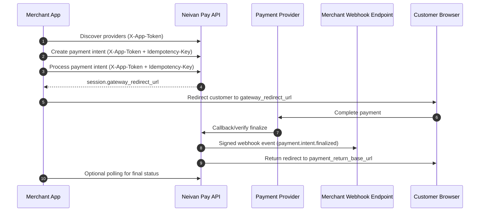

# Neivan Pay Merchant Integration Walkthrough

This is a merchant-only integration guide for payments with `neivan-pay`.

## Base URL and API style

- **Production base URL:** `https://pgm.liracards.com/v1`
- **Auth model:** token in custom headers (not OAuth/JWT bearer).
- **Response format:** envelope JSON with `success`, `code`, `message`, `data`, `meta`, and `error`.

---

## 1) Merchant payment flow (end-to-end)



---

## 2) Merchant prerequisites (what you must receive/configure)

Before you start coding, your team must have these from the pay-admin panel:

1. Merchant app token (`X-App-Token`)
2. A configured `payment_return_base_url` for your app
3. A webhook subscription with:
   - your webhook `target_url`
   - shared webhook `secret`
4. At least one provider route enabled for your target currency

No admin API routes are required in this merchant document. Treat the above as the handover checklist from your internal ops/pay-admin team.

---

## 3) Deep dive: `payment_return_base_url`

`payment_return_base_url` is the browser return destination after customer payment flow completes at the provider side.

### What it is

- A merchant-owned HTTPS base URL.
- Used by Pay service to redirect customer browser back to your app/site.
- Called after provider callback/verification path is processed.

### Why it matters

- It is a customer-facing UX step (post-payment landing page).
- It should never be used as payment truth source by itself.
- Final payment state must still be confirmed by webhook or API status check.

### Rules and best practices

- Must be `https://`.
- Must be stable and reachable publicly.
- Must point to a route in your app that can parse query params and load order state.
- Should render a "processing" state if webhook has not arrived yet.
- Should not mark order as paid only from browser redirect.

### Recommended merchant behavior

1. Customer returns to `payment_return_base_url`.
2. Merchant UI shows temporary status (`processing`).
3. Backend waits for webhook verification OR calls `GET /payment-intents/{id}`.
4. Backend finalizes order on `authorized`; otherwise shows `failed/cancelled`.

---

## 4) Deep dive: webhook subscriptions

Webhook subscription tells Pay service where to push payment finalization events.

### Webhook event purpose

- Main source of truth for asynchronous finalization.
- Enables server-to-server reconciliation independent of browser/device behavior.
- Supports retries/replay when temporary delivery failures happen.

### Required webhook subscription values

- `target_url`: your HTTPS webhook endpoint
- `secret`: shared HMAC secret used to sign outgoing webhook payloads
- `enabled`: should be true in production

### Webhook endpoint requirements on merchant side

- Accept `POST` with raw JSON body.
- Read and validate headers:
  - `X-Neivan-Signature`
  - `X-Neivan-Timestamp`
  - `X-Neivan-Event-Id`
- Verify signature before JSON trust/parsing.
- Apply replay protection (timestamp window + event id dedupe).
- Return `2xx` only after successful verification and durable processing.

### Delivery and retry behavior expectations

- Your endpoint may receive retries for same event.
- Must be idempotent at event level.
- Use `X-Neivan-Event-Id` as unique key for dedupe.

---

## 5) Replay-protection headers: rules and creation

You asked about "reply protection"; in webhook security this is **replay protection**.

### Headers sent by Pay

- `X-Neivan-Timestamp`: event timestamp string (RFC3339 format)
- `X-Neivan-Signature`: `hex(HMAC_SHA256(secret, timestamp + "." + raw_body))`
- `X-Neivan-Event-Id`: unique event identifier for dedupe

### Verification rules (merchant must enforce)

1. Read raw request body bytes exactly as received.
2. Extract `timestamp`, `signature`, and `event_id` headers.
3. Build message: `timestamp + "." + raw_body`.
4. Compute expected HMAC-SHA256 (hex lowercase is recommended).
5. Compare signatures with constant-time compare.
6. Parse timestamp and reject if too old/future-skewed (example: max 300s).
7. Reject already-seen `event_id` (store in Redis/DB with TTL).
8. Process event idempotently and then mark event as seen.

### Signature creation reference (sender side)

This is how the signature is generated conceptually:

```text
message = X-Neivan-Timestamp + "." + raw_request_body
X-Neivan-Signature = HEX(HMAC_SHA256(secret, message))
```

---

## 6) Go example: verify webhook signature + replay protection

```go
package webhook

import (
	"crypto/hmac"
	"crypto/sha256"
	"encoding/hex"
	"errors"
	"io"
	"net/http"
	"strings"
	"time"
)

// SeenStore can be backed by Redis/DB.
// SetIfNotExists should return true only for first time event_id.
type SeenStore interface {
	SetIfNotExists(eventID string, ttl time.Duration) (bool, error)
}

func VerifyNeivanWebhook(r *http.Request, secret string, seen SeenStore) ([]byte, error) {
	const maxSkew = 5 * time.Minute

	ts := strings.TrimSpace(r.Header.Get("X-Neivan-Timestamp"))
	sig := strings.TrimSpace(r.Header.Get("X-Neivan-Signature"))
	eventID := strings.TrimSpace(r.Header.Get("X-Neivan-Event-Id"))
	if ts == "" || sig == "" || eventID == "" {
		return nil, errors.New("missing required neivan webhook headers")
	}

	rawBody, err := io.ReadAll(r.Body)
	if err != nil {
		return nil, err
	}

	// 1) Signature verification
	msg := ts + "." + string(rawBody)
	mac := hmac.New(sha256.New, []byte(secret))
	_, _ = mac.Write([]byte(msg))
	expectedSig := hex.EncodeToString(mac.Sum(nil))
	if !hmac.Equal([]byte(strings.ToLower(expectedSig)), []byte(strings.ToLower(sig))) {
		return nil, errors.New("invalid neivan signature")
	}

	// 2) Timestamp window check
	t, err := time.Parse(time.RFC3339, ts)
	if err != nil {
		return nil, errors.New("invalid neivan timestamp format")
	}
	now := time.Now().UTC()
	if t.Before(now.Add(-maxSkew)) || t.After(now.Add(maxSkew)) {
		return nil, errors.New("timestamp outside allowed skew window")
	}

	// 3) Replay protection by event id
	ok, err := seen.SetIfNotExists(eventID, 24*time.Hour)
	if err != nil {
		return nil, err
	}
	if !ok {
		return nil, errors.New("duplicate webhook event")
	}

	return rawBody, nil
}
```

### Minimal sender-side Go helper (for signature generation reference)

```go
package webhook

import (
	"crypto/hmac"
	"crypto/sha256"
	"encoding/hex"
)

func BuildNeivanSignature(secret, timestamp string, rawBody []byte) string {
	msg := timestamp + "." + string(rawBody)
	mac := hmac.New(sha256.New, []byte(secret))
	_, _ = mac.Write([]byte(msg))
	return hex.EncodeToString(mac.Sum(nil))
}
```

---

## 7) Merchant-facing routes (full request/response contract)

All responses use the envelope shape:

```json
{
  "success": true,
  "code": "STRING_CODE",
  "message": "human-readable message",
  "data": {},
  "meta": {
    "request_id": "req_xxx",
    "timestamp": "2026-06-02T00:00:00Z",
    "version": "v1",
    "build_id": "build_xxx"
  },
  "error": null
}
```

### 7.1 `GET /v1/discovery/providers`

**Headers**

- `X-App-Token` (required)

**Query params**

- `currency` (optional, ISO-4217)
- `amount_minor` (optional, integer >= 0)

**Request body**

- None

**Responses**

- `200 OK`
  - `data.by_currency[]`:
    - `currency` (string)
    - `provider_count` (int)
    - `providers[]`:
      - `provider_key` (string)
      - `label` (string)
      - `flow_type` (`redirect` | `wallet`)
      - `region` (string)
      - `sort_order` (int)
  - `data.currencies[]` (string)
- `401 Unauthorized`
  - Missing/invalid `X-App-Token`

---

### 7.2 `POST /v1/payment-intents`

**Headers**

- `X-App-Token` (required)
- `Idempotency-Key` (required)
- `Content-Type: application/json`

**Request body**

```json
{
  "amount_minor": 250000,
  "currency": "IRR",
  "merchant_reference": "order-123"
}
```

**Body rules**

- `amount_minor`: required, integer, minimum `1`
- `currency`: required, 3-letter code
- `merchant_reference`: optional string

**Responses**

- `201 Created`
  - `data.item`:
    - `id`, `tenant_id`, `app_id`
    - `amount_minor`, `currency`
    - `status` (`created` | `processing` | `authorized` | `failed` | `cancelled`)
    - `created_at`, `updated_at`
- `400 Bad Request`
  - Invalid body/validation error (for example invalid amount/currency)
- `401 Unauthorized`
  - Missing/invalid `X-App-Token`
- `409 Conflict`
  - Idempotency conflict (same key with different request payload)

---

### 7.3 `GET /v1/payment-intents/{payment_intent_id}`

**Headers**

- `X-App-Token` (required)

**Path params**

- `payment_intent_id` (required)

**Request body**

- None

**Responses**

- `200 OK`
  - `data.item` (same schema as payment intent above)
- `401 Unauthorized`
  - Missing/invalid `X-App-Token`
- `404 Not Found`
  - `payment_intent_id` not found for merchant scope

---

### 7.4 `GET /v1/payment-intents/{payment_intent_id}/attempts`

**Headers**

- `X-App-Token` (required)

**Path params**

- `payment_intent_id` (required)

**Request body**

- None

**Responses**

- `200 OK`
  - `data.items[]`:
    - `id`
    - `payment_intent_id`
    - `tenant_id`
    - `app_id`
    - `provider_reference`
    - `outcome` (`approved` | `failed` | `pending`)
    - `failure_reason`
    - `created_at`
- `401 Unauthorized`
  - Missing/invalid `X-App-Token`
- `404 Not Found`
  - `payment_intent_id` not found

---

### 7.5 `POST /v1/payment-intents/{payment_intent_id}/process`

**Headers**

- `X-App-Token` (required)
- `Idempotency-Key` (required)
- `Content-Type: application/json`

**Path params**

- `payment_intent_id` (required)

**Request body**

```json
{
  "provider_key": "zibal"
}
```

**Body rules**

- Body is optional.
- `provider_key` is required when multiple providers are enabled for intent currency.

**Responses**

- `200 OK`
  - `data.item` -> payment intent object
  - `data.session`:
    - `provider_reference` (string, required)
    - `gateway_redirect_url` (string, present for redirect flow)
    - `approved` (bool, true for synchronous wallet settlement)
    - `expires_at` (RFC3339, optional)
- `400 Bad Request`
  - Example: provider key required when multiple routes exist, invalid body
- `401 Unauthorized`
  - Missing/invalid `X-App-Token`
- `404 Not Found`
  - Payment intent not found
- `409 Conflict`
  - Intent status invalid for processing
- `503 Service Unavailable`
  - Provider not configured

---

### 7.6 `POST /v1/payment-intents/{payment_intent_id}/cancel`

**Headers**

- `X-App-Token` (required)
- `Idempotency-Key` (required)

**Path params**

- `payment_intent_id` (required)

**Request body**

- None

**Responses**

- `200 OK`
  - `data.item` -> payment intent object with `status: cancelled`
- `401 Unauthorized`
  - Missing/invalid `X-App-Token`
- `404 Not Found`
  - Payment intent not found
- `409 Conflict`
  - Already cancelled / cannot cancel in current state

---

### 7.7 Browser return routes in merchant journey

These routes are part of redirect flow, but merchants usually do not call them directly from backend code.

#### `GET /v1/providers/zibal/start`

**Query params**

- `trackId` (required)

**Request body**

- None

**Responses**

- `200 OK` (`text/html`)
  - HTML bridge page that navigates browser to Zibal gateway
- `400 Bad Request`
  - Invalid `trackId`
- `404 Not Found`
  - Payment session not found
- `410 Gone`
  - Payment session expired/no longer active

#### `GET /v1/providers/zibal/return`

**Query params**

- `trackId` (optional in spec, typically present in real flow)

**Request body**

- None

**Responses**

- `302 Found`
  - Redirects browser to merchant `payment_return_base_url` with payment result query values

#### `GET /v1/providers/{provider_key}/callbacks`

**Request body**

- None

**Responses**

- Provider-specific browser callback handling response (implementation-dependent)

Note: `POST /v1/providers/{provider_key}/callbacks` and `POST /v1/providers/{provider_key}/verify` are provider-to-pay technical endpoints and are not merchant integration calls.

---

## 8) Merchant go-live checklist

- Store `X-App-Token` securely and rotate by process policy.
- Ensure `payment_return_base_url` is HTTPS and production-stable.
- Implement webhook signature verification with constant-time compare.
- Enforce replay controls: timestamp window + `event_id` dedupe store.
- Make webhook handler idempotent and retry-safe.
- Use unique `Idempotency-Key` for each mutating API call.
- Treat webhook/API status as payment truth, not browser redirect alone.

---

## 9) Example merchant requests

Create payment intent:

```http
POST /v1/payment-intents
X-App-Token: key_live_***
Idempotency-Key: pi-create-order-123
Content-Type: application/json

{
  "amount_minor": 250000,
  "currency": "IRR",
  "merchant_reference": "order-123"
}
```

Process payment intent:

```http
POST /v1/payment-intents/pi_123/process
X-App-Token: key_live_***
Idempotency-Key: pi-process-order-123
Content-Type: application/json

{
  "provider_key": "zibal"
}
```

---

## 10) Scope note

- This document is merchant-focused only.
- Admin/API route details are intentionally excluded.
- Payment link capability is currently internal/testing and not a public merchant feature.
