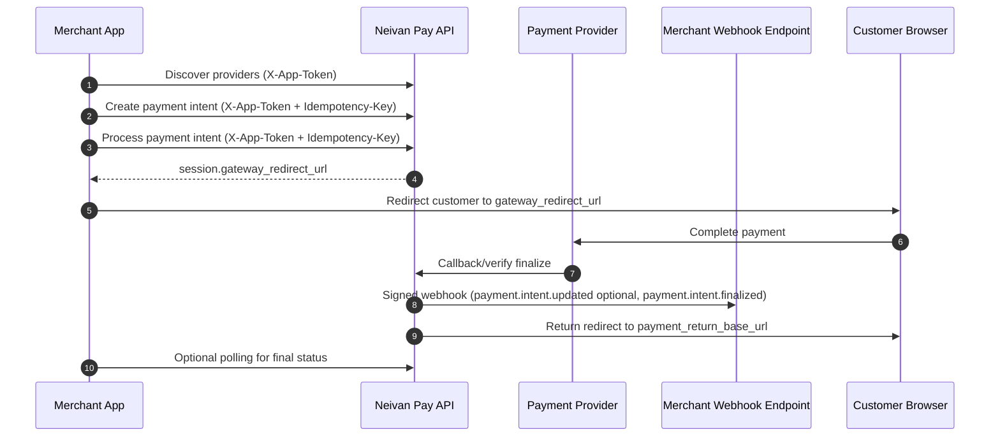

# Neivan Pay Merchant Integration Walkthrough

This is a merchant-only integration guide for payments with `neivan-pay`.

## Base URL and API style

- **Production base URL:** `https://pgm.liracards.com/v1`
- **Auth model:** token in custom headers (not OAuth/JWT bearer).
- **Response format:** envelope JSON with `success`, `code`, `message`, `data`, `meta`, and `error`.

---

## 1) Merchant payment flow (end-to-end)



---

## 2) Merchant prerequisites (what you must receive/configure)

Before you start coding, your team must have these from the pay-admin panel:

1. Merchant app token (`X-App-Token`)
2. A configured `payment_return_base_url` for your app
3. A webhook subscription with:
   - your webhook `target_url`
   - shared webhook `secret`
4. At least one provider route enabled for your target currency
5. (Optional) `currency_exchange_enabled` on your app if you price orders in a **store currency** but charge via providers in a different **charge currency** (for example EUR storefront → USD Airwallex)

No admin API routes are required in this merchant document. Treat the above as the handover checklist from your internal ops/pay-admin team.

---

## 3) Deep dive: `payment_return_base_url`

`payment_return_base_url` is the browser return destination after customer payment flow completes at the provider side.

### What it is

- A merchant-owned HTTPS base URL.
- Used by Pay service to redirect customer browser back to your app/site.
- Called after provider callback/verification path is processed.

### Why it matters

- It is a customer-facing UX step (post-payment landing page).
- It should never be used as payment truth source by itself.
- Final payment state must still be confirmed by webhook or API status check.

### Rules and best practices

- Must be `https://`.
- Must be stable and reachable publicly.
- Must point to a route in your app that can parse query params and load order state.
- Should render a "processing" state if webhook has not arrived yet.
- Should not mark order as paid only from browser redirect.

### Recommended merchant behavior

1. Customer returns to `payment_return_base_url`.
2. Merchant UI shows temporary status (`processing`).
3. Backend waits for webhook verification OR calls `GET /payment-intents/{id}`.
4. Backend finalizes order on `authorized`; otherwise shows `failed/cancelled`.

---

## 4) Currency exchange

Currency exchange lets a merchant price in one currency (your **store currency**) while routing payment through a provider that settles in another (**charge currency**).

### Concepts

| Term | Meaning |
|------|---------|
| **Store currency** | The currency your shop/catalog uses (for example `EUR`). |
| **Charge currency** | The currency sent to the payment provider API (for example `USD` for Airwallex). |
| **Exchange required** | Store and charge currencies differ; you must convert before creating the payment intent. |

Important rules:

- Payment intents are always created in the **charge currency** amount. Pay does not auto-convert inside `POST /payment-intents` or `/process`.
- Some providers always charge in a fixed upstream currency regardless of route label (for example `trawili_airwallex` always charges `USD`).
- Exchange must be enabled at **platform** level and on your **app** (`currency_exchange_enabled`). Ask pay-admin to turn this on.
- `USDT` is treated as `USD` for fiat conversion legs.

### How it affects your integration

1. **Discovery** — pass `store_currency` (and optionally `amount_minor`) to see all enabled providers with FX quotes.
2. **Quote** — use the `quote` object from discovery or call `POST /fx/convert` to get the charge-currency amount.
3. **Create intent** — create the payment intent with `currency` = charge currency and `amount_minor` = converted amount.
4. **Process** — process as usual with `provider_key`. The intent currency must match the provider's charge currency.
5. **Webhooks / status** — `currency` and `amount_minor` on the payment intent reflect what was charged, not your original store-currency price. Keep your own order totals if you need both.

### Recommended cross-currency checkout flow

```text
1. GET /discovery/providers?store_currency=EUR&amount_minor=1202
2. Pick provider (note charge_currency + quote.to_amount_minor)
3. POST /fx/convert  (optional if discovery quote is sufficient)
4. POST /payment-intents  { currency: "USD", amount_minor: <converted> }
5. POST /payment-intents/{id}/process  { provider_key: "trawili_airwallex" }
```

### Minor units

Amounts are always integers in the currency's minor unit:

- Most currencies: 2 decimal places (`1202` = 12.02)
- `IRR`, `JPY`, and several others: 0 decimal places (`250000` = 250000 IRR)
- `BHD`, `KWD`, etc.: 3 decimal places

### Supported rate sources (indicative)

| Source | Typical pairs |
|--------|----------------|
| Frankfurter (fiat) | EUR↔USD, EUR↔TRY, USD↔TRY, EUR↔IRR, USD↔IRR |
| Tetherland | USD/USDT→IRR |

Rates may be served from cache. Check the `stale` flag on quotes and convert responses.

### FX error codes you may see

| Code | When |
|------|------|
| `FX_DISABLED` | Exchange disabled for your app |
| `FX_PLATFORM_DISABLED` | Exchange disabled platform-wide |
| `FX_PAIR_UNSUPPORTED` | Currency pair not supported |
| `FX_QUOTA_EXHAUSTED` | Upstream rate limit hit and no cached rate available |
| `FX_UPSTREAM_UNAVAILABLE` | Rate provider temporarily unavailable |

---

## 5) Deep dive: webhook subscriptions

Webhook subscription tells Pay service where to push payment lifecycle events.

### Webhook event purpose

- Main source of truth for asynchronous finalization.
- Enables server-to-server reconciliation independent of browser/device behavior.
- Supports retries when temporary delivery failures happen.
- `payment.intent.updated` gives intermediate status for long-running provider flows (for example card confirmation).

### Required webhook subscription values

- `target_url`: your HTTPS webhook endpoint
- `secret`: shared HMAC secret used to sign outgoing webhook payloads
- `enabled`: should be true in production

### HTTP delivery format

Pay sends `POST` to your `target_url` with:

**Headers**

| Header | Value |
|--------|-------|
| `Content-Type` | `application/json` |
| `X-Neivan-Timestamp` | RFC3339 timestamp used for signing (on retries this may be refreshed to dispatch time; always verify using this header value) |
| `X-Neivan-Signature` | `hex(HMAC_SHA256(secret, X-Neivan-Timestamp + "." + raw_body))` |
| `X-Neivan-Event-Id` | Same as payload `event_id` |

**Body** — canonical JSON envelope (all production payment events):

```json
{
  "event_id": "evt_1717843039123456789",
  "event_type": "payment.intent.finalized",
  "occurred_at": "2026-06-02T14:30:39Z",
  "idempotency_key": "pi_abc123",
  "data": {}
}
```

| Field | Description |
|-------|-------------|
| `event_id` | Unique delivery identifier; use for dedupe (`X-Neivan-Event-Id` matches this). |
| `event_type` | Event name (see catalog below). |
| `occurred_at` | When the event was created (RFC3339). |
| `idempotency_key` | Stable key for idempotent handling of the same logical event. |
| `data` | Event-specific payload. |

### Event catalog

#### `payment.intent.finalized` (primary)

Sent when a payment intent reaches a **terminal** outcome after provider callback, verification, or reconciliation.

**When sent:** provider confirms `authorized`, `failed`, or `cancelled`.

**`data` fields:**

| Field | Type | Description |
|-------|------|-------------|
| `payment_intent_id` | string | Payment intent ID |
| `tenant_id` | string | Your tenant ID |
| `app_id` | string | Your app ID |
| `status` | string | `authorized`, `failed`, or `cancelled` |
| `currency` | string | ISO-4217 charge currency on the intent |
| `amount_minor` | int64 | Charged amount in minor units |

**Example:**

```json
{
  "event_id": "evt_1717843039123456789",
  "event_type": "payment.intent.finalized",
  "occurred_at": "2026-06-02T14:30:39Z",
  "idempotency_key": "pi_abc123",
  "data": {
    "payment_intent_id": "pi_abc123",
    "tenant_id": "ten_merchant",
    "app_id": "app_shop",
    "status": "authorized",
    "currency": "IRR",
    "amount_minor": 250000
  }
}
```

**Merchant handling:** treat `status: authorized` as paid. Ignore duplicate deliveries with the same `event_id` or `idempotency_key`.

---

#### `payment.intent.updated` (intermediate)

Sent for **non-terminal** status changes while Pay is still waiting on the provider (for example Airwallex card confirmation).

**When sent:** provider reports an in-progress state change; intent is still `processing`.

**`data` fields:**

| Field | Type | Description |
|-------|------|-------------|
| `payment_intent_id` | string | Payment intent ID |
| `tenant_id` | string | Your tenant ID |
| `app_id` | string | Your app ID |
| `status` | string | Current intent status (typically `processing`) |
| `currency` | string | Charge currency |
| `amount_minor` | int64 | Amount in minor units |
| `provider_key` | string | Provider handling the payment |
| `provider_status` | string | Raw status string from the provider |
| `provider_phase` | string | Pay-side phase label (for example `confirming`) |

**Example:**

```json
{
  "event_id": "evt_1717843040123456789",
  "event_type": "payment.intent.updated",
  "occurred_at": "2026-06-02T14:31:05Z",
  "idempotency_key": "pi_abc123:CONFIRMING",
  "data": {
    "payment_intent_id": "pi_abc123",
    "tenant_id": "ten_merchant",
    "app_id": "app_shop",
    "status": "processing",
    "currency": "USD",
    "amount_minor": 1300,
    "provider_key": "trawili_airwallex",
    "provider_status": "CONFIRMING",
    "provider_phase": "confirming"
  }
}
```

**Merchant handling:** optional UX update only (show "confirming payment"). Do **not** mark the order paid until `payment.intent.finalized` with `status: authorized` or a matching `GET /payment-intents/{id}` result.

---

#### `webhook.subscription.test` (admin test only)

Sent when pay-admin triggers a webhook subscription test. Uses a **legacy** payload shape and signing (HMAC over raw body only, no `occurred_at` prefix).

```json
{
  "type": "webhook.subscription.test",
  "timestamp": "2026-06-02T14:00:00Z",
  "data": {
    "subscription_id": 42,
    "tenant_id": "ten_merchant",
    "app_id": "app_shop",
    "message": "test webhook from neivan-pay"
  }
}
```

Production payment handlers can return `200` and ignore this, or implement a separate branch. Do not use it as a payment truth source.

### Webhook endpoint requirements on merchant side

- Accept `POST` with raw JSON body.
- Read and validate headers:
  - `X-Neivan-Signature`
  - `X-Neivan-Timestamp`
  - `X-Neivan-Event-Id`
- Verify signature before JSON trust/parsing.
- Apply replay protection (timestamp window + event id dedupe).
- Return `2xx` only after successful verification and durable processing.
- Branch on `event_type` (or legacy `type` for admin tests).

### Delivery and retry behavior

- Failed deliveries are retried up to **5 attempts** with backoff: ~10s, ~30s, ~2m, then ~5m.
- Retries send the **same payload**; `X-Neivan-Timestamp` and signature may be refreshed at dispatch time.
- Your endpoint must be idempotent at `event_id` level.
- Use `idempotency_key` as a secondary dedupe key for the same logical payment event.

---

## 6) Replay-protection headers: rules and creation

You asked about "reply protection"; in webhook security this is **replay protection**.

### Headers sent by Pay

- `X-Neivan-Timestamp`: event timestamp string (RFC3339 format)
- `X-Neivan-Signature`: `hex(HMAC_SHA256(secret, timestamp + "." + raw_body))`
- `X-Neivan-Event-Id`: unique event identifier for dedupe

### Verification rules (merchant must enforce)

1. Read raw request body bytes exactly as received.
2. Extract `timestamp`, `signature`, and `event_id` headers.
3. Build message: `timestamp + "." + raw_body`.
4. Compute expected HMAC-SHA256 (hex lowercase is recommended).
5. Compare signatures with constant-time compare.
6. Parse timestamp and reject if too old/future-skewed (example: max 300s).
7. Reject already-seen `event_id` (store in Redis/DB with TTL).
8. Process event idempotently and then mark event as seen.

### Signature creation reference (sender side)

This is how the signature is generated conceptually:

```text
message = X-Neivan-Timestamp + "." + raw_request_body
X-Neivan-Signature = HEX(HMAC_SHA256(secret, message))
```

---

## 7) Go example: verify webhook signature + replay protection

```go
package webhook

import (
	"crypto/hmac"
	"crypto/sha256"
	"encoding/hex"
	"errors"
	"io"
	"net/http"
	"strings"
	"time"
)

// SeenStore can be backed by Redis/DB.
// SetIfNotExists should return true only for first time event_id.
type SeenStore interface {
	SetIfNotExists(eventID string, ttl time.Duration) (bool, error)
}

func VerifyNeivanWebhook(r *http.Request, secret string, seen SeenStore) ([]byte, error) {
	const maxSkew = 5 * time.Minute

	ts := strings.TrimSpace(r.Header.Get("X-Neivan-Timestamp"))
	sig := strings.TrimSpace(r.Header.Get("X-Neivan-Signature"))
	eventID := strings.TrimSpace(r.Header.Get("X-Neivan-Event-Id"))
	if ts == "" || sig == "" || eventID == "" {
		return nil, errors.New("missing required neivan webhook headers")
	}

	rawBody, err := io.ReadAll(r.Body)
	if err != nil {
		return nil, err
	}

	// 1) Signature verification
	msg := ts + "." + string(rawBody)
	mac := hmac.New(sha256.New, []byte(secret))
	_, _ = mac.Write([]byte(msg))
	expectedSig := hex.EncodeToString(mac.Sum(nil))
	if !hmac.Equal([]byte(strings.ToLower(expectedSig)), []byte(strings.ToLower(sig))) {
		return nil, errors.New("invalid neivan signature")
	}

	// 2) Timestamp window check
	t, err := time.Parse(time.RFC3339, ts)
	if err != nil {
		return nil, errors.New("invalid neivan timestamp format")
	}
	now := time.Now().UTC()
	if t.Before(now.Add(-maxSkew)) || t.After(now.Add(maxSkew)) {
		return nil, errors.New("timestamp outside allowed skew window")
	}

	// 3) Replay protection by event id
	ok, err := seen.SetIfNotExists(eventID, 24*time.Hour)
	if err != nil {
		return nil, err
	}
	if !ok {
		return nil, errors.New("duplicate webhook event")
	}

	return rawBody, nil
}
```

### Minimal sender-side Go helper (for signature generation reference)

```go
package webhook

import (
	"crypto/hmac"
	"crypto/sha256"
	"encoding/hex"
)

func BuildNeivanSignature(secret, timestamp string, rawBody []byte) string {
	msg := timestamp + "." + string(rawBody)
	mac := hmac.New(sha256.New, []byte(secret))
	_, _ = mac.Write([]byte(msg))
	return hex.EncodeToString(mac.Sum(nil))
}
```

---

## 8) Merchant-facing routes (full request/response contract)

All responses use the envelope shape:

```json
{
  "success": true,
  "code": "STRING_CODE",
  "message": "human-readable message",
  "data": {},
  "meta": {
    "request_id": "req_xxx",
    "timestamp": "2026-06-02T00:00:00Z",
    "version": "v1",
    "build_id": "build_xxx"
  },
  "error": null
}
```

### 8.1 `GET /v1/discovery/providers`

**Headers**

- `X-App-Token` (required)

**Query params**

- `currency` (optional, ISO-4217) — filter to providers that charge in this currency
- `store_currency` (optional, ISO-4217) — your catalog/store currency; when set and exchange is enabled on your app, discovery returns all route currencies with FX metadata
- `amount_minor` (optional, integer >= 0) — store-currency amount used to compute `quote` when `store_currency` is set

**Request body**

- None

**Responses**

- `200 OK`
  - `data.exchange_enabled` (bool, present when `store_currency` was sent and app has exchange on)
  - `data.store_currency` (string, echo of query param)
  - `data.by_currency[]`:
    - `currency` (string) — charge currency bucket
    - `provider_count` (int)
    - `providers[]`:
      - `provider_key` (string)
      - `label` (string)
      - `flow_type` (`redirect` | `wallet`)
      - `region` (string)
      - `sort_order` (int)
      - `store_currency` (string, when exchange flow)
      - `charge_currency` (string, upstream charge currency)
      - `exchange_required` (bool, when store ≠ charge)
      - `quote` (object, when `amount_minor` > 0 and conversion succeeded):
        - `from_currency`, `to_currency`
        - `from_amount_minor`, `to_amount_minor`
        - `rate`, `rate_date`, `source`, `stale`
  - `data.currencies[]` (string)
- `401 Unauthorized`
  - Missing/invalid `X-App-Token`

---

### 8.2 `POST /v1/payment-intents`

**Headers**

- `X-App-Token` (required)
- `Idempotency-Key` (required)
- `Content-Type: application/json`

**Request body**

```json
{
  "amount_minor": 250000,
  "currency": "IRR",
  "merchant_reference": "order-123"
}
```

**Body rules**

- `amount_minor`: required, integer, minimum `1`
- `currency`: required, 3-letter code
- `merchant_reference`: optional string

**Responses**

- `201 Created`
  - `data.item`:
    - `id`, `tenant_id`, `app_id`
    - `amount_minor`, `currency`
    - `status` (`created` | `processing` | `authorized` | `failed` | `cancelled`)
    - `created_at`, `updated_at`
- `400 Bad Request`
  - Invalid body/validation error (for example invalid amount/currency)
- `401 Unauthorized`
  - Missing/invalid `X-App-Token`
- `409 Conflict`
  - Idempotency conflict (same key with different request payload)

---

### 8.3 `GET /v1/payment-intents/{payment_intent_id}`

**Headers**

- `X-App-Token` (required)

**Path params**

- `payment_intent_id` (required)

**Request body**

- None

**Responses**

- `200 OK`
  - `data.item` (same schema as payment intent above)
- `401 Unauthorized`
  - Missing/invalid `X-App-Token`
- `404 Not Found`
  - `payment_intent_id` not found for merchant scope

---

### 8.4 `GET /v1/payment-intents/{payment_intent_id}/attempts`

**Headers**

- `X-App-Token` (required)

**Path params**

- `payment_intent_id` (required)

**Request body**

- None

**Responses**

- `200 OK`
  - `data.items[]`:
    - `id`
    - `payment_intent_id`
    - `tenant_id`
    - `app_id`
    - `provider_reference`
    - `outcome` (`approved` | `failed` | `pending`)
    - `failure_reason`
    - `created_at`
- `401 Unauthorized`
  - Missing/invalid `X-App-Token`
- `404 Not Found`
  - `payment_intent_id` not found

---

### 8.5 `POST /v1/payment-intents/{payment_intent_id}/process`

**Headers**

- `X-App-Token` (required)
- `Idempotency-Key` (required)
- `Content-Type: application/json`

**Path params**

- `payment_intent_id` (required)

**Request body**

```json
{
  "provider_key": "zibal"
}
```

**Body rules**

- Body is optional.
- `provider_key` is required when multiple providers are enabled for intent currency.

**Responses**

- `200 OK`
  - `data.item` -> payment intent object
  - `data.session`:
    - `provider_reference` (string, required)
    - `gateway_redirect_url` (string, present for redirect flow)
    - `approved` (bool, true for synchronous wallet settlement)
    - `expires_at` (RFC3339, optional)
- `400 Bad Request`
  - Example: provider key required when multiple routes exist, invalid body
- `401 Unauthorized`
  - Missing/invalid `X-App-Token`
- `404 Not Found`
  - Payment intent not found
- `409 Conflict`
  - Intent status invalid for processing
- `503 Service Unavailable`
  - Provider not configured

---

### 8.6 `POST /v1/payment-intents/{payment_intent_id}/cancel`

**Headers**

- `X-App-Token` (required)
- `Idempotency-Key` (required)

**Path params**

- `payment_intent_id` (required)

**Request body**

- None

**Responses**

- `200 OK`
  - `data.item` -> payment intent object with `status: cancelled`
- `401 Unauthorized`
  - Missing/invalid `X-App-Token`
- `404 Not Found`
  - Payment intent not found
- `409 Conflict`
  - Already cancelled / cannot cancel in current state

---

### 8.7 `GET /v1/fx/status`

**Headers**

- `X-App-Token` (required)

**Responses**

- `200 OK`
  - `data.item.exchange_enabled` (bool) — `true` when both platform and your app have exchange enabled
  - `data.item.platform` — platform FX settings summary

---

### 8.8 `GET /v1/fx/rates`

**Headers**

- `X-App-Token` (required)

**Query params**

- `base` (required, ISO-4217)
- `quote` (required, ISO-4217)

**Responses**

- `200 OK`
  - `data.item`: `base`, `quote`, `rate`, `rate_date`, `source`, `fetched_at`, `stale`, `from_cache`, `upstream_used`
- `400 Bad Request` — `FX_PAIR_UNSUPPORTED`
- `403 Forbidden` — `FX_PLATFORM_DISABLED`
- `503 Service Unavailable` — `FX_QUOTA_EXHAUSTED`, `FX_UPSTREAM_UNAVAILABLE`

---

### 8.9 `POST /v1/fx/convert`

**Headers**

- `X-App-Token` (required)
- `Content-Type: application/json`

**Request body**

```json
{
  "from_currency": "EUR",
  "to_currency": "USD",
  "amount_minor": 1202
}
```

**Body rules**

- `from_currency`, `to_currency`: required, 3-letter codes
- `amount_minor`: required, integer >= 1 (in `from_currency` minor units)

**Responses**

- `200 OK`
  - `data.item`: `from_currency`, `to_currency`, `from_amount_minor`, `to_amount_minor`, `rate`, `rate_date`, `source`, `stale`
- `403 Forbidden` — `FX_DISABLED` or `FX_PLATFORM_DISABLED`
- `400 Bad Request` — `FX_PAIR_UNSUPPORTED`, `INVALID_AMOUNT`

---

### 8.10 Browser return routes in merchant journey

These routes are part of redirect flow, but merchants usually do not call them directly from backend code.

#### `GET /v1/providers/zibal/start`

**Query params**

- `trackId` (required)

**Request body**

- None

**Responses**

- `200 OK` (`text/html`)
  - HTML bridge page that navigates browser to Zibal gateway
- `400 Bad Request`
  - Invalid `trackId`
- `404 Not Found`
  - Payment session not found
- `410 Gone`
  - Payment session expired/no longer active

#### `GET /v1/providers/zibal/return`

**Query params**

- `trackId` (optional in spec, typically present in real flow)

**Request body**

- None

**Responses**

- `302 Found`
  - Redirects browser to merchant `payment_return_base_url` with payment result query values

#### `GET /v1/providers/{provider_key}/callbacks`

**Request body**

- None

**Responses**

- Provider-specific browser callback handling response (implementation-dependent)

Note: `POST /v1/providers/{provider_key}/callbacks` and `POST /v1/providers/{provider_key}/verify` are provider-to-pay technical endpoints and are not merchant integration calls.

---

## 9) Merchant go-live checklist

- Store `X-App-Token` securely and rotate by process policy.
- Ensure `payment_return_base_url` is HTTPS and production-stable.
- Implement webhook signature verification with constant-time compare.
- Handle all production event types: `payment.intent.finalized` (required) and `payment.intent.updated` (optional UX).
- Enforce replay controls: timestamp window + `event_id` dedupe store.
- Make webhook handler idempotent and retry-safe (up to 5 delivery attempts).
- Use unique `Idempotency-Key` for each mutating API call.
- Treat webhook/API status as payment truth, not browser redirect alone.
- If using cross-currency checkout: confirm `currency_exchange_enabled` with pay-admin, convert before creating intents, and store both store and charge amounts on your order.

---

## 10) Example merchant requests

Create payment intent:

```http
POST /v1/payment-intents
X-App-Token: key_live_***
Idempotency-Key: pi-create-order-123
Content-Type: application/json

{
  "amount_minor": 250000,
  "currency": "IRR",
  "merchant_reference": "order-123"
}
```

Process payment intent:

```http
POST /v1/payment-intents/pi_123/process
X-App-Token: key_live_***
Idempotency-Key: pi-process-order-123
Content-Type: application/json

{
  "provider_key": "zibal"
}
```

Cross-currency discovery and checkout (EUR store → USD Airwallex):

```http
GET /v1/discovery/providers?store_currency=EUR&amount_minor=1202
X-App-Token: key_live_***
```

```http
POST /v1/fx/convert
X-App-Token: key_live_***
Content-Type: application/json

{
  "from_currency": "EUR",
  "to_currency": "USD",
  "amount_minor": 1202
}
```

```http
POST /v1/payment-intents
X-App-Token: key_live_***
Idempotency-Key: pi-create-order-456
Content-Type: application/json

{
  "amount_minor": 1300,
  "currency": "USD",
  "merchant_reference": "order-456"
}
```

```http
POST /v1/payment-intents/pi_456/process
X-App-Token: key_live_***
Idempotency-Key: pi-process-order-456
Content-Type: application/json

{
  "provider_key": "trawili_airwallex"
}
```
